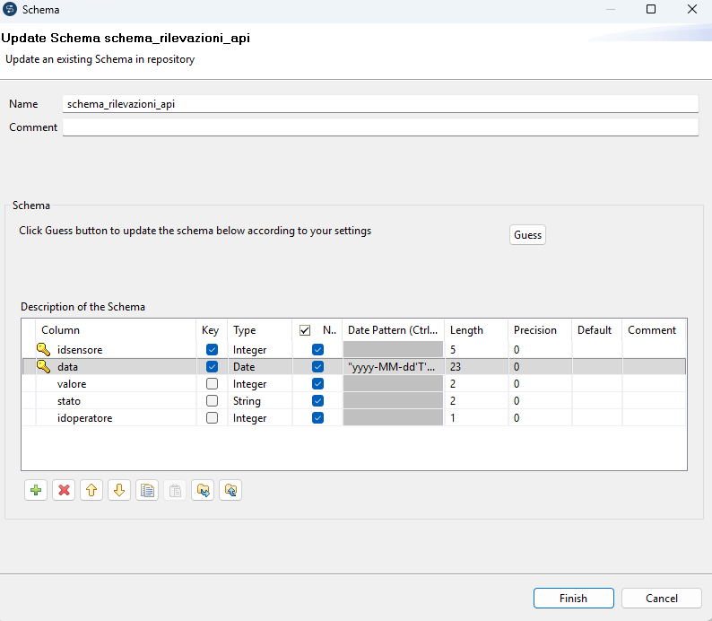
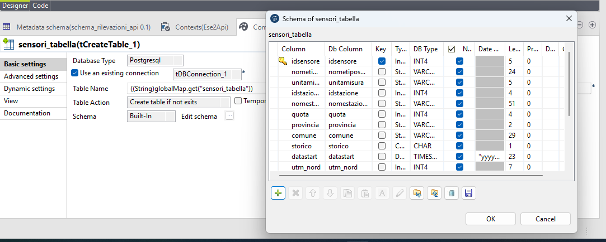
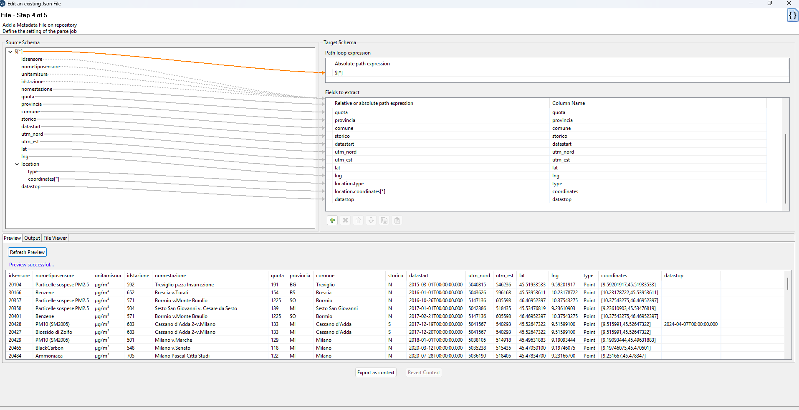
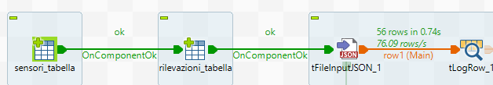
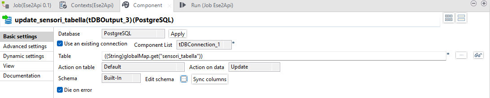
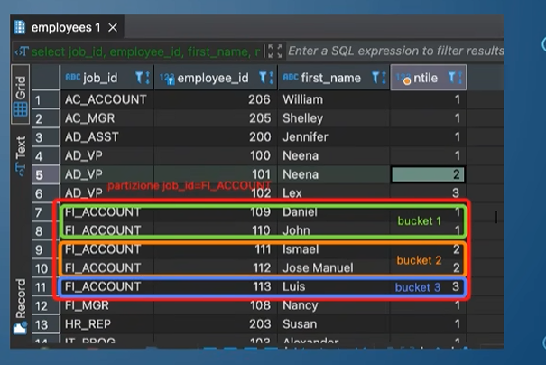
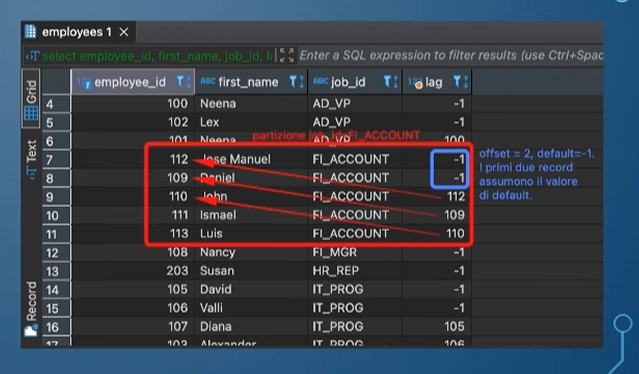
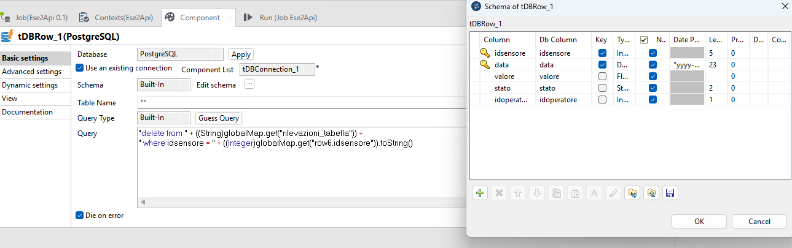
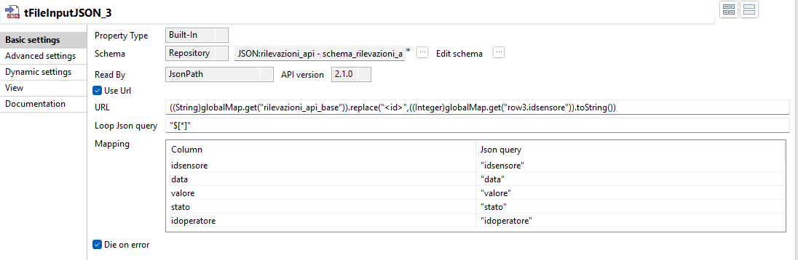
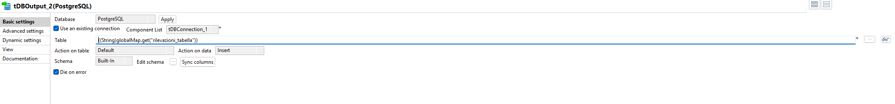

# Basi di dati 
All'interno di questo file markdown sono presenti appunti ed esercitazioni riguardanti il corso di Basi di Dati.

## Linguaggi di un DBMS
Un DBMS supporta diversi tipi di linguaggi:
- **Data Definition Language (DDL)**: permette di specificare e modificare lo schema della base di dati, lo schema delle viste e i vincoli di integrità. Agisce sul livello logico ed esterno.
- **Data Manipulation Language (DML)**: permette di creare, modificare e interrogare l'istanza della basi di dati. Agise su livello logico ed esterno.
- **Storage Definition Language (SDL)**: definisce lo schema fisico del DB. Agisce sul livello fisico.

In sintesi possiamo affermare che **DDL** e **DML** sono linguaggi **CRUD**, ovvero quei linguaggi che supportano operazioni di:
- **Creation**
- **Read**
- **Update**
- **Delete**

Entrambi agiscono allo stesso modo ma da punti di vista differenti:
- il **DML** agisce sulle istanze delle relazioni, i dati veri e propri
- il **DDL** agisce sullo schema delle relazioni, sulla "struttura"

Fra i vari linguaggi di interrogazione uno dei più famosi è **SQL (Structured Query Language)** che fornisce un approccio di interrogazione dichiarativa, poichè in modo esplicito dichiariamo cosa vogliamo ottenere dall'interrogazione.
SQL non è nato nè per la potenza computazionale ma per la potenza espressiva. Di fatti frài vari vantaggi troviamo:
- facilità di utilizzo anche per utenti poco esperti
- possibilità di attuare strategie di ottimizzazione (solitamente attuate dal DBMS che attua una serie di strategie per eseguire in modo ottimizzato le interrogazioni).

## Tipi di dato

Prima di introdurre il concetto di vincolo e le istruzioni SQL per DDL e DML elenchiamo velocemente i vari tipi di dato supportati nella maggior parte dei DBMS:
- tipi caratterre: singoli caratteri, stringhe anche di lunghezza variabile
- tipi numerici: interi, decimali
- tipi temporali: date, ore, intervalli di tempo
- booleani
- BLOB, CLOB (Binary/Character Large Object): per grandi immagini e testi
- tipi binari: bytea e bit

Un tipo particolare di dato è rappresentato dal valore nullo `NULL`. Molti DBMS supportano la possibilità di assegnare a qualsiasi *data-type* il valore `NULL`. Esso rappresenta un valore valido per ogni dominio in quanto non appartiene a un dominio preciso. La gestione dei valori `NULL` deve avvenire in modo dedicato e con cautela (per esempio confrontare `Matricola=NULL` risulta ambiguo).


### Tipi di dato temporali

I tipi di dato temporali supportati in SQL, più precisamente in Postegre, sono:
- timestamp
  - con time zone
  - senza time zone
- date
- time
  - con time zone
  - senza time zone
- interval

Il tipo di dato `TIMESTAMP` contiene informazioni riguardanti la data e l'orario (ore, minuti, secondi) ma non il fuso orario. È possibile specificare una precisione che indica il numero di cifre da salvare come microsecondi. Ad esempio:
```sql
TIMESTAMP => 2025-08-10 14:30:25 

TIMESTAMP(3) => 2025-08-10 14:30:25.333
```

Possiamo poi specificare che vogliamo un campo `TIMESTAMPTZ`, ovvero con *time zone*, e quindi andiamo a salvare un riferimento assoluto. Ad esempio `2025-08-10 14:00` a Roma sono le `2025-08-10 08:00` a New York. Quindi con `TIMESTAMP` sono valori diversi e con `TIMESTAMPTZ` sono lo stesso valore.

Il *time zone* viene sostanzialmente espresso attraverso la dicitura `UTC` come standard universale, seguendo il concetto che `UTC = +00`, Roma in estate è `+02`, Roma in inverno è `+01`. Di conseguenza se salviamo `2025-08-10 15:00+02` Postgre salva internamente `2025-08-10 13:00`, ovvero l'istante assoluto, e affianco l'informazione `+02`.

In Postgre sono supportati anche altri tipi di time zone come Central Europe Summer Time (CEST), Central Europe Time (CET)

Durante una sessione, possiamo andare a specificare il fuso orario della sessione corrente, lanciando il comando `SET TIMEZONE=<nome della zona>`, dove `<nome della zona>` può essere ad esempio `'Europe/Rome'`. In questo modo qualsiasi riferimento temporale con fuso orario viene mostrato secondo quel fuso.

Importante notare che il db di default memorizza le date usando il timezone del server su cui è ospitato, salvo diverse configurazioni.

Altro comando importante è `AT TIME ZONE` che consente di convertire un valore temporale, ad esempio ottenuto dopo una proiezione dei dati. Per esempio possiamo dire `SELECT TIMESTAMP '2025-08-10 15:00' AT TIME ZONE 'Europe/Rome';` e otterremo quella data rispetto al fuso specificato.

Analogamente abbiamo lo stesso risultato col tipo di dato `TIME` che permette di salvare solamente l'orario (ore,minuti,secondi) ed eventualmente i microsecondi se specificati via parametro.

```sql
time => 14:30:25 

time(3) => 14:30:25.333
```

Anche in questo caso possiamo speficare la parte finale `tz` per indicare un timestamp anche se poco utilizzato.

Abbiamo poi il tipo 'DATE` che consente di specificare solo la data, di default in formato ISO (yyyy-MM-dd). Quindi

```sql
DATE => 2025-12-12
```

Infine abbiamo il tipo `INTERVAL` solitamente utilizzato per contenere un range, un intervallo temporale (un mese, un giorno, due ore). I riferimenti temporali supportati sono:
- years
- months
- weeks
- days
- hours
- minutes
- seconds

Solitamente a livello di database memorizziamo `INTERVAL '4 months'` e questo dato viene usato per essere aggiunto/sottratto ad altri riferimenti temporali. Ad esempio possiamo fare `SELECT DATE '2025-08-10' + INTERVAL '5 months'`.

Con i campi di tipo date e time possiamo effettuare operazioni come:
- sommare al tipo DATE dei giorni direttamente come somma di interi alla data `SELECT DATE '2025-08-10' + 5;`, 
- sommare al tipo TIME/TIMESTAMP con INTERVAL `SELECT TIME '10:00:00' + INTERVAL '2 hours';`
- fare la sottrazione tra due date ` SELECT DATE '2025-08-10' - DATE '2025-08-10'` e confrontarle `SELECT DATE '2025-08-20' > DATE '2025-08-10';`
- fare la sottrazione tra due time/timestamp e confrontarle (analogo a sopra)

Possiamo poi usare alcune funzioni built-in come:
- current_date, che restituisce la data corrente (no orario)
- current_timestamp, che restituisce il timestamp corrente con *time zone*
- current_time, che restituisce l'orario corrente con time
- estrarre parti della data/time tramite `EXTRACT()`
  - `SELECT EXTRACT(YEAR FROM DATE '2025-08-10');` 
- arrotondare una data/orario con la funzione `date_trunc()` che supporta molte precisioni tra cui 'hour', 'day', etc..., e genera il valore arrotondato alla precisione specificata impostando a zero gli altri valori. Ad esempio se arrotondiamo per mese, otteniamo il primo giorno di quel mese alle 00:00:00. `SELECT date_trunc('month', DATE '2025-08-10');` genera `2025-08-01 00:00:00` (ATTENZIONE: da DATE passiamo a un TIMESTAMP). Analogamente possiamo farlo su TIME
- formattazione con `TO_CHAR()`
  - `SELECT TO_CHAR(DATE '2025-08-10','DD/MM/YYYY' );`

## Il concetto di vincolo 
All'interno di una relazione, come nella vita reale, possono essere indicati dei vincoli, delle regole (*constraints*), che devono essere rispettate da tutte le tuple che devono appartenere alla relazione. 

Quando si ha a che fare con un DBMS, si parla di **vincoli di integrità**, condizioni che devono essere verificate da **ogni** istanza della base di dati, per esempio dominio degli attributi.

Tra i vari vincoli di integrità abbiamo:
- **vincoli di integrità intra-relazionale** che agiscono all'interno di una singola relazione
- **vincoli di integrità di entità (chiave primaria)** che agiscono sull'istanza di una tabella garantendo che ogni tupla nel database sia univoca e identificabile
- **vincoli di integrità inter-relazionale (referenziale)** che agiscono sul legame tra relazioni differenti.

I **vincoli intra-relazionali** agiscono come regole di validazione interne a una singola tabella. Una tupla può essere inserita o mantenuta nella relazione solo se soddisfa tutti i vincoli imposti, garantendo così la correttezza atomica dei dati. Per esempio:
- l'età deve essere un intero (vincolo di dominio)
- il campo nome non può essere `NULL` (vincolo di colonna)
- il prezzo di vendita dev'essere maggiore del prezzo di acquisto (vincolo di tupla)

I **vincoli di chiave primaria** agiscono sull'intera tupla con una visione globale della relazione. Più precisamente consentono di specificare uno o più attributi come **chiave primaria** ovvero uno o più campi che identificano in modo univoco il record. Quindi per sua natura una chiave primaria non può assumere valori `NULL` e non ammette valori duplicati (per l'intera chiave) all'interno della stessa relazione. Per esempio:
- uno studente è identificato dalla matricola
- un paziente è identificato dal codice fiscale
- la frequentazione di un corso è identificata dalla matricola dello studente e dall'identificativo del corso. 

I **vincoli di integrità referenziale** agiscono sul legame tra relazioni, garantendo che io in una tabella possa inserire il valore di una chiave di un'altra tabella per evitare di inserire tutti i dati della tupla. Per esempio date le tabelle **Corsi** e **Docenti** io posso inserire nella relazione **Corsi** la matricola del docente, in modo da associare a ciascun corso l'identificativo del docente che lo sostiene. Per tanto realizziamo una correlazione logica tra le relazioni e il vincolo stabilisce che non può esistere una chiave, detta **chiave esterna**, che non esiste nella relazione in cui è chiave primaria (non posso aggiungere un corso sostenuto da un docente che non esiste nella tabella Docenti).


## Il concetto di valori nulli
SQL ammette una logica a tre valori:
- `TRUE`
- `FALSE`
- `UNKNOWN`
Il valore `UNKNOWN` indica che il valore di verita di una condizione di ricerca applicata ad una data tupla non e determinabile. Solitamente questo si verifica quando effettuiamo un confronto tra un valore precisato e un valore `NULL`.
Di fatti SQL consente di assegnare a una determinata colonna di una tabella il valore `NULL` per cui si sta indicando che quella colonna non ha un valore specificato attualmente e quindi `NULL` appartiene a tutti i domini. Il problema del valore `NULL` è che se confrontato con un intero o un qualsiasi altro valore (compreso un altro `NULL`) produce in output il valore `UNKNOWN` (per esempio `NULL = 5` oppure `NULL=NULL`).

Un altro problema causato dalla presenza di valori `NULL` e che nelle espressioni aritmetiche se un argomento è `NULL` allora il valore dell'intera espressione è `NULL` (per esempio `dataRest - dataNol` DAY può dare `NULL` se uno dei due campi è `NULL`).

Altro problema lo abbiamo con le funzioni aggregate (che vedremo successivamente) poichè escludono le tuple che hanno valore `NULL` per la colonna specificata nella funzione. Per esempio `SUM(colonna1 + colonna2)` può dare risultato diverso da `SUM(colonna1) + SUM(colonna2)`.

Per risolvere questo problema possiamo ricondurre una logica a 3 valori ad una logica a due valori (vero e falso). Questo viene effettuato grazie al predicato `IS NULL` che se applicato ad un attributo restituisce `TRUE` se la tupla ha valore nullo per l'attributo. Analogamente `NOT IS NULL` restituisce `TRUE` se non è `NULL`.


## DDL
Il DDL permette di definire e modificare lo schema delle relazioni, viste e definire vincoli di integrità. Per le prossime istruzioni useremo una notazione generica che consente di definire in modo generico la sintassi dei comandi SQL. Nel dettaglio useremo questa notazione:
- caratteri maiuscoli per le parole chiave del linguaggio
- `<>` indichiamo i nomi di variabili
- `[]` indichiamo i componenti opzionali
- `*` per indicare 0 o più occorrenze
- `|` per indicare delle opzioni (si intende scegliere un elemento piuttosto che un altro)

Il DDL utilizza le seguenti *keywords*:
- per la creazione **CREATE**
- per la modifica **ALTER**
- per la cancellazione **DROP**
- per l'interrogazione **SHOW**

Per la creazione di una relazione si usa la seguente istruzione:
```sql
CREATE TABLE <nome relazione>
(<specifica colonna> [,<specifica colonna>]*);
```
dove:
- `<nome relazione>` è il nome della relazione che viene creata
- `<specifica colonna>` è una specifica di colonna il cui formato è
  - ```sql 
    <nome colonna> <dominio> [DEFAULT <valore_default>]
    ```
dove:
  - `<nome colonna>` è il nome della colonna (necessariamente divero dal nome delle altre colonne della relazione)
  - `<dominio>` è il dominio della colonna, uno dei *data-type* SQL
  - `<valore_default>` è un valore del dominio, assunto dalle tuple se nessun valore è specificato per la colonna

Esempio:
```sql
CREATE TABLE Video(
colloc DECIMAL(4),
titolo VARCHAR(30),
regista VARCHAR(20),
tipo CHAR DEFAULT 'd');
```

Vediamo ora la definizione dei vincoli di integrità sulla tabella Video. In prima battuta vediamo la definizione di vincoli di colonna, per esempio il titolo e il regista non possono assumere valori di tipo `NULL`. In questo caso definiamo il campo come
```sql
CREATE TABLE Video(
colloc DECIMAL(4),
titolo VARCHAR(30) NOT NULL,
regista VARCHAR(20) NOT NULL,
tipo CHAR DEFAULT 'd');
```

Un altro tipo di vincolo di integrià è il vincolo di chiave, che possono essere:
- `UNIQUE` chiave univoca, quindi simile alla chiave primaria, ma può assumere valori nulli
- `PRIMARY KEY` chiave univoca che non può assumere valori nulli.
In una relazione possiamo specificare più chiavi `UNIQUE` ma una sola `PRIMARY KEY`.

La definizione di una chiave avviene direttamente sull'attributo con la seguente sintassi: 
```sql
<nome colonna> <dominio> [PRIMARY | [UNIQUE] KEY]
```
oppure dopo l'ultimo attributo, solitamente nel caso in cui abbiamo una chiave primaria composta poichè con la definizione *inline* è possibile definirla solo su un campo.

```sql

/*Esempio inline */
CREATE TABLE Video(
colloc DECIMAL(4) PRIMARY KEY,
titolo VARCHAR(30) NOT NULL,
regista VARCHAR(20) NOT NULL,
tipo CHAR DEFAULT 'd');

/*Esempio in coda */
CREATE TABLE Video(
colloc DECIMAL(4),
titolo VARCHAR(30),
regista VARCHAR(20),
tipo CHAR DEFAULT 'd',
PRIMARY KEY(titolo,regista));

/*Esempio in coda con UNIQUE*/
CREATE TABLE Noleggio
(
    colloc DECIMAL(4),
    dataNol DATE DEFAULT CURRENT_DATE,
    codCli DECIMAL(4) NOT NULL,
    dataRest DATE,
    PRIMARY KEY (colloc,dataNol)
    UNIQUE (colloc,dataRest)

);
```

Un altro tipo di vincolo è il vincolo di integrità referenziale, dove andiamo a definire una chiave esterna (**FOREIGN KEY**) sulla tabella riferita e che assume i valori della chiave primaria della tabella referente. Molto importante è che la chiave esterna abbia lo stesso dominio della chiave primaria a cui fa riferimento (non posso definire una chiave esterna stringa in riferimento a una chiave primaria numerica).

La sintassi di definizione della chiave esterna è la seguente (inserita come ultima riga in `CREATE TABLE`):
```sql
FOREIGN KEY (<lista nomi colonne>) REFERENCES <nome relazione>
    [ON DELETE {NO ACTION | CASCADE | SET NULL | SET DEFAULT}]
    [ON UPDATE {NO ACTION | CASCADE | SET NULL | SET DEFAULT}]
```

In caso di una chiave esterna composta da un solo campo è possibile usare la notazione *inline*:
```sql
<nome attributo> <dominio> REFERENCES <nome relazione>
```

Per esempio:
```sql
CREATE TABLE Film(
titolo VARCHAR(30),
regista VARCHAR(20),
anno DECIMAL(4) NOT NULL,
genere CHAR(15) NOT NULL,
valutaz NUMERIC(3,2),
PRIMARY KEY(titolo,regista));

CREATE TABLE Video(
    colloc DECIMAL(4) PRIMARY KEY
    titolo VARCHAR(30) NOT NULL,
    regista VARCHAR(30) NOT NULL,
    tipo CHAR NOT NULL DEFAULT 'd',
    FOREIGN KEY (titolo,regista) REFERENCES Film
);
```


Esempio *inline*:
```sql
CREATE TABLE Cliente(
    codCli DECIMAL(4) PRIAMRY KEY,
    ...
)

CREATE TABLE Noleggio(
    colloc DECIMAL(4) REFERENCES Video,
    dataNol DATE DEFAULT CURRENT_DATE,
    codCli DECIMAL(4) NOT NULL REFERENCES Cliente,
    ...
)
```

Nella clausola di **FOREIGN KEY** possiamo specificare dei comportamenti in caso di aggiornamento/cancellazione della chiave primaria che è usata come chiave esterna in una relazione:
- `ON UPDATE` permette di specificare le azioni da eseguire nel caso di modifica del valore di chiave di una tupla riferita tramite chiave esterna
- `ON DELETE` permette di specificare le azioni da eseguire nel caso di cancellazione di tuple nella tabella riferita tramite chiave esterna.
In entrambi i casi abbiamo 4 opzioni disponibili:
- `NO ACTION`: la cancellazione/modifica di una tupla dalla tabella riferita è eseguita solo se non esiste alcuna tupla nella tabella referente che fa riferimento alla tupla da cancellare
- `CASCADE`:  la cancellazione/modifica di una tupla dalla tabella riferita implica la cancellazione/modifica di tutte le tuple della tabella referente che fanno riferimento alla tupla da cancellare/modificare
- `SET NULL`: la cancellazione/modifica di una tupla dalla tabella riferita implica che in tutte le tuple della tabella referente che fanno riferimento alla tupla da cancellare/modificare, la chiave esterna viene posta a valore `NULL` (se ammesso)
- `SET DEFAULT`: la cancellazione/modifica di una tupla dalla tabella riferita implica che in tutte le tuple della tabella referente che fanno riferimento alla tupla da cancellare/modificare, la chiave esterna viene posta uguale al valore did efault specificato nel comando di CREATE TABLE.

In entrambi i casi, se omessa la modalitàm, di default si imposta `NO ACTION` per entrambi i casi. Non esiste una combinazione corretta o errata, dipende sempre dai vari casi di utilizzo ma la più utilizzata è `ON UPDATE CASCADE ON DELETE NO ACTION`.\

Infine l'ultimo vincolo di integrità definibile sul costrutto `CREATE TABLE` è il vincolo di tipo `CHECK` che consente di specificare condizioni di validità su una colonna o relazione. Quindi il vincolo di check è valido se ciò che viene restituito non è `FALSE`, quindi `TRUE/UNKNOWN` valida il vincolo `CHECK`. Se invece volessimo rendere il vincolo valido solo se otteniamo `TRUE` allora dobbiamo usare una asserzione (successivamente introdotta).

Vincoli **CHECK su colonna** sono definiti come:
```sql
<nome attributo> <dominio> CHECK (query)
```
Ad esempio:
```sql
CREATE TABLE Film(..., 
    valutaz DECIMAL (3,2) CHECK (valutaz BETWEEN 0.00 AND 5.00),
    ...
);
```
Vincoli **CHECK su tabella** sono definiti alla fine dell'istruzione `CREATE TABLE`:
```sql
CREATE TABLE Film(
    ...,
    CHECK(dataRest >= dataNol)
);
```

Il vincolo CHECK deve sempre restituire `True/False` e viene invocato in caso di inserimento/aggiornamento e nel caso positivo, il record viene aggiunto/aggiornato, nel caso negativo non viene inserito/aggiornato.

Dopo aver visto i comandi del DDL per la creazione di relazioni, vediamo il comando per l'eliminazione di una tabella, che avviene tramite l'istruzione `DROP`:
```sql
DROP TABLE <nome relazione> {RESTRICT | CASCADE}
```
Nel dettaglio `DROP` cancella lo schema e la sua istanza (i dati). Nel dettaglio dobbiamo specificare:
- `<nome relazione>`che rappresenta il nome della tabella da cancellare
- `RESTRICT | CASCADE` permettono di specificare il comportamento della `DROP` nel caso in cui la tabella da cancellare è una tabella riferita. Se omessa la scelta `RESTRICT` è di default.
  - `RESTRICT`: l'operazione di cancellamento fallisce se si tratta di una tabella riferita (esiste un'altra tabella che fa riferimento alla tabella che vogliamo eliminare)
  - `CASCADE`: l'operazione di cancellamento viene eseguita sulla tabella specificata e se si tratta di una tabella riferita vengono eliminati i legammi (vincoli di *foreign key*).

Un altro comando del **DDL** è `ALTER`, utilizzato per modificare lo schema di una relazione. La sintassi nell'utilizzo di `ALTER` è:
```sql
ALTER TABLE <nome relazione> <modifica>
```
dove:
- `<nome relazione>` è il nome della relazione da modificare
- `<modifica>` è la modifica da applicare scelta tra:
  - aggiunta di una nuova colonna
  - definizione/rimozione/modifica del valore di default per una colonna esistente
  - eliminazione di una colonna esistente
  - definizione di un nuovo vincolo di integrità
  - eliminazione di un vincoo di integrità esistente

Nel dettaglio `<modifica>` viene scelta tra:
- aggiunta di una nuova colonna `ADD [COLUMN] <specifica colonna>`
- aggiunta/modifica/rimozione del valore di default:
  
  `ALTER [COLUMN] <nome colonna> {SET DEFAULT <valore default> | DROP DEFAULT}`
- eliminazione di una colonna:
  
  `DROP [COLUMN] <nome colonna> {RESTRICT | CASCADE}`

- definizione/eliminazione vincolo

  `ADD CONSTRAINT [nome vincolo] <specifica vincolo>`

  `DROP CONSTRAINT <nome vincolo> {RESTRICT | CASCADE}`


Vediamo ora un esercizio riassuntivo su quanto visto fino ad'ora sul **DDL**.

Specificare, utilizzando i comandi SQL, lo schema
della Palestra SemprelnForma specificando i
vincoli di integrità contenuti nello schema stesso ed
imponendo che:
  1. la cancellazione di una corso non sia possibile se il corso
  è attualmente in orario
  2. la cancellazione di un corso comporti la rimozione di tutti i
  suoi iscritti
  3. Il fatto che un organizzatore di un corso lasci la palestra,
  fa si che il corso non sia momentaneamente assegnato ad
  alcun organizzatore
  4. Il fatto che un istruttore lasci la palestra, fa si che i corsi da
  lui tenuti abbiano come istruttore quello con codice 7253
  5. il livello usuale di un corso sia intermedio

Pertanto procediamo a:
1. Sulla chiave esterna di Orario vado a mettere on delete NO ACTION
2. sulla chiave esterna di iscritti metto on delete cascade
3. sulla chiave esterna di corso relativa all' istruttore, in caso ddelete metto on delete set null, questo implica che di default è null. (doppio vincolo)
4. specifichiamo sulla chiave esterna di corsi on delete set default e poi indichiamo default7253.
5. mettiamo come default sul campo livello "intermedio".
```sql

-- Tabella Istruttori
CREATE TABLE Istruttori (
    codice_istruttore INT PRIMARY KEY,
    nome VARCHAR(50) NOT NULL
);

-- Tabella Organizzatori
CREATE TABLE Organizzatori (
    id_organizzatore INT PRIMARY KEY,
    nome VARCHAR(50) NOT NULL
);

-- Tabella Corsi
CREATE TABLE Corsi (
    codice_corso INT PRIMARY KEY,
    nome_corso VARCHAR(50) NOT NULL,
    -- Punto 5: Livello usuale intermedio di default
    livello VARCHAR(20) DEFAULT 'intermedio',
    -- Punto 3: Se l'organizzatore se ne va, il campo diventa NULL
    id_organizzatore INT,
    FOREIGN KEY (id_organizzatore) 
        REFERENCES Organizzatori(id_organizzatore) 
        ON DELETE SET NULL,
    -- Punto 4: Se l'istruttore se ne va, viene assegnato il codice 7253
    codice_istruttore INT DEFAULT 7253,
    FOREIGN KEY (codice_istruttore) 
        REFERENCES Istruttori(codice_istruttore) 
        ON DELETE SET DEFAULT
);

-- Tabella Orari (Programmazione corsi)
CREATE TABLE Orari (
    id_orario INT PRIMARY KEY,
    codice_corso INT NOT NULL,
    giorno_settimana VARCHAR(10),
    -- Punto 1: RESTRICT impedisce la cancellazione se il corso è in orario
    FOREIGN KEY (codice_corso) 
        REFERENCES Corsi(codice_corso) 
        ON DELETE RESTRICT
);

-- Tabella Iscritti
CREATE TABLE Iscritti (
    id_iscritto INT PRIMARY KEY,
    nome_utente VARCHAR(50),
    codice_corso INT,
    -- Punto 2: CASCADE rimuove gli iscritti se il corso viene eliminato
    FOREIGN KEY (codice_corso) 
        REFERENCES Corsi(codice_corso) 
        ON DELETE CASCADE
);
```

- La palestra SemprelnForma decide di memorizzare anche l'email di iscritti (in modo facoltativo) ed istruttori (in modo obbligatorio). Modificare lo schema di conseguenza:
```sql
ALTER TABLE Istruttori ADD COLUMN
email(varchar(30) NOT NULL);

ALTER TABLE Iscritti ADD COLUMN
email (varchar(30) DEFAULT NULL); /*equivalente se non scrivo default null.*/
```
- Si vuole inoltre cambiare il livello usuale di un corso da intermedio a base:
```sql
ALTER TABLE Orario ALTER COLUMN livello SET DEFAULT 'base'
```
## DML

Dopo aver visto il **DDL**, che permette di definire, modificare ed eliminare lo schema delle tabelle, introduciamo il **DML (Data Manipulation Language)** che permette di inserire, modificare ed eliminare le istanze di una tabella. Quindi le istruzioni del DML hanno non trattano più lo schema della istanze, bensì le tuple che popolano le varie relazioni.

Il DML utilizza le seguenti *keywords*:
- per l'inserimento **INSERT**
- per la modifica **UPDATE**
- per la cancellazione **DELETE**
- per l'interrogazione **SELECT**

Per l'inserimento di un nuovo record nella tabella si utilizza la seguente sintassi:
```sql
INSERT INTO S [(C1,C2, ... ,Cn)]
{VALUES (V1,V2, ... ,Vn) | sq};
```
dove:
- `S` è il nome della tabella su cui inserire i dati
- `C1,C2,cn` è la lista delle colonne della nuova tupla (o delle nuove tuple) a cui si assegnano i valori. Molto importante notare che tutte le colonne non elencate esplicitamente ricevono il valore `NULL` o di default (se opportunamente specificato nel comando di `CREATE`)
- la mancata specifica di una lista di colonne equivale ad una lista che include tutte le colonne di `S` nell'ordine dato nel comando di `CREATE` (per cui vanno inseriti necessariamente tutti i valori)
- i valori da assegnare alla nuova tupla sono specificati esplicitamente attraverso la clausola `VALUES` dove:
  - `V1,V2,...,Vn` è la lista di valori da assegnare alla nuova tupla
  - i valori sono assegnati nell'ordine in cui sono scritti (l'*i-esimo* valore viene assegnato alla colonna *i-esima*)
  - la lista può contenere la parola chiave `NULL` o `DEFAULT` per assegnare il valore di default alla colonna indicata
  -  possono essere specificati attraverso una sottoquery `sq` (quindi le tuple restituite dalla sotto-interrogazione vengono inserite nella relazione `S` e ovviamente il dominio della colonna *i-esima* della tupla deve coincidere col dominio della colonna Ci)

Esempio in cui specifichiamo tutti i valori tranne il campo valutazione che essendo nullable assumerà valore `NULL`:
```sql
INSERT INTO Film(titolo, regista, anno, genere)
VALUES ('la tigre e la neve', 'roberto begnigni',2005,'commedia');
```
Ricapitolando possiamo affermare che se un valore non viene specificato:
- se il campo è *nullable*
  - se il campo ha un valore di *default* assumerà il valore specificato
  - se il campo non ha un valore di *defualt* assumerà valore `NULL`
- se il campo non è *nullable*
  - se il campo ha un valore di *default* assumerà il valore specificato
  - se il campo non ha un valore di *default* verrà generato un errore

Esempio di inserimento tramite sotto-interrogazione:
```sql
INSERT INTO ProdottiMilanesi
SELECT codice,descrizione
FROM Prodotti
WHERE LuogoProduzione = 'Milano';
```

Così come possiamo inserire uno o più record, possiamo anche cancellare una tupla attraverso la clausola `DELETE` con la seguente sintassi:
```sql
DELETE FROM S [<alias>] [WHERE F]
```
dove:
- `S` è il nome della relazione su cui si esegue la cancellazione
- Il nome della realazione può avere associato un alias se è necessario riferire tuple di tale relazione in una qualche sotto-interrogazione presente in `F`
- `F` è la clausola di qualificazione che specifica le tuple da cancellare
- Se non è specificata alcuna clausola di qualificicazione, vengono cancellate tutte le tuple
Importante specificare che la clausola `DELETE` opera tupla per tupla, quindi per ogni tupla della tabella viene applicato il predicato e se è vero, la tupla viene cancellata altrimenti si passa alla prossima tupla. Quindi se operiamo con predicati su cui lavoriamo con una chiave primaria, abbiamo la certezza che se presente cancelleremo una sola tupla.

Per esempio:
```sql
DELETE FROM Film WHERE titolo = 'la tigre e la neve' AND regista = 'roberto benigni'
```

Dopo aver visto inserimento e cancellazione possiamo introdurre la clausola `UPDATE` per aggiornare i record di una relazione:
```sql
UPDATE S [<alias>]
SET C1 = {e1 | NULL},..., Cn = {en | NULL}
[WHERE F]
```
dove:
- `S` è il nome della relazione su cui si esegue la modifica
- `S` può avere associato un alias se è necessario riferire tuple di `S` in una qualche sotto-interrogazione presente in F
Quindi la clausola `UPDATE` aggiorna tutte le tuple che soddisfano il predicato `F` assegnando come nuovi valori alle colonne specificate (`C1,..,Cn`). I valori specificati in `SET` possono essere recuperati da delle sotto-interrogazioni purchè esse restituiscano un solo valore.

Inoltre:
- `Ci = {ei | NULL} (i=1,...n)` è un'espressione di assegnamento che specifica che alla colonna `Ci` deve essere assegnto il valore dell'espressione `ei`:
  - `ei` può essere una costante, oppure un'espressione aritmetica o di stringa, spesso funzione dei valori correnti delle tuple da modificare, oppure una sotto-interrogazione
- Alternativamente si puo specificare che alla colonna sia assegnato il valore nullo
- `F` è la clausola di qualificazione che specifica le tuple da modificare
- Se non è specificata alcuna clausola di qualificazione, vengono modificate tutte le tuple.

Per esempio:
```sql
/* Aggiorniamo la valutazione di tutti i film raddoppiando la scala*/
UPDATE Film
SET valutazione = valutazione * 2;

/* Aggiorniamo la restituzione di tutti i film a noleggio del cliente 6635 */
UPDATE Noleggio
SET dataRest = current_date
WHERE codCli = 6635 AND dataRest IS NULL;
```

Le sotto-interrogazioni con `UPDATE` possono essere specificate:
- nella clausola di qualificazione per determinare le tuple da modificare
- nella clausola di assegnamento per determinare i nuovi valori da assegnare alle tuple


Infine passiamo a vedere la clausola `SELECT` che consente di visualizzare i dati presenti nelle relazioni. Il formato abse di una interrogazione segue la seguente forma:
```sql
SELECT {[DISTINCT] R1.C1, R1.C2, R2.C1, ... | *}
FROM R1,R2,...,Rk
[WHERE F]
```
Con questa interrogazione andiamo a caricare *in primis* le relazioni `R1,R2,..,Rk` in memoria, successivamente applichiamo una clausola di qualificazione `F` se presente e infine preleviamo i campi necessari tramite la clausola di proiezione `SELECT`. Nel dettaglio:
- `R1.C1` consente di accedere alla colonna `C1` della relazione `R1`.

Quando eseguiamo questa clausola `FROM` stiamo applicando un prodotto cartesiano tra tutte le relazioni indicate, quindi come risultato otteniamo un'unica tabella dove abbiamo tutte le possibili combinazioni fra le varie tuple di ciascuna relazione con le altre. Successivamente `WHERE` e `SELECT` operano direttamente su questa tabella.

Se nella clausola `SELECT` specifichiamo l'operatore `*` indichiamo la volontà di ottenere tutti i campi della tabella calcolata nella clausola `FROM`. Inoltre se nella clausola `FROM` indichiamo solo una relazione, possiamo indicare i campi direttamente con il loro nome senza la sintassi `relazione.colonna`. Altrimenti possiamo fare renaming della relazione indicata nella `FROM` inserendo dopo la relazione il nome dell'alias. In questo caso la relazione `Film` verrà rinominata f per tutta la query.
```sql
SELECT nome
FROM Film f

/*analogo ma abbiamo una sola relazione */
SELECT f.nome
FROM Film f
```

Analogamente possiamo rinominare, assegnare un alias ai campi della `SELECT` tramite la clausola `AS` 

Per esempio:
```sql
/* Otteniamo tutti i film presenti nella tabella Film */
SELECT *
FROM Film

/* Otteniamo il titolo dei film precedenti al 2000*/
SELECT titolo
FROM Film
WHERE anno < 2000

/* Otteniamo tutti i campi dei film del regista Tim Burton */
SELECT *
FROM Film
WHERE regista = 'Tim Burton'
```
La keyword `DISTINCT` nella clausola `SELECT` specifica che si vogliono ottenere solo valori distinti (non ripetuti) di tutti i campi che compaiono dopo. Per esempio `SELECT DISTINCT(genere) FROM Film` restituisce i vari generi senza ripetizione. 

Nella clausola `WHERE` possiamo specificare delle espressioni che vengono calcolate tupla per tupla. Per esempio potrei volere il codice dei clienti che hanno dei film noleggiati negli ultimi 5 giorni:
```sql
SELECT DISTINCT codCli
FROM Noleggio
WHERE dataNol >= current_date + 5
```

Oltre a specificare delle espressioni nella clausola `WHERE` è possibile specificare delle espressioni nella clausola `SELECT` che causano una modifica del risultato ottenuto (non modifica direttamente i valori nella tabella come `UPDATE`). Per esempio:
```sql
SELECT colloc, (dataRest - dataNol) DAY 
FROM Noleggio
WHERE codCLi = 1234
```

È possibile inoltre assegnare un nome differente a una colonna assegnando un alias tramite la keyword `AS`:
```sql
SELECT nome as nome_dipendente
FROM dipdenente

SELECT Stipendio/12 AS stipendioMensile
FROM Dipendenti
WHERE Cognome = 'bianchi'
```


## Operatore BETWEEN e LIKE
Nella clausola `WHERE` è possibile utilizzare l'operatore `BETWEEN` che permette di specificare un range, valore minimo e valore massimo (inclusi). Solitamente compatibile su dati numerici ma anche su date e orari. Per esempio:
```sql
SELECT *
FROM Film
WHERE anno BETWEEN 1999 AND 2000
```
L'operatore `LIKE` si usa invece solitamente per cercare un match con stringhe tramite l'utilizzo di due *wildcard*:
- `_` identifica un carattere qualsiasi
- `%` identifica qualsiasi numero di caratteri, da 0 a più.
Per esempio:
```sql
/* Determinare tutti i film che hanno 'd' come terza lettera del titolo */
SELECT *
FROM Film
WHERE titolo LIKE '__d%'
```

## Ordinamento del risultato e limitazione
Quando eseguiamo una query possiamo specificare di ordinare il risultato rispetto a uno o più campi (in modo crescente o decrescente). Questo avviene tramite la clausola `ORDER BY` che causa un ordinamento del risultato rispetto ai campi indicati.
Ad esempio se vogliamo il nome dei dipendenti in ordine alfabetico crescente:
```sql
SELECT nome
FROM dipendenti
ORDER BY nome ASC /*ASC è opzionale, se omesso è di default */
```
Oppure lo stipendio dei dipendenti a partire dal più alto (tramite la keyword `DESC`):
```sql
SELECT stipendio
FROM dipendenti
ORDER BY stipendio DESC
```

Possiamo anche ordinare per campi non presenti in `SELECT` ma ovviamente in questo caso non abbiamo un riferimento visivo dell'ordinamento:
```sql
SELECT nome
FROM dipendenti
ORDER BY data_di_nascita
```

Inoltre possiamo limitare la visualizzazione del risultato ai primi n record tramite la clausola `LIMIT` (non è standard SQL ma supportato dalla maggior parte dei DBMS). Ad esempio se vogliamo i primi cinque dipendenti con lo stipendio più alto
```sql
SELECT nome
FROM dipendenti
ORDER BY stipendio DESC
LIMIT 5
```


A questo punto risulta importante indicare come il DBMS (DataBase Management System) esegue le query, in termini di ordine di esecuzione delle clausole. 
1. FROM -> Il DBMS carica l'intera tabella in memoria
2. WHERE -> Se presente il DBMS inizia ad applicare i predicati a ciascun record della tabella caricata, per cui alcuni record rimangono altri vengono scartati
3. SELECT -> Il DBMS preleva solo gli attributi indicati nella clausola di proiezione,
4. DISTINCT -> Se presente il DBMS preleva solo i valori non duplicati dei campi specificati nella clausola di proiezione
5. ORDER BY -> Se presente il DBMS ordina il risultato da proiettare sulla base dei campi specificati
6. LIMIT -> Se presente il DBMS preleva solo i primi n record da proiettare

## Join
Dopo aver visto le query basilari, dove solitamente abbiamo una sola relazione nella clausola `FROM`, introduciamo il predicato di `JOIN` che consente di stabilire delle associazioni tra più relazioni, operando pertanto su più tabelle all'interno della stessa query.
Per prima cosa l'operazione di join può essere vista come un metodo che consente di affiancare le informazioni di una tabella ad un altra rispetto a un predicato, detto **predicato di join**. Nel dettaglio noi specifichiamo un predicato per cui, presa una riga della tabella uno e una riga della tabella di destra, se è vero i due record vengono affiancati altrimenti se il predicato è falso l'associazione si perde e le due righe non compariranno affiancate.
Vediamo un esempio in pseudo-codice:

Supponiamo di possedere le relazioni Studente ed Esami, dove:
- matricola è la chiave primaria di Studente
- codiceEsame è la chiave di Esame
- codiceEsame è presente anche in Studente come chiave esterna (*foreign key*) rispetto alla relazione Esami. Quindi per ogni studente possiamo tenere traccia dell'esame frequentato.

Ora se volessimo ottenere l'esame frequentato da ciascuno studente basterebbe fare:
```sql
SELECT matricola,codiceEsame
FROM Studente
```
Ma se volessimo reperire anche il numero di CFU dell'esame? Questa informazione non è presente in Studente, bensì in Esami. Per tale motivo dobbiamo fare un operazione di *lookup*, ovvero a partire da Studenti diamo uno "sguardo" a Esami, portandoci in output i campi necessari. Un primo esempio potrebbe essere:
```sql
SELECT matricola,codiceEsame,cfu
FROM Studente,Esami
```
In questo modo indichiamo due relazioni nella `FROM` e il DBMS calcolerà il prodotto cartesiano tra esse. Il prodotto cartesiano di due insiemi (in questo caso due relazioni) restituisce tutte le combinazioni possibili del primo insieme con il secondo (quindi preso uno studente verrà accoppiato con tutti gli esami presenti in Esami). Ovviamente questo risultato non ci piace, perchè non vogliamo che lo studente con matricola `123` venga associato a tutti gli esami presenti ma solo a quello che lui segue. Quindi una possibile modifica che possiamo fare è filtrare il risultato controllando per ogni riga che il codiceEsame di Studente coincide con il relativo codiceEsame di Esami (in questo caso dobbiamo usare la notazione *relazione.campo* in quanto potremmo avere ambiguità sullo stesso nome, il dbms non sa a quale relazione facciamo riferimento a parità di nome di attributo. Quindi possiamo assegnare un alias alle relazioni o usare il nome delle relazioni originale):
```sql
SELECT matricola,codiceEsame,cfu
FROM Studente s,Esami e
WHERE s.codiceEsame = e.codiceEsame
```
La query appena descritta restituisce il risultato aspettato ma poichè abbiamo introdotto le `JOIN` è opportuno notare che quanto indicato nella clausola `WHERE` non è nient'altro che il **predicato di join**, ovvero un predicato/condizione per cui solo le tuple che trovano match tra le due tabelle vengono affiancate. Come indicato nel paragrafo precedente il DBMS esegue prima la `FROM` e poi la `WHERE`. Quindi in questo caso stiamo facendo il prodotto cartesiano tra due relazioni (operazione molto costosa) e poi filtriamo il risultato. La soluzione migliore e più efficiente è usare il predicato di `JOIN` nella clausola `FROM` indicando il predicato di join tra le relazioni. La sintassi del predicato di `JOIN` è:
```sql
FROM <nome relazione> JOIN <nome relazione> ON <predicato di join>
```
dove:
- `<nome relazione>` è il nome della prima relazione
- `<nome relazione>` è il nome della seconda relazione (possono essere uguali prima e seconda)
- `<predicato di join>` è la condizione per cui se è vera, la riga della tabella di sinistra e la riga della tabella di destra vengono unite rispettando questa condizione.
Dal punto di vista logico la `JOIN` si può leggere come "per ogni riga della tabella di sinitra uniscila alla riga della tabella di destra se il predicato tra queste due righe è vero". Quindi la `FROM` ci da in output uno schema (insieme di colonne) che è l'unione dei due schemi.

Nel nostro caso possiamo applicare la join ottenendo:
```sql
SELECT matricola,codiceEsame,cfu
FROM Studente s JOIN Esami e ON s.codiceEsame = e.codiceEsame
```
Ovviamente il predicato di `JOIN` è una qualsiasi condizione booleana per cui possiamo usare tutti gli operatori di confronto come `>,<,=>,<=, <>, =`.

Nelle join solitamente si opera andando a indicare nel predicato di join una condizione booleana sulle chiavi delle relazioni (primaria/esterna) in quanto garantiscono univocità dei record, ma nulla ci vieta di operare su campi che non sono chiave (in questo caso potremmo aspettarci più match in quanto non operiamo su valori univoci).

Inoltre quando si usano le join solitamente è comodo rinominare una relazione assegnando un alias, sia per praticità, che per evitare ambiguità di riferimento.

Spesso il predicato di `JOIN` in molti DBMS assume il nome di `INNER JOIN` rappresentando di fatto la stessa operazione.

Vediamo altri esempi:
```sql
/* Restituire nome,cognome dei dipendenti nati dopo il 2000 e sede del dipartimento in cui lavorano*/
SELECT d.nome, d.cognome, d2.sede
FROM Dipendente d JOIN Dipartimento d2 ON d.id_dipartimento = d.id_dipartimento
WHERE d.data_di_nascita >= '1/1/2001'

/* Restituire i film con lo stesso regista ma titolo diversi */
SELECT f1.
FROM Film f1 JOIN Film f2 ON f1.regista=f2.regista AND f1.titolo <> f2.titolo
```

Analogamente è possibile utilizzare la `JOIN USING`, la quale prevede di applicare una `JOIN ON` nel caso in cui le tabelle condividono lo stesso campo su cui fare la join. Ad esempio:
```sql
SELECT *
FROM employees e JOIN jobs j USING (jobs_id)
```
prevede che entrambe le tabelle abbiano un campo chiamato `jobs_id` su cui computare la join. Dato che il campod di join è univoco per entrambi, quello che accade è che abbiamo in output una sola colonna del predicato di join.

Lo svantaggio di questa tecnica è che non possiamo inserire ulteriori condizioni come predicato e oltretutto non possiamo applicare operatori come `>,<, <>` ma solo *equi-join*.

Vediamo ora altre tipologie di JOIN.
Un esempio di JOIN che abbiamo già visto è la `CROSS JOIN` che computa il prodotto cartesiano e per cui non è richiesto un predicato (equivale a fare `FROM r1,r2`).

Più importanti sono invece le `OUTER JOIN` che si suddividono in:
- `LEFT JOIN`
- `RIGHT JOIN`
- `FULL OUTER JOIN`
- `LEFT ANTI JOIN`
- `RIGHT ANTI JOIN`
- `FULL OUTER ANTI JOIN`

Procedendo in ordine e introduciamo la `LEFT JOIN`. Da un punto di vista di esecuzione della query la `LEFT JOIN` permette sempre di eseguire un'operazione di `JOIN` tra le due relazioni ma oltre a restituire i record che soddisfano il predicato di join restituisce anche tutti i record della tabella di sinistra che non soddisfano la condizione di join. Siccome la `JOIN` restituisce uno schema che è l'unione dei due schemi, nel caso della `LEFT JOIN` le tuple della tabella di sinistra che non soddisfano la condizione di join vengon completate con valori `NULL` nei campi della tabella di sinistra.

Da un punto di vista insiemistico la `LEFT JOIN` può essere vista in questo modo:


La sintassi della `LEFT JOIN` è:
```sql
FROM <nome relazione> LEFT JOIN <nome relazione> ON <predicato di join>
```
Esempi di utilizzo è per esempio ottenere l'elenco di tutti i proprietari e le loro eventuali auto, inclusi quelli che non ne possiedono.

```sql
SELECT p.nome, p.cognome, a.targa
FROM Proprietari p LEFT JOIN Auto a ON p.id_propriterario = a.id_proprietario
```
In questo caso un possibile risultato potrebbe essere:

| Nome      | Cognome | Targa   |
| --------- | ------- | ------- |
| Mario     | Rossi   | AA123BB |
| Francesco | Neri    | AA124CC |
| Luigi     | Verdi   | NULL    |

Da qui possiamo capire che Luigi Verdi non possiede nessuna auto.

La `RIGHT JOIN` opera ugualmente ma semplicemente calcola la join a partire dalla tabella di destra. Per cui restituisce tutte le tuple che soddisfano il predicato di join e le tuple della tabella di destra che non lo soddisfano vengono completate con `NULL` nei campi della tabella di sinistra. 

Da un punto di vista insiemistico la `RIGHT JOIN` può essere vista in questo modo:


La sintassi della `RIGHT JOIN` è:
```sql
FROM <nome relazione> RIGHT JOIN <nome relazione> ON <predicato di join>
```
Esempi di utilizzo è per esempio ottenere l'elenco di tutte le auto e dei loro eventuali proprietari, quindi anche auto senza proprietario.

```sql
SELECT p.nome, p.cognome, a.targa
FROM Proprietari p RIGHT JOIN Auto a ON p.id_propriterario = a.id_proprietario
```

In questo caso un possibile risultato potrebbe essere:

| Nome      | Cognome | Targa   |
| --------- | ------- | ------- |
| Mario     | Rossi   | AA123BB |
| Francesco | Neri    | AA124CC |
| NULL      | NULL    | XX999ZZ |

Da qui possiamo capire che l'auto targata XX999ZZ non ha nessun proprietario associato.

Introduciamo ora la `FULL OUTER JOIN` che può essere vista come l'unione delle due precedenti join, rispettivamente `LEFT JOIN` e `RIGHT JOIN`. Di fatti questo tipo di join restituisce le tuple della tabella di sinistra unite a quella di destra se rispettano il predicato di join e poi completa:
- le tuple della tabella di sinistra che non hanno trovato un match con `NULL` nei campi della tabella di destra (eseguiamo di fatto una left join)
- le tuple della tabella di destra che non hanno trovato un match con `NULL` nei campi della tabella di sinistra (eseguiamo di fatto una right join)

Da un punto di vista insiemistico la `FULL OUTER JOIN` può essere vista in questo modo:



La sintassi della `FULL OUTER JOIN` è:
```sql
FROM <nome relazione> FULL JOIN <nome relazione> ON <predicato di join>
```
Esempi di utilizzo è per esempio ottenere l'elenco di tutte le opere che sono esposte al museo compresi i musei che non hanno opere e le opere non esposte.

```sql
SELECT o.nome, m.località
FROM Opere o FULL JOIN Musei m ON o.id_museo = m.id_museo
```

In questo caso un possibile risultato potrebbe essere:

| Nome     | Località |
| -------- | -------- |
| Gioconda | Louvre   |
| NULL     | Uffizi   |
| Guernica | NULL     |

Da qui possiamo capire che la Gioconda è esposta al Louvre mentre gli Uffizi non hanno nulla esposto e analogamente Guernica non è esposto in alcun museo.

Ora introduciamo le `ANTI JOIN` che rispettano il funzionamento delle precedenti `OUTER JOIN` ma aggiugnendo un predicato di selezione nella `WHERE` per filtrare il risultato. Di fatti nelle `OUTER JOIN` viste fino ad ora avevamo sempre in output l'intersezione dei due insiemi (di fatto il risultato di una inner join) mentre con le anti join andiamo a eliminare questa parte in quanto vogliamo sempre e solo la parte di risultato completata con `NULL`. 

Per la `LEFT ANTI JOIN` possiamo notare che il risultato insiemistico coincide con:



E da un punto di vista sintattico abbiamo:
```sql
FROM <relazione_sx> LEFT JOIN <relazione_dx> ON <predicato di join>
WHERE relazione_dx.key IS NULL
```
Possiamo notare come di fatto eseguiamo una `LEFT JOIN` andando a filtrare poi quei record completati con `NULL`. 
Un esempio potrebbe essere quello di reperire il nome di studenti che non frequentano esami
```sql
SELECT s.nome, s.codiceEsame
FROM Studenti s LEFT JOIN Esami e ON s.codiceEsame = e.codiceEsame
WHERE e.codiceEsame IS NULL
```
In questo caso un possibile risultato potrebbe essere:

| Nome  | CodiceEsame |
| ----- | ----------- |
| Mario | NULL        |
| Luigi | NULL        |

Analogamente funziona la `RIGHT ANTI JOIN` che in questo caso restituisce solo i record della tabella di destra completati con `NULL`.

Da un punto di vista insiemistico abbiamo:


E la sintassi della `RIGHT ANTI JOIN`:
```sql
FROM <relazione_sx> LEFT JOIN <relazione_dx> ON <predicato di join>
WHERE relazione_sx.key IS NULL
```

Un esempio potrebbe essere quello di reperire il nome degli esami non frequentati da studenti
```sql
SELECT s.nome, s.codiceEsame
FROM Studenti s LEFT JOIN Esami e ON s.codiceEsame = e.codiceEsame
WHERE s.matricola IS NULL
```
In questo caso un possibile risultato potrebbe essere:

| Nome | CodiceEsame |
| ---- | ----------- |
| NULL | Matematica  |
| NULL | Scienze     |

Infine introduciamo la `FULL OUTER ANTI JOIN` che di fatto è l'unione della `LEFT ANTI` e `RIGHT ANTI`.

Dal punto di vista insiemistico abbiamo:


La sintassi della `FULL OUTER ANTI JOIN` è:
```sql
FROM <relazione_sx> FULL JOIN <relazione_dx> ON <predicato di join>
WHERE relazione_sx.key IS NULL OR relazione_dx.key IS NULL
```
Un esempio di utilizzo può essere reperire le persone che non hanno un auto e le auto senza proprietario:
```sql
SELECT p.nome, p.cognome, a.targa
FROM Proprietari p FULL JOIN Auto a ON p.id_proprietario = a.id_proprietario
WHERE p.id_proprietario IS NULL OR  a.targa IS NULL
```

Un possibile risultato è:

| Nome  | Cognome | Targa   |
| ----- | ------- | ------- |
| Mario | Rossi   | NULL    |
| NULL  | NULL    | AA124CC |
| NULL  | NULL    | XX999ZZ |

Importante notare come nel predicato di selezione della `WHERE` nelle `ANTI JOIN` non controlliamo che tutti i campi siano `NULL` ma per praticità operiamo direttamente sulla chiave della relazione.

## Operatori insiemistici
`UNION`,`INTERSECT` e `EXCEPT`.

Importante sottolineare che gli operatori insiemistici operano sullo stesso schema, quindi se una query restituisce una coppia di varchar anche l'altra parte della union deve dare coppie di varchar.
Inoltre non possiamo fare affidamento sull'ordine. Non abbiamo garanzia che avremo in output tutta la query uno e poi tutta la query due.

Altra nota è la clausola `ALL`, che non rimuove i duplicati e non fà ordinamento (se mettiamo `UNION` e basta, toglie i duplicati e fa ordinamento).

Per visualizzare le performance di una query possiamo andare a vedere l'*execution-plan*.

Il costrutto `VALUES` ci permette di generare tabelle temporanee che non ha nome ma può essere referenziata nella query.

```sql
select *
from (values('Erba','Lorenzo'), ('Liguori','Nicolas')) as tab_prova (cognome,nome)
union
select *
from (values('Martini','Laura'), ('Santi','Simone')) /* ometto alias, comanda la master che è la tabella di sx */
```

Con la keyword `explain` in testa a una query, posso vedere l'execution-plan di quella query, da leggere dal basso verso l'alto:



Nel caso di union, un duplicato è un record che compare sia in un insieme che nell'altro mentre nel caso di intersect significa che ho due o più record uguali in entrambi gli insiemi.

Nel caso di except, il duplicato é quando è la tabella di sinistra (la master) che ha due o più record uguali. Quindi se applico all li mantiene, se tolgo all toglie tutti i duplicati.

Esempio di duplicati con `UNION`:
```sql
select *
from (values('Lorenzo','Erba'), ('Nicolas','Liguori')) as tab_prova (cognome,nome)
union
select *
from (values('Lorenzo','Erba'), ('Santi','Simone')) as tab_prova_2 
```

Esempio di duplicati con `INTERSECT`:
```sql
select *
from (values('Lorenzo','Erba'),('Lorenzo','Erba'), ('Nicolas','Liguori')) as tab_prova (cognome,nome)
intersect
select *
from (values('Erba','Lorenzo'), ('Santi','Simone'),('Lorenzo','Erba')) as tab_prova_2 
```

Esempio di duplicati con `EXCEPT`:
```sql
select *
from (values('Lorenzo','Erba'),('Lorenzo','Erba'), ('Nicolas','Liguori')) as tab_prova (cognome,nome)
except
select *
from (values('Erba','Lorenzo'), ('Santi','Simone')) as tab_prova_2 
```

Il vantaggio degli insiemistici è che per esempio per le quadrature (controllare che una tabella copia ha tutti i record copiati correttamente) si usa molto `EXCEPT` e mi tolgo le seccature di gestione dei *null values*. Infatti è proprio l'operatore insiemistico che si gestisce la gestione dei null. Di fatti in una `JOIN` o `WHERE` l'espressione `NULL= NULL` restituisce `UNKNOWN` poichè non `NULL` non è confrontabile, per tanto dobbiamo usare il costrutto `IS [NOT] NULL`. Con gli operatori insiemistici invece è automatico il riconoscimento dei *null-values* (se eseguiamo una differenza insiemistica e `NULL` è presente in entrambi gli insiemi, l'operatore lo riconosce ed esegue la differenza).

Abbiamo poi alcuni *work-around* per gestire le incongruenze tra i datatype delle due tabelle quando operiamo con operatori insiemistici. Un esempio è attraverso i casting:

```sql
/* work around con casting */
select cognome,cast(nome as varchar)
from (values('Lorenzo',1), ('Nicolas',2)) as tab_prova (cognome,nome)
union
select *
from (values('Erba','Lorenzo'), ('Santi','Simone')) as tab_prova_2 /* ometto nome colonne, comanda la master che è la tabella di sx */
```


Infine vediamo l'ordine di esecuzione degli operatori insiemistici:
- intersect ha la stessa precedenza della moltiplicazione
- union/except ha la stessa precedenza della somma

*Best-practice* è esplicitare con le parentesi l'ordine di esecuzione.
Di seguito vengono riportati esempi di esecuzione di operatori insiemistici:
```sql
/*A partire dalle tabelle 'familiari' e 'iscritti', estrarre i nomi di tutti i familiari e di tutti gli iscritti. */

select f.nome
from familiari f 
union
select i.nome 
from iscritti i 

/* equivalente con join */

select coalesce(f.nome,i.nome)
from familiari f full join iscritti i on f.nome = i.nome 

/*A partire dalle tabelle 'persone' e 'auto', estrarre il numero di patente di quelle persone che non hanno alcuna auto. */

select p.patente 
from persone p
except
select a.proprietario 
from auto a

/* equivalente con join */
select distinct p.patente 
from persone p left join auto a on a.proprietario = p.patente 
where a.proprietario is null


/*A partire dalle tabelle 'persone' e 'auto', estrarre il numero di patente di quelle persone che hanno almeno un'auto. */
select p.patente 
from persone p
intersect
select a.proprietario 
from auto a

/* equivalente con join */
select distinct p.patente 
from persone p inner join auto a on p.patente = a.proprietario 

/*A partire dalla tabelle 'employees' e 'jobs', estrarre le coppie job_id, salario di quei dipendenti il cui salario è il minimo per quel job_id. */

select e.job_id , e.salary 
from employees e 
intersect
select j.job_id, j.min_salary 
from jobs j

/* equivalente con join */

select distinct(e.job_id) , e.salary
from employees e join jobs j on e.job_id = j.job_id and e.salary = j.min_salary 

/*5. A partire dalle tabelle 'employees' e 'departments' estrarre tutti i dipendenti a capo di un dipartimento 
 * ed il capo dell'azienda (quel dipendente con manager_id NULL). Mostrare in output la coppia employee_id, 
 * ruolo (dove ruolo è una stringa del tipo 'Capo dipartimento <nome_dipartimento>'/'CEO' ) 
 */

select d.manager_id, 'Capo dipartimento ' || d.department_name as ruolo
from departments d 
where d.manager_id is not null
union
select e.employee_id, 'CEO' as ruolo
from employees e 
where e.manager_id is null


/* equivalente con join */

select e.employee_id, case
	when t.roles = 'is_ceo' then 'CEO'
	when t.roles = 'not_ceo' then 'Capo dipartimento ' || d.department_name
end as ruolo
from employees e left join departments d on e.employee_id = d.manager_id
cross join (values ('is_ceo'),('not_ceo')) as t(roles)
where (d.manager_id is not null and t.roles = 'not_ceo') or (e.manager_id is null and t.roles='is_ceo')

/*6. A partire dalla tabella 'employees' creare una tabella copia chiamata 'employees_copy'.  

Sulla tabella 'employees_copy' effettuare le seguenti operazioni: 

a) eliminare i record dei dipendenti con i 5 employee_id più grandi 

b) aggiornare i record dei dipendenti con i 5 employee_id più piccoli sommando un anno al valore dell'attributo hire_date 

c) inserire 2 record prendendo i valori degli attributi dai 2 record con gli employee_id più piccoli della tabella e sommando 200 al loro employee_id. 

Scrivere a questo punto una query che ci permetta, per i soli record valorizzati in modo differente in 'employees' ed 'employees_copy' o non presenti in una delle due tabelle, di vedere quali siano i valori assunti nelle due tabelle, aggiungendo nel risultato della query un campo informativo valorizzato con: 

- 'old' per il record proveniente dalla tabella 'employees' (se presente) 

- 'new' per il record proveniente dalla tabella 'employees_copy' (se presente)  */

drop table employees_copy

create table employees_copy as select * from employees

/*a) eliminare i record dei dipendenti con i 5 employee_id più grandi */
delete from employees_copy where employees_copy.employee_id in (
select e.employee_id from employees e order by e.employee_id desc limit 5)

/* b) aggiornare i record dei dipendenti con i 5 employee_id più piccoli sommando un anno al valore dell'attributo hire_date  */
update employees_copy ec set hire_date = (hire_date + interval '1 year') where ec.employee_id in (
select e.employee_id from employees e order by e.employee_id limit 5)

/*c) inserire 2 record prendendo i valori degli attributi dai 2 record con gli employee_id più piccoli della tabella e sommando 200 al loro employee_id.  */

insert into employees_copy 
select ec2.employee_id + 200, 
ec2.first_name, 
ec2.last_name, 
ec2.email, 
ec2.phone_number, 
ec2.hire_date, 
ec2.job_id, 
ec2.salary, 
ec2.commission_pct, 
ec2.manager_id, 
ec2.department_id 
from employees ec2
order by ec2.employee_id
limit 2

/*Scrivere a questo punto una query che ci permetta, per i soli record valorizzati in modo differente in 'employees' ed 'employees_copy' o non presenti in una delle due tabelle, di vedere quali siano i valori assunti nelle due tabelle, aggiungendo nel risultato della query un campo informativo valorizzato con: 

- 'old' per il record proveniente dalla tabella 'employees' (se presente) 

- 'new' per il record proveniente dalla tabella 'employees_copy' (se presente)  */

(select ec.*, 'new' as informazione
from employees_copy ec left join employees e on ec.employee_id = e.employee_id 
where e.employee_id is null or ec.* is distinct from e.*) /* restituisce i record presenti in employees_copy ma non in employees */
union
(select e.*, 'old' as informazione
from employees e left join employees_copy ec on e.employee_id = ec.employee_id 
where ec.employee_id is null or e.* is distinct from ec.*) /* restituisce i record presenti in employees ma non in employees_copy  */
order by employee_id

/*equivalente*/

select e.*, 'old' as informazione
from employees e 
except 
select ec.*, 'old' as informazione
from employees_copy ec 
union
select ec.*, 'new' as informazione
from employees_copy ec
except 
select e.*, 'new' as informazione
from employees e

/*equivalente e ottimizzata con with*/

with old as (
    select *
    from employees e 
    except 
    select *
    from employees_copy ec 
), new as (
    select *
    from employees_copy ec 
    except 
    select *
    from employees e 
)

select *, 'old' as informazione
from old
union
select *, 'new' as informazione
from new
```
## Sub-query

Le sub-query o sotto-interrogazioni rappresentano una tecnica ad elevate prestazioni e flessibilità in quanto consentono di specificare all'interno di una query (detta *query esterna*) una seconda query chiamata *query-interna*. Le sub-query si suddividono principalmente in due macro tipologie in tre sotto-categorie:
- sub-query scalare, si tratta di una sotto-interrogazione che restituisce un solo valore (e.g. `SELECT max(eta) FROM persona`)
- sub-query colonna, si tratta di una sotto-interrogazione che restituisce una colonna (e.g. `SELECT nome FROM persona`)
- sub-query tabella, si tratta di una sotto-interrogazione che restituisce una tabella con più di un attributo (e.g. `SELECT nome,cognome FROM persona`)

Vediamo ora le sub-query **annidate**. Le sotto-interrogazioni annidate si chiamano così in quanto vengono definite come interrogazioni interne ad un'altra interrogazione e sono caratterizzate dal fatto che vengono eseguite una sola volta prima della valutazione della query più esterna. Il vantaggio delle query annidate è che possiamo scomporre il problema iniziale con approccio *divide-et-impera*.

Di seguito possiamo notare un esempio di query annidata scalare che restituisce il film con la valutazione superiore alla media:
```sql
SELECT titolo
FROM film 
WHERE valutazione > (SELECT AVG(valutaz)
FROM film)
```

È facilmente intuibile che quando utilizziamo sotto-interrogazioni scalari gli operatori più utilizzata sono quelli di confronto come `<,>,<>,>=, <=, ='`, questo perchè si prestano bene a eseguire confronti tra singoli record, ma nulla vieta di utilizzare altri operatori. **N.B Una query annidata è scalare se operiamo con funzioni di raggruppamento o chiave primaria nella SELECT**.

Se si vuole utilizzare una sotto-interrogazione che restituisce più valori, è necessario specificare come i valori restituiti devono essere usati nella clausola `WHERE` della query esterna. Per tanto esistono alcuni operatori di confronto molto utili come `IN, ANY, ALL, EXISTS`. Per prima cosa vediamo un esempio di query annidata colonna dove vogliamo titolo e anno dei film più vecchi di tutti i film di Quentin Tarantino. Questa interogazione potremmo formularla con `MIN` prelevando il film più vecchio di Tarantino e confrontando la data con quella degli altri film ma in alcuni casi le funzioni di aggregazione non funzionano su alcuni data type (per esempio `AVG` su un tipo `Date`). Inoltre usando le funzioni di aggregazione si introducono alcuni problemi.Per esempio se la sub-query è vuota, `MIN` restituisce `NULL` e il risultato finale sarebbe `NULL`. 

Introduciamo in ordine di semplicità questi operatori partendo da `IN`. Questo operatore ha lo stesso funzionamento dell'operatore $\in$ in matematica, ovvero l'appartenenza insiemistica. La forma di utilizzo dell'operatore `IN` segue sempre questa forma: `value IN (value1,value2, ...)`. È immediato notare che `IN`:
- restituisce true se `value` è uguale a un qualsiasi valore specificato nella lista di destra
- restituisce false se `value` non è presente nell'insieme di destra (risulta diverso da tutti).

Questo operatore è la versione sintetica della concatezione di OR logici fra di loro `value= value1 OR value= value2 ...`.

Importante notare che la lista di valori può essere *hard-coded*, quindi specificati a mano, oppure provenire da una subquery, ma in entrambi i casi dev'essere mantenuta coerenza tra il valore a sinistra di `IN` e quelli a destra (come per gli operatori insiemistici). Per esempio:
- possiamo confrontare varchar con varchar (e.g. `(nome) IN ( ('Lorenzo') )`), invece `'Lorenzo' IN (1,2,3)` produce errore
- possiamo confrontare solo valori di pari cardinalità (e.g. `(nome,cognome) IN ( ('Lorenzo','Erba') )`), invece `(nome,cognome) IN ( ('Lorenzo') )` produce errore
- il confronto avviene in modo ordinato, la prima colonna di sinistra con la prima colonna di destra e così via.

Esempio di utilizzo è un'interrogazione dove vogliamo il peso delle persone nate in provincia di Milano o di Como:
```sql
SELECT peso
FROM persona
WHERE provincia_nascita IN ('Milano','Como')
```

Nel caso di subquery un esempio è restituire il nome e cognome di coloro che hanno noleggiato film a partire dal 2025:
```sqL
SELECT nome,cognome
FROM cliente
WHERE cod_cliente IN (SELECT cod_cliente
FROM noleggio
WHERE data_noleggio >= '2025-01-01')
```

Analogamente a `IN` esiste l'operatore `NOT IN` che inverte il risultato ottenuto dall'applicazione di `IN`.

Importante la gestione dei valori `NULL` con l'operatore `IN`. Distinguiamo due casi:
- il primo caso è quando abbiamo `NULL` al primo membro e lo confrontiamo con un insieme di valori non nulli, il confronto ci restituirà `NULL`
- il secondo caso è quando abbiamo `NULL` al secondo membro e lo confrontiamo con un primo membro che non è nullo. In questo caso la gestione dei nulli è ottimizzata poichè vengono lasciati per ultimi i confronti con `NULL` cercando prima un match con valori non nulli. Se ciò non dovesse accadere si passa a confrontare il `NULL`

Introduciamo ora l'operatore `ALL`, il quale viene sempre utilizzato nella forma `expression operator ALL (subquery)`, per esempio `anno < ALL (subquery)`. L'operatore `ALL` dev'essere sempre preceduto da un operatore di confronto (`<,>,<>,>=, <=, ='`) e seguito da una subquery racchiusa tra parentesi tonde. Il funzionamento è semplice:
- `ALL` restituisce true se l'espressione di confronto è vera per ogni valore restituito dalla subquery
- `ALL` restituisce false se esiste almeno un record della sottoquery che non soddisfa la condizione (basta un solo record che non soddisfa la condizione).

Se la sotto-interrogazione è vuota (nessun risultato restituito), `ALL` restituisce true.

In questo caso, per ogni film valutato nella query esterna, controllo che l'anno di produzione sia minore (antecedente) a **tutti** i film di Tarantino. Perciò se esiste un film di Tarantino che è più vecchio del film considerato esternamente, quest'ultimo non verrà prelevato. Se invece nella tabella `film` non sono presenti film di Quentin Tarantino, otterremo in output l'intera tabella film.
```sql 
SELECT titolo,anno
FROM film
WHERE anno < ALL (SELECT anno
                    FROM film
                    WHERE regista = 'Quentin Tarantino')
```

Possiamo inoltre notare che `<> ALL` è un predicato che coincide con `NOT IN`.


Vediamo invece l'operatore `ANY`. Questo predicato viene utilizzato nella forma `expression operator ANY (subquery)`, per esempio `stipendio > ANY (subquery)`. L'operatore `ANY` dev'essere sempre preceduto da un operatore di confronto (`<,>,<>,>=, <=, ='`) e seguito da una subquery racchiusa tra parentesi tonde. Il funzionamento è semplice, `ANY` restituisce:
- true se l'espressione di confronto è vera per almeno un valore restituito dalla subquery
- false se l'espressione di confronto è falsa per tutti i valori restituiti dalla subquery.

Se la sotto-interrogazione è vuota (nessun risultato restituito), `ANY` restituisce false.

In questo caso, per ogni persona valutata nella query esterna, controllo che la provincia di residenza sia **una qualsiasi** provincia della Lombardia. Perciò se quella persona risiede in una provincia della Lombardia, quel record viene prelevato altrimenti se la sua provincia di residenza non compare tra quelle lombarde, il record non viene preso.
```sql
SELECT nome,cognome
FROM persona
WHERE provincia_residenza = ANY(SELECT provincia
                                FROM tabella_provincia
                                WHERE regione = 'Lombardia'
)
```
Possiamo inoltre notare che `= ANY` è un predicato che coincide con `IN`.

Altro tipo di interrogazione è restituire lo stipendio dei dipendenti del reparto Marketing che guadagnano più di almeno uno dei colleghi del reparto Amministrazione.
```sql
SELECT d.sitpendio
FROM dipendenti d
WHERE d.reparto = 'Marketing' AND d.stipendio > ANY (SELECT d2.stipendio
                                                        FROM dipendenti d2
                                                        WHERE d.reparto = 'Amministrazione')
```

Infine vediamo l'operatore `EXISTS`. Questo predicato viene utilizzato nella forma `EXISTS (subquery)`. Come gli operatori visti precedentemente, `EXISTS` restituisce un booleano che può essere:
- true se la subquery restituisce almeno un risultato
- false se la subquery non restituisce risultati.

Importante notare che se la subquery restituisce `NULL` allora `EXISTS` restituisce true. Inoltre se per ottenere true basta un record nella subquery non conviene usare `SELECT *` poichè di quei campi non ce ne facciamo nulla, basta che ci sia un risultato. Una soluzione ottimale è usare i *literal values*, ovvero valori direttamente specificati nella clausola `SELECT` (per esempio `SELECT 1 FROM film` restituisce una tabella di una colonna dove avremo tante righe con il valore 1 quante quelle presenti in film).

Analogamente a `IN` l'operatore `EXISTS` ammette lo speculare `NOT EXISTS`.

Esempio di interrogazione può essere di volere il codice fiscale di ciascuna persona (per attivare promozioni) solo se il cinema ha film di produzione italiana in sala:
```sql
SELECT cf
FROM clienti
WHERE EXISTS (SELECT 1
                FROM film
                WHERE produzione='Italia')
```

Sebbene l'operatore `EXISTS` possa essere usato in query annidate, spesso viene utilizzato in **subquery correlate**.

A differenza delle subquery annidate, che vengono eseguite una sola volta prima della valutazione della query esterna e il cui risultato viene salvato in memoria e utilizzato per i confronti, le subquery correlate prevedono che per ogni tupla (record) valutato nella query esterna viene calcolata la query interna, prelevato il valore e usato per il confronto. Successiavamente per il prossimo record si ripete l'operazione. Questo suggerisce che le query correlate sono molto più costose in termini di prestazioni e che le possiamo identificare immediatamente se nella query interna compare un riferimento alla tabella della query esterna. Vediamo qualche esempio:

Restituire titolo, reigsta e anno dei film la cui valutazione è superiore alla media delle valutazioni dei film dello stesso regista:
```SQL
SELECT f.titolo, f.regista, f.anno
FROM film f
WHERE valutazione > (SELECT AVG(f2.valutazione)
                        FROM film f2
                        WHERE f2.regista = f.regista
)
```
Notiamo come sia necessario rinominare con *alias* entrambe le tabelle altrimenti non sapremmo a quale attributo di quale tabella fare riferimento. L'ordine di esecuzione prevede di caricare la tabella film e per ogni record guardare il campo valutazione e assicurarsi che sia maggiore della media delle valutazioni di quei film per cui il regista è lo stesso del film considerato fuori.

Con gli operatori introdotti precedentemente abbiamo:

Restituire il nome e cognome dei clienti che hanno noleggiato film usciti nello stesso anno in cui sono nati:
```sql
SELECT c.nome, c.cognome
FROM clienti c
WHERE c.anno_nascita IN (
    SELECT f.anno 
    FROM noleggio n 
    JOIN film f ON n.film_id = f.film_id
    WHERE n.cod_cliente = c.cod_cliente  -- Correlazione
)
```

Trovare i film che hanno un prezzo di noleggio inferiore ad almeno uno dei noleggi effettuati dal cliente Rossi dello stesso genere.
```sql
SELECT f1.titolo, f1.anno
FROM film f1
WHERE f1.prezzo < ANY ( SELECT f2.prezzo
                        FROM noleggio n JOIN film f2 ON n.film_id = f2.film_id JOIN clienti c on n.cod_cliente = c.cod_cliente
                        WHERE c.cognome = 'Rossi' 
                        AND f2.genere = f1.genere -- Correlazione

)
```

Restituire i film che costano più di tutti i film prodotti nello stesso anno:
```sql
SELECT f1.titolo, f1.budget, f1.anno
FROM film f1
WHERE f1.budget >= ALL (
    SELECT f2.budget FROM film f2 WHERE f2.anno = f1.anno
)
```
Importante notare che qua usiamo `>= ALL` in quanto se due film hanno lo stesso budget questa query li restituisce entrambi. Se avessimo inserito `> ALL` invece avremmo dovuto in primis escludere lo stesso film, altrimenti non sarebbe mai possiible essere maggiori di sè stessi, e inoltre a parità di budget non avremmo nessuno dei due film. Una via più leggibile è attraverso `MAX` evitando oltretutto l'autoconfronto.
```sql
--equilvanete
SELECT f1.titolo, f1.budget, f1.anno
FROM film f1
WHERE f1.budget = (
    SELECT MAX(f2.budget)
    FROM film f2
    WHERE f2.anno = f1.anno -- Correlazione: per lo stesso anno
)
```

Trovare il nome dei dipendenti dell'ufficio Marketing senza omonimo (stesso nome):
```sql
SELECT d.nome
FROM dipendenti d
WHERE d.ufficio = 'Marketing' AND NOT EXISTS(SELECT 1
                                            FROM dipendenti d2
                                            WHERE d2.ufficio = d.ufficio AND d2.nome = d.nome
                                            AND d2.matricola <> d.matricola) -- importante escludere se stesso altrimenti lui è uguale a lui)
```

Una piccola nota dev'essere precisata per quanto riguarda i *row constructor* o costruttori di tupla che abbiamo visto nel caso di `IN`. Essi permettono di realizzare una tupla "temporanea" a partire da:
- valori *hard-coded* come `('Lorenzo','Erba')` che crea una tupla di due attributi con valore fisso
- valori calcolati dal DBMS come `(nome,cognome)` che crea una tupla di due attributi con valore che dipende dagli attributi del record valutato

Oltre a essere utilizzati con operatori `IN, NOT IN` possono essere usati con operatori di confronto come `<,>,<>,>=, <=, =`, sia singolarmente che abbinati a `ALL,ANY`. È importante però notare che gli operatori di confronto si comportano in modo differente a seconda del tipo di operatore:
- operatori come `<>, =` restituiscono true se la riga è esattamente diversa,uguale rispetto all'altra, quindi si controllano **TUTTI** i campi
- operatori restanti come `<,>,>=,<=` prevedono un confronto gerarchico a partire da sinistra verso destra. Se ipotizziamo di usare `>` come operatore, il confronto cessa di essere eseguito quando un campo è maggiore del rispettivo dall'altro lato. `(1,2) > (0,4)` restituisce true, perchè `1>2` e non viene valutato `2>4`. Il confronto scorre a destra se il precedente fallisce, per esempio `(1,3) > (3,1)` restituisce true ma perchè `1>3` restituisce false e quindi si passa a valutare `3>1` che restituisce true.

Analogamente ad altri confronti, il confronto tra un `NULL` e un valore preciso o due `NULL` restituisce un `NULL`. Per ovviare a questo problema è possibile utilizzare i costrutti `IS DISTINCT FROM` e `IS NOT DISTINCT FROM` che operano rispettivamente come `<>` e `=` ma gestendo i *null-values* garantendo risultati solo come true/false e assenza di *null-result*

Le stesse regole valgono per quando combiniamo operatori di confronto con operatori `ALL` e `ANY`, che a differenza degli operatori di confronto che richiedono una subquery scalare, richiedono una subquery colonna o tabella. 

## Funzioni aggregate

Le funzioni aggregate in SQL permettono di calcolare un valore aggregato (quindi univoco) a partire da un gruppo di record. In assenza della clausola `GROUP BY`, che vedremo successivamente, viene calcolato l'aggregato sull'intera tabella. Le funzioni di aggregazione supportate sono:
- `COUNT`: effettua il conteggio dei record sulla base del campo specificato nel parametro
- `SUM`: effettua la somma dei valori assunti dall'espressione specificata come parametro
- `AVG`: calcola la media dei valori assunti dall'espressione specificata come parametro
- `MIN`: calcola il minimo dei valori assunti dall'espressione specificata come parametro
- `MAX`: calcola il massimo dei valori assunti dall'espressione specificata come parametro

Per esempio:
```sql
SELECT 
COUNT(d.ferie_godute),
AVG(d.ferie_godute),
MAX(d.ferie_godute),
MIN(d.ferie_godute),
SUM(d.ferie_godute)
FROM dipendenti d
```
Importante notare che se le funzioni di aggregazione calcolano un solo valore per quel gruppo (in questo caso l'intera tabella), non possiamo stampare affianco valori che non sono univoci. Per esempio
```sql
SELECT COUNT(*),nome
FROM dipendenti
```

produce errore, perchè nome cambia per ogni tupla e non possiamo associarlo a un valore unico.

Importante notare che possiamo specificare la keyword `DISTINCT` all'interno della funzione aggregata in modo da agire direttamente solo sui valori non ripetuti specificati come parametro. In questo esempio andiamo a contare il numero di dipendenti con ferie godute non ripetute:
```sql
SELECT COUNT(DISTINCT d.ferie_godute)
FROM dipendenti d
```
Importante notare che la funzione aggregata `COUNT` può essere applicata:
- a un campo specifico e in questo caso contiamo i record sulla base del campo specificato
- a tutti i campi tramite `COUNT(*)` dove contiamo sulla base di tutti i campi

Inoltre se applichiamo qualsiasi funzione aggregata, tranne `COUNT`, a una tabella vuota resituiscono `NULL` mentre `COUNT` restituisce 0. Questo perchè in assenza di record SQL non è in grado di fare i calcoli su record assenti.

Un altro aspetto importante è che le funzioni aggregate operano solo su valori non `NULL`. Per esempio `AVG` calcola la media facendo la somma

Possiamo poi specificare un predicato di filtro per la singola funzione di aggregazione, invece che specificarlo nella clausola `WHERE` con il vantaggio che filtriamo la tabella solo per quell'aggregato mentre per gli altri rimane invariata. Per esempio in questo caso andiamo a calcolare la somma delle ferie godute solo se il dipendente ha un id maggiore di 3.
```sql
select sum(d.ferie_godute) filter (where d.id_dipendente > 3), sum(d.ferie_godute)
from dipendenti d
```

In PostgreSQL possiamo poi utilizzare alcune funzioni *built-in* che consentono di calcolare un'aggregazione specificando la clausola di ordinamento dentro il metodo. In questo caso andiamo a calcolare una concatenazione del campo `nome` ordinando i nomi in modo decrescente.
```sql
select string_agg(d.nome, ';' order by d.nome desc) 
from dipendenti d
```

Con le funzioni aggregate noi calcoliamo un unico valore a partire da un gruppo (al momento l'intera tabella). Alle volte può tornare utile calcolare una funzione aggregata su più gruppi specificando il campo su cui calcolari. Questo è possibile tramite l'uso della clausola `GROUP BY` che richiede uno o più campi su cui verranno creati i gruppi. Ad esempio `GROUP BY dipartimento` realizza tanti gruppi quanti sono i valori distinti assunti da `dipartimento`, in modo da creare un gruppo per ciascun valore diverso di dipartimento dove in ogni gruppo abbiamo tutti i record che condividono questo valore. 

Molto importante notare che quando operiamo con `GROUP BY` nella clausola `SELECT` possiamo indicare solo funzioni aggregate e/o i campi presenti nella clausola di `GROUP BY`. Questo perchè se inserissimo altri campi, ad esempio nome e cognome, dovremmo fare un gruppo per ogni dipartimento e di quest'ultimi prende nome e cognome, ma non sapremmo quali in quanto un gruppo è visto come un unico blocco dati da cui estrapolare un solo valore.

```sql
/* produce ERRORE */
SELECT nome
FROM dipendenti
GROUP BY dipartimento

/* restituisce il numero di dipendenti per dipartimento */
SELECT COUNT(*)
FROM dipendenti
GROUP BY dipartimento

/* restituisce la somma degli stipendi per dipartimento e il dipartimento associato*/
SELECT SUM(stipendio), dipartimento
FROM dipendenti
GROUP BY dipartimento
```

Così come `WHERE` filtra i record prodotti da `FROM`, anche per `GROUP BY` possiamo filtrare i record di ciascun gruppo tramite la clausola `HAVING`. Questa clausola permette di filtrare i gruppi prodotti da `GROUP BY` che soddisfano il predicato specificato. Quindi in altre parole `HAVING` viene applicato per ogni gruppo e per tale motivo può solo operare con funzioni aggregate oppure sul campo indicato in `GROUP BY`.

Ad esempio `GROUP BY dipartimento HAVING SUM(stipendio) > 1000` filtra i dipartimenti per cui la somma degli stipendi è maggiore di 1000. È possibile anche specificare delle funzioni aggregate nella clausola `HAVING` che ovviamente calcoleranno un valore univoco per ciascun gruppo. Ad esempio potremmo volere i dipartimenti con almeno dieci dipendenti e quindi:
```sql
SELECT dipartimento
FROM dipendenti
GROUP BY dipartimento
HAVING COUNT(*) >= 10
```

Vediamo di seguito alcuni esercizi:
```sql
/* 1. Dalla tabella countries per ogni region_id trovare il numero di country_id associati  */
select region_id, count(country_id)
from countries
group by region_id 

/* 2. Dalla tabella countries per ogni region_id trovare il numero di country_id associati 
 * solo per i record con region_id pari (provare anche a fare l'esercizio utilizzando la filter clause)  */
select region_id, count(country_id)
from countries
where region_id % 2 = 0
group by region_id 

/* con filter clause */
select region_id, count(country_id) filter (where region_id % 2 = 0)
from countries
group by region_id 
having count(country_id) filter (where region_id % 2 = 0) > 0

/* 3. Dalla tabella countries selezionare quei region_id che hanno più di 5 diversi country_name */
select region_id
from countries
group by region_id
having count(distinct country_name) > 5

/* 4. Nella tabella employees a parità di department_id trovare: 

- minimo employee_id 

- massimo employee_id 

- conteggio degli employee_id 

- differenza tra massimo employee_id e minimo employee_id 
per tutti quei department_id  per cui la differenza tra massimo employee_id e minimo employee_id 
coincide con il numero di record presenti nella tabella employees  con quel department_id */

select department_id, max(employee_id), min(employee_id), count(employee_id), (max(employee_id) -  min(employee_id)) as differenza
from employees
group by department_id
having (max(employee_id) -  min(employee_id)) = count(employee_id)

/* 5. Dalla tabella countries selezionare per ogni region_id il country_name avente la lunghezza maggiore  */
select c1.region_id, c1.country_name, length(c1.country_name)
from countries c1
where (c1.region_id, length(c1.country_name)) in (
	select c2.region_id, max(length(c2.country_name))
	from countries c2
	group by c2.region_id 
)


/* 6. A partire dalle tabelle 'Marche' e 'Modelli' scrivere una query che restituisca tutte le informazioni delle case automobilistiche 
 * che producono più di due modelli di automobili di tipo 'SPORT'  */

select marche.*
from marche natural join modelli
group by marche.cod_casa
having count(modelli.tipo) filter (where modelli.tipo = 'SPORT') > 2
``` 

## Transazioni
Indipendentemetne dal DBMS che andiamo a utilizzare (PostgreSQL, OracleDB, MySQL, etc...) l'obbiettivo primario è sempre quello di garantire una serie di proprietà durante l'esecuzione di query sul database. In particolare queste proprietà prendono il nome di **ACID(e)** dall'acronimo:
- **Atomicità**
- **Consistenza**
- **Isolamento**
- **Durabilità** o persistenza.

Queste proprietà vengono garantite quando eseguiamo una **transazione**, ovvero un'unità logica di lavoro, non ulteriormente scomponibile, compostàda una sequenza di operazioni (istruzioni SQL) di modifica dei dati. Quindi una transazione rappresenta un blocco di istruzioni, per esempio una transazione è l'insieme di operazioni da eseguire quando si effettua un bonifico bancario. Questa transazione si compone di:
- controllo del saldo mittente
- prelievo del saldo mittente
- versamento saldo destinatario
  
La proprietà dell'**atomicità** garantisce che ogni transazione eseguita sul database viene vista come un'operazione atomica, non scomponibile in sotto-operazioni ma come un unico blocco di esecuzione. Per esempio se una query deve togliere 100 euro al saldo di un utente e allo stesso tempo caricare 100 euro sul saldo di un altro utente, quest'ultime due vengono viste e interpretate come un unica operazione. Il vantaggio è immediato, io non posso posizionarmi in mezzo a queste due operazioni ed eseguire altre modifiche. Potrò farlo solo una volta che la transazione considerata "atomica" si conclude.

La proprietà della **consistenza** garantisce che ogni volta che una transazione si conclude, il database si ritrova in uno stato consistente (tutti i vincoli sono rispettati e i dati rispettano le regole sintattiche e semantiche stabilite dalle relazioni). Analogamente garantisce che nel caso di un errore durante l'esecuzione di una transazione il database venga ripristinanto all'ultimo stato consistente conosciuto. Il vantaggio è che in qualsisasi caso la base di dati si trova sempre in uno stato consistente, sia che la transazione sia andata a buon fine sia che la transazione abbia avuto qualche errore. Pensando al caso del bonifico, nel caso positivo il database transita in uno stato dove il mittente ha 100 euro in più e il destinatario ha 100 euro in meno, nel caso negativo non avremmo mai che il mittente ha 100 euro in meno ma il destinatario non riceve il versamento, bensì ripristiniamo all'ultimo stato consistente (mittente coi suoi 100 euro e il destinatario senza versamento).

La proprietà dell'**isolamento** garantisce che durante l'esecuzione di una transazione nessun'altra transazione può interfrerire con la sua esecuzione. In altre parole l'esito di una transazione non deve essere influenzato dall'esecuzione contemporanea di altre transazioni. Quindi una transazione non può leggere gli stati intermedi di un'altra transazione. Per esempio se una transazione leggesse i risultati intermedi di un'altra transazione che successivamente eseguirebbe un *rollback* (ripristino dell'ultimo stato consistente), avremmo dei problemi in termini di esito dell'esecuzione. Nel nostro esempio, se una transazione esegue operazioni sulla tabella dei saldi allora la transazione acquisisce un *lock* su quella tabella e qualsiasi altra transazione che vuole eseguire un'operazione sulla tabella dei saldi non potrà farlo in quanto il *lock* è stato già acquisito e si potrà continuare solo una volta che il *lock* verrà rilasciato.

La proprietà della **durabilità** o persistenza, garantisce che i risultati di una transazione che non ha fatto *rollback* vengano serializzati nella base di dati e quindi resi permanenti. In particolare prima della serializzazione le operazioni eseguite vengono salvate nel *transaction log*, un log di transazioni che tiene traccia di tutte le operazioni fatte. Il vantaggio è che in caso di malfunzionamenti durante la serializzazione, il sistema di *recovery* del database procede a controllare il log e ripristinare lo stato coerente.

Una transazione inizia sempre con un'istruzione di `START TRANSACTION` e termina con un'istruzione di fine transazione:
- `COMMIT`: salviamo le modifiche effettuate dalla transazione e chiude la transazione (ma se la transazione ha errori, viene lanciato comunque rollback sotto al cofano)
- `ROLLBACK`: annulliamo quanto fatto nella transazione e ripristina l'ultimo stato consistente.

La maggior parte dei DBMS solitamente viene configurato di default con un impostazione di **commit automatico**, ovvero ogni operazione che eseguiamo sul database viene racchiusa tra uno *start transaction* e un *commit* se l'operazione va bene, altrimenti *rollback*. Noi non dobbiamo specificare nulla prima di un'operazione e la serializzazione viene fatta in automatico.

È possibile però specificare che vogliamo usare una configurazione di **commit manuale**, quindi dobbiamo noi lanciare l'istruzione di inizio transazione e fine transazione. Quindi il DBMS tratterà come transazione tutto quello che viene eseguito dopo il momento in cui lanciamo *start transaction* e prima di *commit/rollback*. Importante notare inoltre che la maggior parte dei client DB (DBeaver o altri) lanciano un comando di *start transaction* alla prima operazione di modifica dati anche se noi non lo abbiamo specificato (ma dobbiamo lanciare infine un *commit/rollback*)

Solitamente si può modificare il fatto che l'esecuzione di uno script sia in commit manuale o automatico ma a volte può risultare più comodo avere una connessione che sia in transazione manuale/automatica senza doverla modificare di volta in volta.
Solitamente in sviluppo conviene usare una connessione *dev* per lo sviluppo, dove teniamo il commit automatico, e una connessione *prod* per quando lasciamo il sw in produzione e dove quindi il commit è manuale (oltre ad altri flag come conferma di modifica dati o connessione *select-only*).

Importante notare che in molti DBMS il concetto di **isolamento** differisce in modo sostanziale. La maggior parte dei DBMS garantisce isolamento a livello di tabella, quindi due transazioni concorrenti (lanciate contemporaneamente oppure una dopo l'altra) non possano lavorare contemporaneamente alla stessa tabella. Altri DBMS permettono di specificare isolamento a livello di record, quindi due transazioni concorrenti non possono lavorare sullo stesso record della stessa tabella ma su record differenti si.

Vediamo i comandi delle transazioni in PostgreSQL.
Il comando `START TRANSACTION` viene identificato tramite `begin` mentre `commit` e `rollback` rimangono invariati.
Quindi ogni volta che in commit manuale lanciamo `begin`, stiamo facendo partire una transazione e tutto quello che viene eseguito da quel momento fino a quando si esegue `commit` o `rollback` viene trattato come una transazione. N.B le istruzioni di `begin`,`commit`,`rollback` non sono placeholder, non dobbiamo necessariamente racchiudere tutto tra queste istruzioni perchè SQL tiene traccia del riferimento temporale di quando è stato lanciato il comando. Quindi se lancio `begin` alle ore 10:00 e dopo qualche minuto eseguo una `UPDATE SET WHERE` che risulta sopra l'istruzione di begin, noi stiamo eseguendo comunque dentro la transazione. Questo avviene perchè stiamo eseguendo pezzi di istruzioni dal nostro script, ad esempio:
```sql
UPDATE utente
SET nome = 'Lorenzo'
WHERE matricola = 1234

begin;

SELECT * FROM utente

UPDATE utente
SET eta = 22
WHERE nome = 'Lorenzo`

commit;
```
In questo caso se eseguiamo prima `begin` e poi `UPDATE` sopra, stiamo eseguendo dentro la transazione appena lanciata. Poi eseguendo la `SELECT` e la seconda `UPDATE` siamo sempre nella transazione creata e infine facciamo `commit`. Se eseguissimo invece lo script intero in manuale, allora prima della `UPDATE` del nome il client aprirebbe una transazione (esecuzione implicita di `begin`), eseguirebbe la prima update, ignorerebbe il secondo `begin` (nella maggior parte dei database moderni non si possono aprire due transazioni nella stessa sessione, dove per sessione intendiamo solitamente ogni scheda/tab SQL) perchè abbiamo già una transazione aperta e farebbe la select e update e committerebbe.

Inoltre, per quanto riguarda Postgre, le istruzioni di `SELECT` non vengono tracciate nel *transaction log* e allo stesso tempo non acquisiscono un lock di tabella. In altre parole se abbiamo due transazioni concorrenti, la prima lanciata che contiene una select e una seconda che contiene una update, la seconda può essere lanciata e non darà problemi anche se la prima transazione è aperta. Il viceversa invece, ovviamente, non vale.

Quindi abbiamo due effett, il primo:
- transazione 1 che esegue una update
- transazione 2 che successivamente esegue una select
- la transazione 2 viene eseugita ma vede uno stato "precedente" alla update perchè la transazione 1 non si è conclusa
il secondo:
- transazione 1 che esegue una update
- transazione 2 che esegue una update
- la transazione 2 rimane pending e non esegue fino a quando la transazione 1 che ha il lock sulla stessa tabella non rilascia il lock

Inoltre alcune operazioni in alcuni DBMS sono *rollbackabili*. Infatti in Postgre possiamo fare una *truncate*/*delete* dove possiamo fare una rollback e tornare indietro mentre in *OracleDB* la *delete* è auto-committante. Il vantaggio di OracleDB è che la delete è molto performante, non devo salvarmi lo stato intermedio per eventuali rollback però non posso tornare indietro.

Inoltre possiamo notare che quando eseguiamo delle operazioni in Postgre in una transazione e quest'ultima da un errore, quella transazione va in *abort* e lui ci consente di fare altre operazioni (ma inutilmente, perchè una transazione abort non verrà mai committata). Inoltre alcuni client dopo una rollback ci restituiscono implicitamente una nuova transazione, lanciano un begin di nascosto, perchè non possiamo avere istruzioni che non sono in transazioni. Analogamente avviene in Talend dopo l'esecuzione di un tDbRollback.

## Viste
Una vista è un oggetto di un database che consente di associare un'etichetta (un nome) a una query. Quindi noi possiamo richiamare quel nome (etichetta) come se fosse una tabella del database e in questo modo, eseguendo la query che richiama la vista, andiamo ad eseguire la query sottostante la vista. Di fatti la vista viene definita come **tabella virtuale**, in quanto non serializzata/materializzata, ma mostrata virtualmente all'atto della sua invocazione.

Le viste ci tornano comode quando dobbiamo implementare una logica, anche complessa, e vogliamo associarle un'etichetta e infine interroghiamo quella etichetta senza ripetere molte volte la logica complessa. 

Dal lato perfomance/trade-off abbiamo che quando eseguiamo una query sul db, noi interroghiamo una tabella presente nel database, materializzata, prelevando i vari dati. Quando invece interroghiamo una vista, quei dati non sono presenti nel database, bensì bisogna generare il dato eseguendo la query associata alla vista e riprocessarlo nella query più esterna. Quindi computazionalmente l'interrogazione di una vista è molto più pesante di interrogare una tabella materializzata nel db.

Un esempio di utilizzo delle viste è proprio la **segregazione dei dati**. Ovvero se supponiamo di avere due utenze differenti, con diversi permessi e necessità, non ha senso che io espongo tutti i dati a tutte le utenze. Mi conviene rendere i dati accessibili e visualizzabili solo alle utenze dedicate e nel modo specifico. Ad esempio amministrazione può vedere tutte le informazioni di una tabella sulle fatture mentre il team di analisti può solo vedere un subset di quegli attributi.

Il comando per definire una vista è `CREATE VIEW <nome vista> AS (sq)` dove:
- `<nome vista>` è il nome/etichetta della vista
- `sq` è la query SQL associata

Esempio:

```sql

CREATE VIEW emp_jobs AS
SELECT *
FROM employees e JOIN jobs j ON e.job_id = j.job_id
```

Così come creiamo una tabella, noi non possiamo avere campi duplicati con lo stesso nome (in questo caso evitiamo questo problema grazie all'uso della join using). Inoltre non abbiamo fornito alias per i campi prelevati dalla query e per tale motivo vengono riportati con lo stesso nome con il quale vengono prelevati.
Per definire degli alias in una vista abbiamo due strade:
1. definire un alias nella query associata della vista
2. definire i nomi dei campi nella definzione della view (`CREATE VIEW <nome view> (campo1,campo2,...,campo3) AS`). In questo caso dobbiamo prestare attenzione alla notazione posizionale, in quanto *campo1* viene associato al primo campo estratto dalla query

Su Postgre inoltre abbiamo anche il costrutto `OR REPLACE` che ci consente di cambiare la query definizione della vista senza effettuare il *drop* e ridefinirla. Quindi tutto il resto rimane invariato (permessi di esecuzione di quella vista, etc...). Importante che noi andiamo a mantenere invariato il tracciato della vista, ovvero possiamo aggiungere un predicato di selezione o aggiungere una nuova colonna, ma non possiamo:
- modificare il *datatype* dei campi, il loro ordine o il nome
- eliminare colonne esistenti
Se dobbiamo eseguire una di queste operazioni dobbiamo prima lanciare `DROP VIEW` e poi `CREATE VIEW`

Ad esempio:
```sql
CREATE VIEW OR REPLACE emp_jobs AS
SELECT *, e.job_Id as job_id2
FROM employees e JOIN jobs j ON e.job_id = j.job_id
WHERE e.salary > 100
```
modifica la vista andando a prendere solo i dipendenti che hanno salario maggiore di 100 e aggiungiamo un campo chiamato *job_id2*

Ora possiamo utilizzare quella vista per effettuare delle interrogazioni vere e prioprio, ad esempio:

```sql
SELECT *
FROM emp_jobs
```

L'errore che ci da l'`OR REPLACE` è quando facciamo:
```sql
CREATE VIEW OR REPLACE emp_jobs AS
SELECT *
FROM employees e JOIN jobs j ON e.job_id = j.job_id
WHERE e.salary > 100
```
in quanto stiamo ridefinendo la vista rimuovendo dei campi.

Ora introduciamo due varianti di viste:
- viste aggiornabili (*updatable*)
- viste materializzate

Il primo tipo di vista consentono di eseguire operazioni *DML* sulla tabella restituita dall'esecuzione della query associata alla vista. Quindi possiamo eseguire operazioni di `INSERT, UPDATE, DELETE` richiamando la vista. Questo può avvenire solo se:
- la query della vista non deve contenere delle join (quindi deve avere una sola tabella)
- la query non deve avere costrutti come `GROUP BY, HAVING, LIMIT`, funzioni di aggregazione, window functions
- la query non deve avere colonne virtuali, cioè definite tramite espressione (ad esempio `SELECT (dataRestituzione - DataNoleggio) as giorni`)
- le colonne non restituite dalla query sono colonne *nullable* o per cui è specificato un valore di default

Quindi immaginiamo di avere:
```sql
CREATE VIEW emp_view AS
SELECT *
FROM employees
```

Io posso fare:
```sql
DELETE FROM emp_view WHERE employee_id > 100
```

Importante notare che fino ad ora noi possiamo eseguire operazioni *DML* sulla vista senza controlli. Immaginiamo di avere:
```sql
CREATE VIEW emp_view AS
SELECT *
FROM employees
WHERE employee_id > 200
```
Per com'è definita la vista io posso inserire un record che non vedrei nella vista (un impiegato con id <= 200) oppure trasformare/aggiornare un record in modo tale che io non lo veda tramite la vista (prendo un dipendente con id 210 e lo modifico a 110). Questo tipo di operazioni sono molto pericolose e si possono risolvere con la clausola `WITH CHECK OPTION` inserito alla fine della vista. Se presente questa clausola stiamo indicando che le operazioni *DML* su quella vista possono essere eseguite solo se stanno nel perimetro della vista (*tracciato* aka schema, *perimetro* aka dati presenti). Quindi se facciamo:
```sql
CREATE VIEW OR REPLACE emp_view AS
SELECT *
FROM employees
WHERE employee_id > 200
WITH LOCAL CHECK OPTION;
```
le operazioni di *DML* verranno eseguite solo se (oltre alle condizioni di prima) il vincolo specificato nella `WHERE` è soddisfatto.

Si hanno due tipi di `CHECK OPTION`:
- `LOCAL CHECK OPTION` che è quello di default assegnato col check option, se non specificato, che prevede di controllare i vincoli definiti nella vista locale/attuale. Nel caso in cui utilizziamo altre viste, allora abbiamo due strade, se proviamo ad esempio a inserire un dato nella nostra vista:
  - se l'altra vista ha un vincolo check option, allora anche il suo vincolo dev'essere rispettato
  - se non ha un vincolo basta che sia rispettato il nostro vincolo local.

- `CASCADED CHECK OPTION` verifica che i dati rispettino il `WHERE` della vista attuale e anche tutti i `WHERE` di tutte le viste sottostanti utilizzate nella clausola `FROM` (utilizzato in gerarchie di viste). Quindi se noi utilizziamo altre viste nella `FROM` e possediamo il `CASCADED CHECK OPTION` significa che dobbiamo rispettare anche i loro vincoli (indipendentemente se quest'ultimi sono definiti tramite check option oppure no).

Quindi possiamo riassumere che:
- se eseguiamo un *DML* su una vista con `CASCADED CHECK OPTION`, lei controlla il vincolo locale e quello di tutte le viste utilizzate nella gerarchia, indipendentemente se usano check option o no
- se eseguiamo un *DML* su una vista con `LOCAL CHECK OPTION`, lei controlla il vincolo locale e valuta anche quello delle viste nella gerarchia solo se lo hanno esplicitamente indicato tramite check option, altrimenti si ferma a valutare sé stessa.

Importante notare che i vincoli check option li valutiamo a partire dalla vista su cui eseguiamo il *DML*. Quindi `LOCAL/CASCADED` fanno la differenza solo sulla vista su cui tentiamo il *DML*, per le altre nella gerarchia, che sia `LOCAL/CASCADED`, poco importa, ci interessa solo se hanno il vincolo

Le viste **materializzate** invece consentono di memorizzare, serializzare, l'esecuzione della vista direttamente in una tabella del database. Il vantaggio immediato è in termini di performance perchè quei dati sono subito disponibili nel database e non deve essere rieseguita ogni volta. Una vista materializzata viene definita tramite il comando:
```sql
CREATE MATERIALIZED VIEW <nome_view> AS (sq)
```

Con le viste materializzate c'è necessità che ogni tanto quella query definita nella vista debba essere rieseguita per poter aggiornare la tabella serializzata.

Questo avviene tramite il comando `REFRESH MATERIALIZED VIEW <nome_vista>`.

Una specifica importante di Postgre è la *keyword* `CONCURRENTLY`. Questa opzione specificata all'atto della definzione del *refresh* della vista ci permette di definire che quella vista in caso di refresh mantiene i dati vecchi disponibili e visionabili fino a quando l'operazione di refresh non termina. Appena termina l'operazione di *refresh* i dati vecchi spariscono e vengono sovrascritti da quelli nuovi.

## Window function
Una window function é una funzione che ci permette di effettuare dei calcoli aggregati su record che in qualche modo sono legati al record corrente. Fino ad'ora eseguivamo funzioni aggregate facendo "aggregazioni" sull'intera tabella (tramite `GROUP BY`) e di conseguenza passiamo da una certa cardinalità in input a una cardinalità differente in output, cambia la granularità.

Con le window function manteniamo la stessa cardinalità, quindi calcoliamo gli aggregati ma a partire dal record corrente e mantenendo la granularità.
Sintassi:
```sql
SELECT window_function ([argomenti]) over ([partition by colonne] [order by colonne]) 
```

La clausola `over` contraddistingue una window function e determina come i record vengono passati alla funzione, puö contenere al suo interno i seguenti componenti:
- `Partition by`: si occupa di raggruppare i record in partizioni (gruppi su cui poi verrà calcolata la window function)
- `Order by`: si occupa di specificare l'ordine con cui i record saranno passati alla window function

**NOTA**: le due componenti sopra citate sono opzionali, quindi possono essere omesse: in caso di
omissione della partition by ci sarà un'unica partizione per tutti i record in input, in caso di omissione
della order by l'ordine con cui i record in input verranno passati alla window function sarà randomico.

Ad esempio:
```sql
SELECT emp_id, nome, cognome, avg(salary) over (partition by job_id)
FROM employees
```
consente di prendere l'intera tabella employees e per ogni record affiancare la media dei salari di tutti i dipendenti che hanno lo stesso *job_id*. Fino a poco fa avremmo avuto solamente la media dei salari per job_id ma non potevamo portare in `SELECT` altri campi che non fossero quelli indicati nella clausola di `GROUP BY`.


Ad esempio:
```sql
SELECT emp_id, nome, cognome, avg(salary) over (partition by job_id order by )
FROM employees
```

Le window function possono essere utilizzate soltanto nelle clausole `SELECT` e `ORDER BY` in quanto sono valutate successivamente alle funzioni di aggregazione.
**NOTA BENE**: se ci dovesse essere la necessitå di filtrare in base al
valore assunto da una window function, non potendole utilizzare
nella clausola where, si pub utilizzare Una outer query che filtra
SUI valore della window function calcolato nella subquery.


Le window function che possiamo utilizzare sono quelle derivanti dalle funzioni aggregate, applicate tramite clausola `over`:
- max
- min
- sum
- avg
- count

oppure le window function 'pure':
- row_number()
- rank()
- dense_rank()
- percent_rank()
- cume_dist()
- ntile(n)
- lag(value [, offset, default])
- lead(value [, offset, default])
- first_value(value)
- last_value(value)
- nth

La window function `row_number` permette di produrre un numero progressivo (a partire da 1) per i vari record all'interno della partizione.
- Non necessita parametri in input
- se non specifichiamo la clausola `order by` l'ordinamento prodotto sarà randomico (a ogni esecuzione un esito diverso)
- se specifichiamo la clausola `order by` l'ordinamento viene calcolato per ciascuna partizione a partire da 1 valutando il window frame corrente  e in caso di *peers* uno possiede il valore *n* e il successivo *n+1*.

```sql
SELECT employee_id, job_id, row_number() over (partition by job_id)
FROM employees
```


La window function `rank` permette di produrre il 'rango' del record corrente (con *gap*), ovvero il row_number del primo record nel gruppo di peers a cui appartiene il record corrente.
- **rank necessita di ordinamento**, perché per produrre il progressivo utilizza appunto l'ordinamento specificato nella clausola `order by`
- I peers avranno appunto lo stesso valore progressivo, il record successivo ai peers avrà un progressivo che prevede un gap rispetto al progressivo precedente (il gap sarà pari al numero di peers)

```sql
SELECT employee_id, job_id, rank() over (partition by job_id order by first_name desc)
FROM employees
```


La window function 'dense_rank' ha lo stesso comportamento della `rank` ma non genera *gap* nei progressivi generati. Analogamente alla precedente necessita di ordinamento.

```sql
SELECT employee_id, job_id, rank() over (partition by job_id order by first_name desc)
FROM employees
```



La window function `percent_rank` rende il rank del record corrente in percentuale, calcolato utilizzando questa formula $\frac{rank - 1}{numeroRighePartizione -1}$ 
- Il primo record della partizione (e i suoi peers) hanno sempre rank=1 quindi `percent_rank` = 0.
- Analogamente alle altre rank, `percent_rank` richiede ordinamento.

```sql
SELECT job_id, first_name,
rank() over (
  partition by job_id order by first_name desc
),
percent_rank() over (
  partition by job_id order by first_name desc
)
FROM employees
```


La window function `cume_dist` restituisce la distribuzione cumulativa (ovvero la frazione di valori minori o uguali rispetto al valore corrente all'interno della partizione). Il valore della window function è calcolato valutando questa formula: $\frac{\#recordPrecedentiOPeerDelRecordCorrente}{\#RecordPartizione}$

- Nella formula sopra le righe precedenti si riferiscono alla partizione del record corrente
- La window function `cume_dist` restituisce un double compreso in (0,1]
- La window function `cume_dist` necessita ordinamento
```sql
SELECT job_id, first_name,
cume_dist() over (
  partition by job_id order by first_name desc
)
FROM employees
```


La window function `ntile(n)` permette, dato in input un valore intero, di suddividere i record ordinati all'interno di una partizione in quel numero di gruppi in uscita, facendo in modo di mantenere gruppi dello stesso numero di record.
- i gruppi prendono il nome di *bucket*
- i valori assunti dalla window function sono compresi tra 1 e N: il primo bucket ha numero 1, i successivi saranno 2 ecc, fino ad arrivare al valore specificato come parametro della funzione
- la funzione `ntile` necessita ordinamento

```sql
SELECT job_id,employee_id, first_name,
ntile(3) over (partition by job_id order by employee_id)
FROM employees
```




La funzione `lag(value,[offset,default])` permette di prelevare il valore (`value`) su `offset` record precedenti, e se non lo trova restituisce `default`. Tale funzione richiede 3 parametri:
- `value` (obbligatorio): rappresenta il valore osservato dalla funzione (può essere un'espressione)
- `offset` (opzionale, di base a 1): il numero di record precedenti su cui valutare la `value`
- `default` (opzionale, di base a NULL): se non esiste il record all'indietro restituisce come valore della lag il valore associato come parametro di default (che dev'essere dello stesso datatype di `value`)
- entrambe necessitano di ordinamento.

Ovviamente guardando indietro il `default` trova utilizzo sui primi record, che non hanno antecedenti.
```sql
select employee_id, first_name, job_id, lag(employee_id) over (partition by job_id)
from employees
```


Vediamo un altro esempio sulla lag:

```sql
select employee_id, first_name, job_.id, lag(employee_id,2,-1) over (partition by job_id)
from employees
```



La funzione `lead(value,[offset,default])` al contrario, dato che lag guarda indietro, guarda in avanti. Quindi cerca il `value` su `offset` record successivi. Se non lo trova usa il valore di `default`.

Ovviamente guardando avanti il `default` trova utilizzo sugli ultimi record, che non hanno successivi.

```sql
SELECT employee_id, first_name, job_id, 
lead(employee_id) over (partition by job_id)
```




La funzione `first_value(value)` assume il valore `value` valutato sul primo record della partizione a cui appartiene il record corrente.

```sql
SELECT employee_id, first_name, job_id,
first_value(first_name) over (partition by job_id order by employee_id asc)
FROM employees
```



Analogamente `last_value(value)` assume il valore `value` valutato sull'ultimo record della partizione a cui appartieene il record corrente. 

Importante notare che la funzione `first_value` non restituisce valori differenti fissato un determinato ordine (in quanto il window frame cresce verso il basso ma tutti i record punteranno sempre alla cima del window frame, che una volta "nato" mantiene sempre il primo record inalterato e nella stessa posizione). Viceversa, la funzione `last_value`, fornisce di volta in volta un valore differente fissato un determinato ordine, perchè il window frame crescendo verso il basso aggiorna di volta in volta quello che, "attualmente", è l'ultimo valore. 

Quindi fissato un determinato ordine la `first_value` restituisce sempre il primo record, indipendentemente dal record che stiamo valutando (la cima è uguale per tutti), mentre invece `last_value` restituisce sempre l'ultimo record del window frame corrente (che coincide con il record stesso o un suo *peer* nell'ordinamento).


```sql
SELECT employee_id, first_name, job_id,
last_value(first_name) over (partition by job_id)
```


La funzione `nth_value(value, nth)` restituisce il valore `value` valutato sull `nth`-esimo record del frame del record corrente.
- Se nth-esimo record nella partizione non esiste,
la funzione assumerà il valore NULL; qui non c'è la
possibilità di fornire come parametro un valore di
default, per realizzare questo tipo di logica
possiamo applicare la funzione coalesce al
risultato della window function.
- Se nella clausola over non specifichiamo order by
nth-esimo record sarà selezionato utilizzando un
ordine randomico
- Anche con questa window function vale il discorso
dell'ordinamento e del window frame, ovvero se
è specificato un ordinamento e il record é
progressivamente minore rispetto al valore
specificato come nth, allora il risultato della
window function sarà null (perché il window frame
non comprende l'nth-esimo record della
partizione).

```sql
select employee_id, first_name, job_id, 
nth_value(first_name,2) over (partition by job_id order by employee_id asc)
from employees
```




## PL/pgSQL

PL/pgSQL è il linguaggio procedurale supportato da Postgres. Questo tipo di linguaggio permette di definire funzioni, procedure, trigger e istruzioni non esposte da SQL standard come cicli, controlli e dichiarazioni di variabili.
Possiamo quindi definire ad esempio una procedura e successivmante invocarla dal nostro client database. Una funzione/procedura PL/pgSQL è definita tramite due blocchi:
- il primo blocco tramite `DECLARE` dove possiamo dichiarere le variabili
- il secondo blocco compreso tra `BEGIN END` che contiene il blocco del corpo

Ad esempio:
```sql
[ DECLARE
    declarations ]
BEGIN
    statements
END [ label ];
```

Prima di un blocco declare (opzionale) e del correlato begin-end (obbligatorio) dobbiamo sempre specificare un'etichetta da associare a quel blocco. Quell'etichetta può essere una dichiarazione di creazione di funzione `CREATE FUNCTION`, di procedura `CREATE PROCEDURE`, di altre istruzioni o tramite l'istruzione `DO` che esegue un blocco di PL/pgSQL anonimo.
```sql
DO
$$
BEGIN
    RAISE NOTICE '%', 'Hello, World';
END;
$$;
```
La dollar-quoted notation (che non è standard) ci permette di specificare il corpo della procedura/funzione (che è a tutti gli effetti una stringa). Di fatti ogni stringa dovrebbe iniziare con `$` seguito da uno o più caratteri (chiamati *tag*) che identificano l'apertura/chiusura di una stringa. Ad esempio il corpo di una funzione potrebbe essere racchiuso tra `$hello`. Lo svantaggio è che se usassimo caratteri particolari, come `'` oppure `"`, questi potrebbero causare conflitti laddove venissero usati per altri scopi. Quindi è possibile omettere il *tag* e identificare una stringa come `$$`.

Definiamo ora delle variabili nel blocco `DECLARE` e stampiamole:
```sql
DO
$$
DECLARE
name VARCHAR = 'Joe';
BEGIN
RAISE NOTICE 'Hello %', name;
END;
$$
```
Qui l'istruzione `RAISE NOTICE` permette di  stampare a video il contenuto specificato. Prima aveva un placeholder `%` che veniva sostituito dalla stringa da stampare, mentre in questo caso stampiamo *Hello* seguito dal nome contenuto nella variabile `name`.

Le variabili possono essere dichiarate tramite la clausola `CONSTANT`, il che consente di definire delle costanti. Possiamo anche definirle `NOT NULL` per far si che non possono assumere valori `NULL`.
```sql
DO
$$
DECLARE 
    total_quantity INT = 10;
    ts CONSTANT timestamp NOT NULL= current_timestamp;
BEGIN
     DECLARE
          total_quantity INT = 20;
     BEGIN
            RAISE NOTICE 'Total quantity %', total_quantity;
            RAISE NOTICE 'Total quantity in the outer block %', main.total_quantity; 
     END;
END
$$;
```

Vediamo l'istruzione `SELECT INTO` che consente di assegnare il risultato di una query a una variabile:
```sql
DO
$$
DECLARE
    v_price DECIMAL;
BEGIN
    SELECT price INTO v_price
    FROM products
   WHERE product_id = 1;

   RAISE NOTICE 'The price is %', v_price;
END;
$$;
```

L'istruzione `RAISE` non serve solo a stampare a video ma possiamo usare diversi nomi dopo per stampare delle info o eccezioni:
- `RAISE DEBUG` usato per il debug del codice. 
- `RAISE LOG` Scrive i messaggi nel log del server PostgreSQL, ma non inviarli al client
- `RAISE NOTICE` scrive sullo standard output
- `RAISE WARNING` avvisa il client senza interrompere l'esecuzione
- `RAISE EXCEPTION` lancia un eccezione interrompendo l'esecuzione

Vediamo ora come definire procedure/istruzioni, dove all'interno possiamo definire tutti i tipi di query (DML,DDL) ma non istruzioni di utility (analyze, vacuum) e non possiamo gestire la transazionalità (no commit, no rollback). Ecco un esempio di funzione:
```sql
CREATE OR REPLACE function_name(parameters)
RETURNS return_type
AS
'function body'
LANGUAGE plpgsql;
```

Come già introdotto con le viste (view), il costrutto `or replace` introdotto da Postgres è solo per modificare il blocco della funzione ma non possiamo modificare:
- nome della funzione
- parametri
- valore di ritorno

I parametri possono essere passati come:
- nome e datatype (consigliato)
- solo datatype, si accede quindi in notazione posizionale
- nome, datatype e un default

Ad esempio:
```sql
CREATE OR REPLACE FUNCTION get_price(id INT)
RETURNS DEC
AS
$$
DECLARE
    v_price DEC;
BEGIN
    SELECT price
    INTO v_price
    FROM products
    WHERE product_id = id;

    RETURN v_price;
END;
$$
LANGUAGE plpgsql;
```

A differenza di una function, una `PROCEDURE` non restituisce valori in output:
```sql
CREATE OR REPLACE PROCEDURE procedure_name(parameters)
AS
$$
DECLARE
    -- declaration
BEGIN
    -- body
END;
$$
LANGUAGE plpgsql;
```
Ad esempio:
```sql
CREATE OR REPLACE PROCEDURE update_safety_stock(
    id INT,
    new_safety_stock INT
)
AS
$$
BEGIN
    UPDATE products
    SET safety_stock = new_safety_stock
    WHERE product_id = id;
END;
$$
LANGUAGE plpgsql;
```