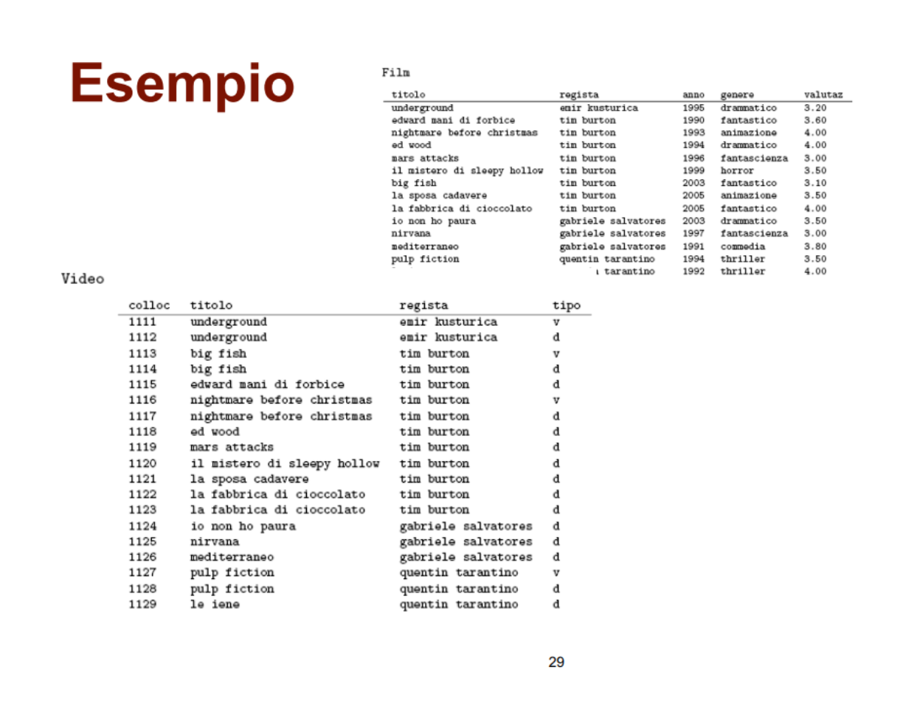
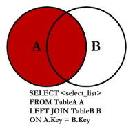

# Big Data Analytics

## Lezione 9/2/26 - Ripasso introduttivo

La resilienza degli RDD si può spiegare introducendo due famiglie di operazioni in Spark:
1. trasformazioni
2. azioni

Una trasformazione in Spark è un'operazione che a partire da un RDD crea un altro RDD. Si parla di operazioni immutabili, quindi una trasformazione non causa modifiche alla struttura originale (ad esempio il metodo .select() fa a tutti gli effetti una trasformazione). Le trasformazioni in Spark sono sempre indicizzate, ovvero a ogni RDD è associato un lineage (la sequenza di operazioni che portano alla formazione di quel RDD).

La proprietà fondamentale delle trasformazioni in Spark è che sono **lazy-evaluated** ovvero Spark di base esegue le trasformazioni solo quando servono (in altre parole solo quando vengono chieste esplicitamente, attraverso le azioni).

Le **azioni** sono tutte le operazioni che permettono di ottenere un risultato, per esempio la funzione .count().

Quindi avere un lineage associato a ogni trasformazione garantisce resilienza (in caso di errori posso ripercorrere all'indietro la costruzione del dato per garantire **fault-tolerance**). 

Abbiamo due tipi di trasformazioni:
- **narrow**: input e output sono nella stessa partizione, quindi no data movement (per esempio map e filter)
- **wide**: è necessario pescare input da altre partizioni e quindi i data necessariamente vengono mischiati prima del processing (per esempio groupBy, join e distinct). L'operazione di trasferimento dati tra partizioni prende il nome di *shuffle* ed è un'operazione pesante perchè genera traffico sul cluster di nodi.
---
Vediamo ora come viene organizzata un'applicazione Spark proprio sul piano di esecuzione.

Un'applicazione viene inizialmente divisa in una serie di job, una serie di operazioni generate in risposta a una determinata azione.
I job creano a loro volta una serie di operazioni chiamate Stage, che sono operazioni eseguibili senza shuffle. Se eseguo una nuova trasformazione wide, genero pertanto un nuovo stage. A loro volta infine gli stage sono composti da una serie di task che sono le unità elementari da eseguire sugli executor del cluster.

## Lezione 16/2/26

In Spark possiamo fare tutte le join, comprese `LEFT/RIGHT` e `ANTI JOIN`. Inoltre è possibile fare anche la semi-join, un tipo di join che restituisce tutte le tuple della tabella di sinistra per cui vi è un match con la tabella di destra. A differenza della `INNER JOIN` dove se una tupla della tabella A ottiene match con 10 righe della tabella B otteniamo 10 righe, nella `SEMI JOIN` otterremmo solo una volta la riga della tabella A.

Vediamo ora come funzionano le join in Spark dietro le quinte.

La prima tecnica, più semplice ma poco efficace é **Nested Loop Join**. 
Questa tecnica prevede di fare sostanzialmente due for innestate e verificare la condizione di join a ogni iterazione.
Lo svantaggio qui risiede nella complessità che è $O(n \times m)$

Una seconda opzione, piú performante, è la **Sort Merge Join**. Tale tecnica richiede un pre-requisito fondamentale, la chiave di join dev'essere ordinabile. Una volta che abbiamo ordinato le chiavi dei due dataset, andiamo a eseguire la join. Quest'ultima prevede che se ottengo match, allora vado avanti, ma se trovo una chiave con un id di valore maggiore, mi fermo (inutile andare avanti, sono ordinate). Quindi passo al record successivo della tabella *Outer* confrontandolo a partire dal primo record della tabella *Inner* in cui ho avuto un *mismatch*.

In questo caso la complessità è:
- ordinamento costo $O(n \times log n)$
- merge costo $(m + n)$ in quanto scan lineare

Questa tecnica si presta bene per range join (<,>, <=, =>)

Terza tecnica è l'**Hash join**.

Questa tecnica prevede di selezionare una *Probe Table* e una *Build Table*. A partire dalla Build Table, viene creata una tabella di hash dove andiamo a calcolare l'hash rispetto alla chiave di join, per ogni chiave, salvando la chiave in chiaro e il digest associato.

Da qui in poi useremo questa tabella per fare la join. Quindi ora si procede a prendere la Probe Table e per ogni chiave della Probe andiamo a cercare un match nella hash table. Se si verifica un match si memorizza il valore hash al risultato finale a cui corrispondono i risultati.

Le hash join hanno un vincolo importante, ovvero che le hash table sono allocate in memoria principale, e devo avere abbastanza memoria per storarla. Quindi solitamente si sceglie una *Build Table* a partire dalla piú piccola.

La complessità è lineare, costo di costruzione della hash table $O(m)$ e costo della scansione dellla probe $O(n)$, quindi $O(m+n)$.

Se non abbiamo sufficiente spazio in memoria per costruire una Hash table, possiamo andare a scrivere una parte di hash table su disco dove posso fare una lookup su disco (molto lento poiché si esegue un *random access* su disco). In questi casi quindi la Sort Merge risulta essere piú robusta. 

Confronto tra le varie tecniche:

