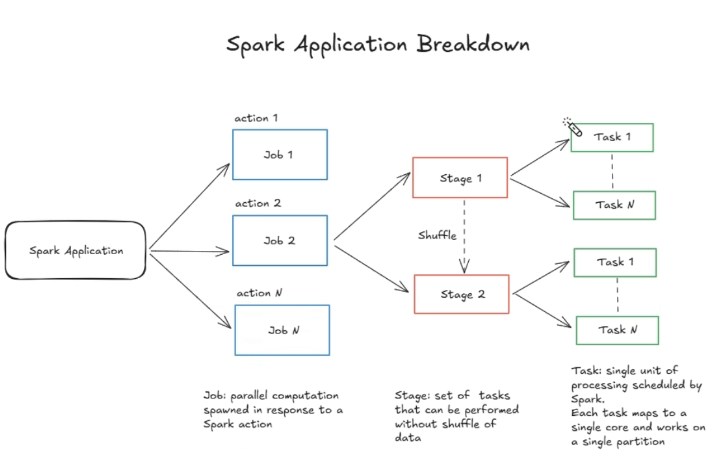
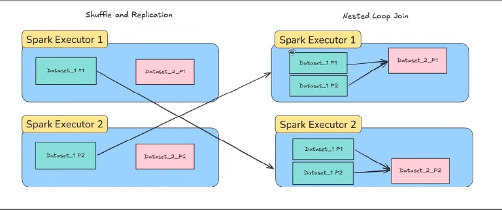

# Big Data Analytics

## Lezione 9/2/26 - Ripasso introduttivo
In un sistema distribuito di elaborazione dati, l'elaborazione avviene in un cluster che è un gruppo di nodi (solitamente seguendo un'architettura master-slave) che comunicano fràdi loro per produrre il risultato richiesto. Operando in un cluster non si ha più un blocco monolitico di dati ma quest'ultimi vengono partizionati e distribuiti fra i vari cluster. Un esempio di applicazione di elaborazione dati in modo distribuito è **Spark**.

Spark viene usato in particolare:
- per la sua efficienza in quanto lavora in memoria RAM e non su disco
- per la sua semplicità
- ampiamente modulare perchè supporta svariati linguaggio come Python (PySpark), Java, SQL etc...

Ora vediamo l'architettura Spark.

L'applicazione Spark una volta eseguita genera uno **Spark Driver**, un processo responsabile dell'organizzazione delle operazioni da eseguire sul cluster. Nel dettaglio viene generata una **Spark Session** ovvero il punto d'ingresso dell'API di Spark. 
Abbiamo poi un **Cluster Manager** responsabile della gestione e orchestrazione del cluster (allocazione di risorse, tracking dei job e dello stato). Ogni nodo, che riceve vari task, prende il nome di **Worker Node** dove viene allocato uno **Spark Executor** (dove solitamente si alloca un task per *core*).

In Spark sono supportate principalmente tre tipologie di strutture di dati:
- RDD (Resilient Distributed Dataset), una collezione di dati distribuiti e partizionati in memoria
- Dataframe sono un'astrazione più elevata degli RDD, in quanto sono dotati di schema a differenza degli RDD che sono dati non strutturati
- Dataset

La resilienza degli RDD si può spiegare introducendo due famiglie di operazioni in Spark:
1. trasformazioni
2. azioni

Una trasformazione in Spark è un'operazione che a partire da un RDD crea un altro RDD. Si parla di operazioni immutabili, quindi una trasformazione non causa modifiche alla struttura originale (ad esempio il metodo .select() fa a tutti gli effetti una trasformazione). Le trasformazioni in Spark sono sempre indicizzate, ovvero a ogni RDD è associato un *lineage* (la sequenza di operazioni che portano alla formazione di quel RDD).

La proprietà fondamentale delle trasformazioni in Spark è che sono **lazy-evaluated** ovvero Spark di base esegue le trasformazioni solo quando servono (in altre parole solo quando vengono chieste esplicitamente, attraverso le azioni).

Le **azioni** sono tutte le operazioni che permettono di ottenere un risultato, per esempio la funzione .count().

Quindi avere un *lineage* associato a ogni trasformazione garantisce resilienza (in caso di errori posso ripercorrere all'indietro la costruzione del dato per garantire **fault-tolerance**). 

Abbiamo due tipi di trasformazioni:
- **narrow**: input e output sono nella stessa partizione, quindi no *data movement* (per esempio map e filter)
- **wide**: è necessario pescare input da altre partizioni e quindi i data necessariamente vengono mischiati prima del processing (per esempio groupBy, join e distinct). L'operazione di trasferimento dati tra partizioni prende il nome di *shuffle* ed è un'operazione pesante perchè genera traffico sul cluster di nodi.
  

Vediamo ora come viene organizzata un'applicazione Spark proprio sul piano di esecuzione.

Un'applicazione viene inizialmente divisa in una serie di *job*, una serie di operazioni generate in risposta a una determinata azione.
I job creano a loro volta una serie di operazioni chiamate *Stage*, che sono operazioni eseguibili senza shuffle. Se eseguo una nuova trasformazione wide, genero pertanto un nuovo stage. A loro volta infine gli stage sono composti da una serie di task che sono le unità elementari da eseguire sugli executor del cluster.

## Lezione 16/2/26

In Spark possiamo fare tutte le join, comprese `LEFT/RIGHT` e `ANTI JOIN`. Inoltre è possibile fare anche la semi-join, un tipo di join che restituisce tutte le tuple della tabella di sinistra per cui vi è un match con la tabella di destra. A differenza della `INNER JOIN` dove se una tupla della tabella A ottiene match con 10 righe della tabella B otteniamo 10 righe, nella `SEMI JOIN` otterremmo solo una volta la riga della tabella A.

Vediamo ora come funzionano le join in Spark dietro le quinte.

La prima tecnica, più semplice ma poco efficace é **Nested Loop Join**. 
Questa tecnica prevede di fare sostanzialmente due for innestate e verificare la condizione di join a ogni iterazione.
Lo svantaggio qui risiede nella complessità che è $O(n \times m)$

Una seconda opzione, piú performante, è la **Sort Merge Join**. Tale tecnica richiede un pre-requisito fondamentale, la chiave di join dev'essere ordinabile. Una volta che abbiamo ordinato le chiavi dei due dataset, andiamo a eseguire la join. Quest'ultima prevede che se ottengo match, allora vado avanti, ma se trovo una chiave con un id di valore maggiore, mi fermo (inutile andare avanti, sono ordinate). Quindi passo al record successivo della tabella *Outer* confrontandolo a partire dal primo record della tabella *Inner* in cui ho avuto un *mismatch*.

In questo caso la complessità è:
- ordinamento costo $O(n \times log n)$
- merge costo $(m + n)$ in quanto scan lineare

Terza tecnica è l'**Hash join**.

Questa tecnica prevede di selezionare una *Probe Table* e una *Build Table*. A partire dalla Build Table, viene creata una tabella di hash dove andiamo a calcolare l'hash rispetto alla chiave di join, per ogni chiave, salvando la chiave in chiaro e il digest associato. L'idea è avere tutti gli stessi record con la stessa chiave assieme. 

Da qui in poi useremo questa tabella per fare la join. Quindi ora si procede a prendere la Probe Table e per ogni chiave della Probe andiamo a cercare un match nella hash table. Se si verifica un match si memorizza il valore hash al risultato finale a cui corrispondono i risultati.

Le hash join hanno un vincolo importante, ovvero che le hash table sono allocate in memoria principale, e devo avere abbastanza memoria per storarla. Quindi solitamente si sceglie una *Build Table* a partire dalla piú piccola.

La complessità è lineare, costo di costruzione della hash table $O(m)$ e costo della scansione dellla probe $O(n)$, quindi $O(m+n)$.

Se non abbiamo sufficiente spazio in memoria per costruire una Hash table, possiamo andare a scrivere una parte di hash table su disco dove posso fare una lookup su disco (molto lento poiché si esegue un *random access* su disco). In questi casi quindi la Sort Merge risulta essere piú robusta. 

Confronto tra le varie tecniche:

## Lezione 25/2/26 - Tipologie di Join in pratica
Facciamo dei piccoli ragionamenti sulle cardinalità che otteniamo dalle join per poter comprendere e capire le varie casistiche. 

Immaginiamo di avere due tabelle:

Tabella A

| Col1   | Col2  |
| ------ | ----- |
| 1 | a |
| 2 | b |
| 3 | c |
| 4 | d |

Tabella B

| Col1   | Col2  |
| ------ | ----- |
| 1 | a |
| 1 | b |
| 2 | c |
| 3 | c |
| 3 | c |

- Se eseguiamo una `INNER JOIN` su chiave Col1 il numero di record restituiti sarà pari a 5 (abbiamo solamente 5 match)
- Se eseguiamo una `A LEFT JOIN B` su chiave Col1 il numero di record restituiti sarà 6 (la left restituisce il risultato della inner più tutti i record di sinistra che non hanno match completati con null)
- Se eseguiamo una `A RIGHT JOIN B` su chiave Col1 il numero di record restituiti sarà 5 (equivale a una inner)

Se ora immaginiamo invece di non avere informazioni su Col1 e quindi non sappiamo i valori delle chiavi, analizziamo la seguente tabella che restituisce il numero minimo e massimo di record restituibili in base al tipo di join:

| Tipo di join   | Numero minimo  | Numero massimo  |
| ------ | ----- | ----- |
| INNER JOIN | 0 | 4x5=20  |
| LEFT JOIN | 4 |  4x5=20  |
| RIGHT JOIN | 6 |  4x5=20 |
| FULL OUTER JOIN | 6 | 4x5=20 |

Questi esempi valgono se consideriamo che una chiave ammette duplicati (altamente improbabile ma possibile).

Tutte hanno come numero massimo 20 in quanto questo è il caso in cui la tabella A contiene record dove tutti hanno la stessa ed unica chiave e che ciò avvenga anche nella tabella B a parità di chiave. In questo caso, ogni record di A trova match con tutti i record di B e quindi coincide con il prodotto cartesiano delle due cardinalità.

Nel caso di:
- `INNER JOIN` il numero minimo è 0 in quanto non avremmo alcun match
- `LEFT JOIN` il numero minimo è 4 in quanto la tabella di sinistra comanda 
- `RIGHT JOIN` il numero minimo è 6 in quanto la tabella di destra comanda 
- `FULL OUTER JOIN` il numero minimo è 6 perchè la full outer deve garantire l'esistenza di tutte le righe, sia che hanno match e sia che alcune siano completate con null. Non può dare meno di 4 record perchè perderemmo alcuni record della tabella A e non meno di 6 record altrimenti perderemmo alcuni record della tabella B. Di conseguenza il minimo è dettato da 6. 

Se invece ci poniamo in una condizione in cui le chiavi non ammettono valori duplicati la tabella si aggiorna in:

| Tipo di join   | Numero minimo  | Numero massimo  |
| ------ | ----- | ----- |
| INNER JOIN | 0 | 4  |
| LEFT JOIN | 4 |  4 |
| RIGHT JOIN | 6 | 6 |
| FULL OUTER JOIN | 6 | 10 |

Vediamo come funzionano gli algoritmi visti la scorsa lezione ma in Spark. Quando siamo in Spark le tabelle sono partizionate e inviate ai diversi nodi del cluster quindi va fatto uno step aggiuntivo, ovvero la fase di shuffle dove mescoliamo secondo la chiave di join. Vediamo un esempio errato di join in Spark senza shuffle:

Esempio con shuffle dove i due nodi cooperano per trasferisi i dati e ripartizionare i propri dataset:

Vediamo ora come funzionano nel dettaglio gli algoritmi di join in Spark. Spark in primis grazie al suo ottimizzatore cerca sempre di applicare la strategia migliore possibile, quindi la dove possibile applica **Broadcast Hash Join**.

Questo tipo di join, applicata quando metto in join una tabella piccola e una tabella grande, prevede che lo Spark Driver invia questa piccola tabella e la invia in copia ai vari Spark Executor, i quali hanno una partizione del dataset più grande e quindi fanno una *lookup* con la tabella piccola ricevuta evitando shuffle. Il vantaggio è che rimuoviamo il collo di bottiglia ottenuto solitamente con lo shuffle mentre lo svantaggio è la tabella "piccola" non sia sufficientemente piccola per essere memorizzata in memoria. Questo problema può essere risolto modificando la property `spark.sql.autoBroadcastJoinThreshold` che determina il peso massimo della tabella inviata in broadcast, di default a 10 Megabyte.

Un secondo tipo di join Spark è la **Shuffle Hash Join**, applicata nel caso in cui la broadcast non possàessere eseguita. In prima battuta si fa shuffle quindi si riorganizzano le partizioni in modo tale da avere le chiavi necessarie sulle rispettive partiizoni. Successivamente si compone l'hash table sul dataset più piccolo e poi si esegue la lookup a partire dal dataset più grande verso l'hash table. Si hanno sempre i vantaggi dell'hash join ma analogamente gli stessi svantaggi, ovvero avere una tabella troppo grande per calcolarci sopra l'hash table.

Un terzo tipo di join Spark è invece la **Shuffle Sort Merge Join**.

In questo caso si esegue:
- shuffle sulle varie partizioni
- poi si esegue una sort sulla chiave di join su ogni partizione locale
- infine si esegue una merge join su ciascuno Spark Executor e infine si uniscono i risultati

Ovviamente valgono le stesse considerazione della **Sort Merge Join**, quindi chiave ordinabile, ed è più efficiente delle altre tecniche perchè facendo una sort evito confronti inutili. Quindi solitamente si usa quando abbiamo dataset abbastanza grandi da *joinare*.

C'è in Spark poi una preferenza imnpostata a `True` di default che imposta questa tecnica come strategia preferita, chiamata: `spark.sql.join.preferSortMergeJoin (default True)`.

Infine abbiamo la **Shuffle and Replicate Nested Loop Join (Cartesian Product)**, ovvero una Nested Loop Join dove prima vi è una fase di shuffle and replicate. Mentre nella broadcast hash join andavamo a inviare (da parte del Driver) una copia del dataset più piccolo, in questo caso inviamo tutte le partizioni ai vari Spark Executor (partizioni potenzialmente di grandi dimensioni).

Ovviamente questa tecnica porta a un rapido degrado delle performance in quanto estremamente intensiva a livello di memoria. Inoltre l'unico caso in cui questa tecnica viene applicata è quando non eseguiamo una equi-join.  

Di seguito possiamo vedere come avviene la scelta da parte di Spark della tecnica di Join da utilizzare:

Nel caso di `Hint in Join` Spark controlla se vengono forniti dei consigli da seguire per eseguire le varie tecniche di join.

In assenza di specifici *hint*, Spark seleziona la strategia di join seguendo questa gerarchia decisionale:

1.  **Broadcast Hash Join (BHJ)**:
    *   Applicata se almeno una delle due tabelle è sufficientemente piccola da poter essere inviata in broadcast a tutti i nodi.

2.  **Shuffle Hash Join o Sort Merge Join**:
    *   Se il broadcast non è possibile, Spark controlla il parametro `spark.sql.join.preferSortMergeJoin`:
        *   **Shuffle Hash Join**: Eseguita se il parametro è impostato a `False`.
        *   **Sort Merge Join (SMJ)**: Eseguita se il parametro è `True` e le chiavi di join sono ordinabili.

3.  **Shuffle and Replicate Nested Loop (Cartesian Product)**:
    *   Applicata come fallback se le condizioni precedenti non sono soddisfatte (spesso utilizzata per prodotti cartesiani).

4.  **Broadcast Nested Loop Join (BNLJ)**:
    *   L'ultima opzione disponibile, utilizzata in assenza di una *equi-join*.
    *   **Funzionamento**: È una versione più onerosa della broadcast hash join; i dataset vengono copiati su ogni executor per eseguire una lookup completa sull'altro dataset.
  
In presenza di *hint*, ovvero strategie che noi forniamo a Spark per la scelta della join, si segue questo processo decisionale:
1. Forniamo un *hint* per applicazione della Broadcast hash join allora si esegue una  **Broadcast Hash Join (BHJ)**
2. Forniamo un *hint* per applicazione della Shuffle hash allora si esegue una  **Shuffle Hash Join**
3. Forniamo un *hint* per applicazione della Sort Merge Join allora si esegue una  **Sort Merge Join**
4. Forniamo un *hint* per applicazione della Shuffle and Replicate Nested Loop allora si esegue una  **Shuffle and Replicate Nested Loop**

Quanto visto vale per join di tipo *equi-join*. Nel caso in cui abbiamo qualcosa che non sia una *equi-join*, andiamo a scegliere solo tra Broadcast Hash Join e Shuffle and Replicate Nested Loop in quanto Shuffle Hash, Sort Merge e Broadcast Nested Loop non sono applicabili.