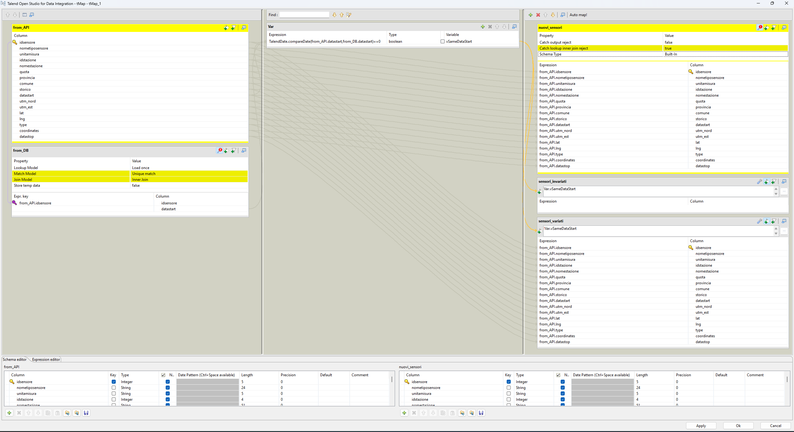
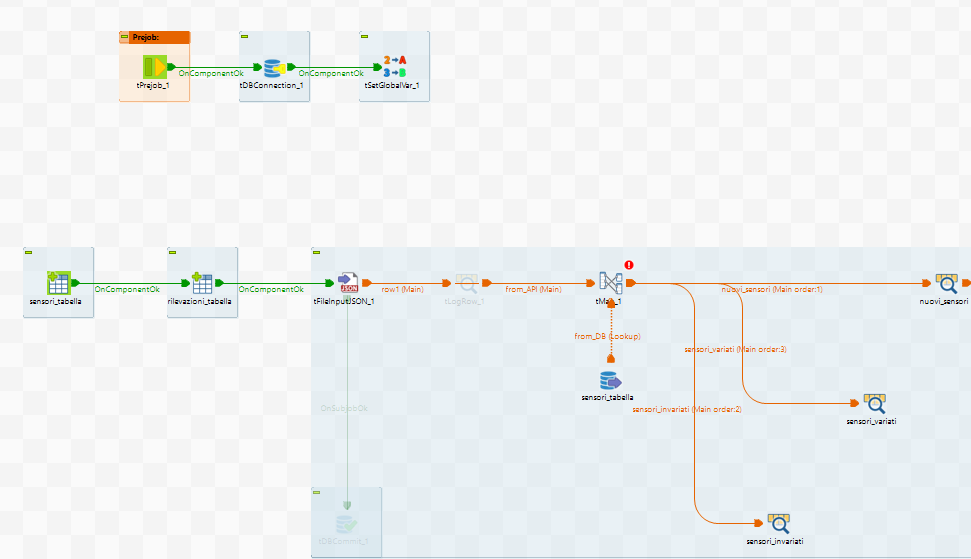
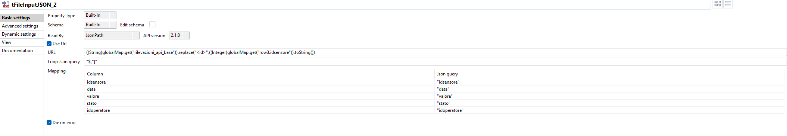
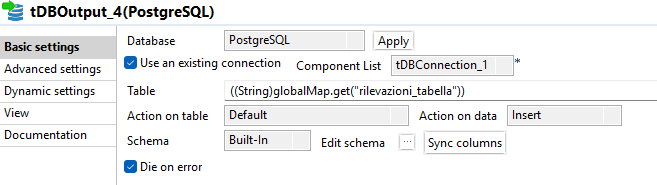

# Data Integration

## Esercizi Riassuntivi

### <u> Ese 1 </u>

**Creare nel repository Talend i metadati relativi al file Employees.txt.**

Per poter creare dei metadati per prima cosa andiamo nella sezione Repository -> Metradata -> File Delimited. Successivamente creaiamo un nuovo file delimited, fornendo un nome significativo, un path al file, formato Unix.

Alla schermata successiva specifichiamo:
- enconding UTF-8
- field separator (nel nostro caso "," ma dipende dal tipo di file .csv)
- row separator "Standard End Of Line"
- row to skip spuntiamo header con valore 1 (significa che ignoriamo l'header che si trova in riga 1)

Importante ora é il setting dell'escape char. Siccome siamo in un contesto Java con file CSV dobbiamo selezionare opzione per CSV file, inserendo:

- Escape char "\ "" (usiamo il \" come in Java per gli escape character)
- Text enclosure "\ "" (nel nostro caso ogni stringa nel file è racchiusa tra doppi apici. In questo modo ci assicuriamo che Talend legga il testo escludendo gli apici che lo racchiudono)

Clicchiamo su refresh preview per un cross-check, e se otteniamo un risultato simile a come lo otterremo su Excel, è tutto corretto.


---

### <u> Ese 2 </u>

**Utilizzando i metadati definiti nell'esercizio 1, leggere il file Employees.txt e stamparne a video il contenuto.**

Per l'esercizio 2, dobbiamo realizzare per prima cosa un Job, cliccando con tasto destro su Job Designs e creando un nuovo Job (assegnandogli un nome significativo).

Successivamente possiamo inserire nel job due elementi, recuperabili in due modi:
1. Trascinandoli dalla palette di lato (dopo averli cercati dalla barra di ricerca)
2. Cliccare sulla scacchiera centrale e digitare direttamente il nome del componente.

I componenti necessari sono:

- tFileInputDelimited che rappresenta il nostro file csv da leggere in input
- tLogRow che fornisce la possibilità di stampare a video un log (report)

Questi due componenti però devono dialogare, di conseguenza necessitano di essere collegati. In Talend si hanno due tipi di collegamenti:
- row, che consente di trasferire un flusso dati (Data flow)
- trigger, che consente di trasferire un flusso di controllo (Control flow)

Nel nostro caso, possiamo collegare tFileInputDelimited al tLogRow semplicemente tirando la riga arancione da sx a dx. In questo caso inseriamo una row Main che trasferisce il contenuto dal componente a monte al componente a valle, in un unico flusso.

Ora passiamo a configurare il tFileInputDelimited.

Poichè esso rappresenta il file di input, andiamo a fare un dobbio click sul componente e selezioniamo la schermata "Component". Da qui:

- "Schema" = Repository
- selezioniamo il primo ... per selezionare lo schema creato nell'esercizio due (andiamo in file delimited >  "nome del file" > metadata). Se viene chiesto di propagare le modifiche, diciamo di sì, in questo modo verranno applicate anche al tLogRow. Per verificare, clicchiamo Edit Schema, se tutto coincide facciamo cancel
- File name/Stream = path/to/file.csv
- Spuntiamo CSV options, inserendo escape char e text enclosure come indicato nell'ese 1, e header = 1. Infine spuntiamo "Die on error" e togliamo la spunta da "Skip empty rows".

Rimamnendo sempre sulla scheda Component, selezioniamo "Advanced Settings" e modifichiamo l'enconding in UTF-8.

Ora passiamo a configurare il componente TLogRow. 

Sempre dalla scheda Component clicchiamo "Edit schema" e possiamo notare come a sx abbiamo lo schema di ingresso (tutte le colonne) mentre a dx abbiamo lo schema di output. Possiamo selezionare, a nostro piacimento per esempio, di voler in output solo uno o più campi, ma per il momento li lasciamo tutti e clicchiamo cancel.

Nella scheda Component, mettiamo il radio button su Mode = Table, in questo modo la stampa avrà un aspetto tipo tabella.

Terminato tutto possiamo andare nella scheda Run e cliccare "Run" per eseguire il job.


### <u> Ese 3 </u>

**Utilizzando i metadati definiti nell'esercizio 1, leggere il file Employees.txt e generare come output un file csv con header avente lo stesso tracciato del file originario ma come delimitatore per le colonne il carattere ';'**

Per la realizzazione dell'esercizio é necessario utilizzare due componenti:
1.  tFileInputDelimited, che rappresenta il file di input CSV da leggere
2.  tFileOutputDelimited, che rappresenta il file di output CSV in cui scriveremo.

La configurazione del tFileInputDelimited avviene come fatto precedentemente, sfruttando i metadata creati nell'esercizio 1 e inserendo le modifiche necessarie nella scheda Component.

Per quanto riguada la configurazione del tFileOutputDelimited é necessario:
- configurare il *File Name* inserendo il percorso assoluto di dove salveremo il file di output (e.g "C:/Program Files (x86)/TOS_DI-8.0.1/studio/workspace/out.csv")
- inseriamo come *Field Separator* il valore ";"
- togliere la spunta da 'Use OS line separator as row separator ...'
- spuntare *Include Header* in quanto vogliamo mantenere come prima riga l'intestazione del file
- infine come cross-check clicchiamo su 'edit schema' per controllare che lo schema è stato importato correttamente.
  
Successivamente andiamo nella schermata *Advanced Settings* dove:
- abilitiamo *CSV options* e inseriamo i soliti valori per *Escape char* e *Text enclosure*
- spuntiamo *Create directory if does not exist*
- selezioniamo 'UTF-8' come *Encoding*.
- togliamo la spunta da *Throw an error if the file already exist*.


## Esercizi API

### <u> Ese 1 </u>
TODO

### <u> Ese 2 </u>

**Realizzare un job che crei due tabelle 'anagrafica_sensori' e 'rilevazioni_sensori' utilizzando le seguenti API:**\

anagrafica sensori -> https://www.dati.lombardia.it/resource/ib47-atvt.json?$where=datastart>'2015-01-01T00:00:00.000' 

rilevazioni per sensore ->  https://www.dati.lombardia.it/resource/nicp-bhqi.json?$limit=10&$where=idsensore= '< id >'

**L'integrazione deve essere fatta nel seguente modo: interrogare l'API dell'anagrafica, nel caso in cui essa restituisca un sensore che non è presente nella tabella di anagrafica, aggiungere il record alla tabella, poi scaricare le rilevazioni per quel sensore interrogando l'API delle rilevazioni e salvarle nella tabella delle rilevazioni. Per quei sensori che invece sono già presenti nella tabella di anagrafica bisogna effettuare un controllo sulla data start per capire se il record sia stato aggiornato o meno (stiamo ipotizzando che in caso ci sia una variazione su un sensore, l'API dell'anagrafica restituirà per quel sensore un record con data start più recente e che le vecchie rilevazioni per quel sensore saranno da considerare non più valide). Nel caso in cui la data start del record restituito dall'API coincida con quella del record presente in tabella non deve essere effettuata alcuna modifica, altrimenti aggiornare il record nella tabella di anagrafica con i nuovi valori restituiti dall'API, cancellare le rilevazioni presenti per quel sensore dalla tabella delle rilevazioni e salvare nella tabella delle rilevazioni le nuove rilevazioni per quel sensore, ottenute interrogando l'API delle rilevazioni.  
Prima di procedere con la realizzazione del job, disegnare il flow-chart, tenendo in considerazione le varie problematiche che si possono riscontrare.**

Per la realizzazione dell'esercizio necessitiamo in prima battuta dei seguenti componenti:

- tPrejob
- tDbConnection
- tSetGlobalVar
- tCreateTable_1
- tCreateTable_2
- tFileInputJson
- tDbCommit

Procediamo a impostare il tDBConnection selezionando come database *PostgreSQL* e trascinando sul component il metadato relativo alla connessione DB. 
Successivamente colleghiamo il tPrejob al tDbConnection, che a sua volta risulterà collegato al tSetGlobalVar (tutti con collegamento *OnComponentOk*).

Passiamo ora a realizzare i metadati del file json dell'anagrafica e delle rilevazioni (per semplicità prendiamo le rilevazioni del sensore 20104).
Dopo aver creato il metadato in Repository > File Json, in ultima battuta ci viene chiesto di specificare lo schema. Per il file dei sensori il risultato dovrà essere il seguente (importante rimuovere gli *underscore* da Column Name "coordinates__"):


Importante spuntare *idsensore* come chiave e impostare *datastart* e *datastop* in tipo Date con formato "yyyy-MM-dd'T'HH:mm:ss.SSS":


Mentre per quanto riguarda le rilevazioni (campo *idsensore* e *data* sono chiave e data ha il formato precedentemente indicato):


Successivamenten configuriamo il componente tSetGlobalVar, che dovrà avere la seguente configurazione


Procediamo ora a configurare i tCreateTable, dove andiamo a specificare che usiamo Postgresql, di usare una connessioine esistente (selezionandola) e come *Table Action: Create table if not exists". Trasciniamo poi la variabile *sensori_tabella* nel campo *Table Name* e trasciniamo lo schema *sensori_api_schema*.


Analogamente facciamo per l'altro tCreateTable:


Procediamo ora a configurare il tFileInputJSON, dove andiamo a trascinare lo schema *sensori_api_schema* sul componente, spuntiamo *Use Url* e trasciniamo la variabile globale *sensori_api* e infine spuntiamo l'ultima voce *Die on error*. Risultato:


Infine colleghiamo i componenti nel seguente modo:


Eseguendo poi il job possiamo notare se tutto quanto è ok. Se le configurazioni sono state eseguite correttamente, nel database avremo due nuove tabelle, vuote ma con lo schema che rispecchia la nostra API.

Ora procediamo a configurare l'ultima parte dell'esercizio inserendo:
- tMap
- tDbCommit
- tDbInput
- tDbOutput x4
- tFlowToIterate x2
- tDbRow
- tFileInputJSON x2
- tLogRow x2

Per prima cosa colleghiamo il tMap al precedente tLogRow e  un tDbInput, entrambi con collegamento *Main*. Questo oggetto ci serve per dividere il flusso in input in più flussi di output. Nel dettagio il tMap otterrà in input il flusso JSON dell'anagrafica tramite richiesta API correttamente parsato (chiameremo questo flusso *from_API*) e il flusso di dati provenienti dall'interrogazione del database (chiameremo questo flusso *from_DB*), mentre in output dobbiamo ottenere 3 flussi:
1. flusso dati per i sensori già presenti e invariati (*datastart* coincide). Chiameremo questo flusso *sensori_invariati*
2. flusso dati per i sensori già presenti ma variati (*datastart* non coincide). Chiameremo questo flusso *sensori_variati*
3. flusso dati per sensori non ancora presenti. Chiameremo questo flusso *nuovi_sensori*.

Configuriamo ora il tDbInput (chiamato *sensori_tabella*) dove andiamo a specificare che usiamo PostgreSQL e una connessione pre-esistente. Successivamente selezioniamo *schema_sensori_api* dal repository e lo trasciniamo sul tDbInput. Successivamente facciamo *Guess query*, in questo modo Talend genera una ```SELECT * FROM <tabella>``` esplicitando tutti i campi. Modifichiamo poi la query affinché risulti in questo modo:
```sql
"SELECT 
  idsensore,
  datastart
FROM "+((String)globalMap.get("sensori_tabella"))
```
e modifichiamo lo schema del tDbInput lasciando solo i campi *idsensore* e *datastart*, in modo che coincidano col risultato della query.

Configuriamo ora il tMap in questo modo:


Possiamo notare che nuovi_sensori e sensori_variati hanno in output lo stesso schema di input, perché i nuovi sensori andranno salvati mentre i sensori variati, dovranno essere aggiornati (e non sappiamo cosa cambia oltre la datastart, quindi ci portiamo tutto), mentre i sensori invariati rimarranno tali.
Andiamo quindi a eseguire in input una *INNER JOIN* tra il campo *from_API.idsensore* e *from_DB.idsensore*. Nel flusso *nuovi_sensori* andiamo a indicare in *Catch lookup inner join reject = true*. Questa opzione permette di trasferire lo scarto della inner join verso questo flusso (ciò che non rispetta l'uguaglianza tra *idsensore*). Questa tecnica consente di implementare una *LEFT ANTI JOIN* in quanto eseguiamo una *INNER JOIN* tra i due flussi in input e preleviamo i record che non matchano (ma solo della tabella di sinistra, in quanto la master table è sempre quella che proviene dal flusso *Main* arancione non tratteggiato). Quindi ricapitolando, questa opzione consente di fare una lookup con LEFT ANTI JOIN, eseguendo una INNER JOIN e prelevando come scarto i record della tabella di sinistra che non matchano con quella di destra (a differenza della LEFT JOIN non vengono completati con NULL).

Infine realizziamo una variabile nel tMap che chiamiamo *vSameDataStart* di tipo *Boolean* e con la seguente espressione:
```java
TalendDate.compareDate(from_API.datastart,from_DB.datastart)==0 
```

Il metodo `compareDate` restituisce:
- 1 se la prima data è successiva alla seconda
- 0 se sono uguali
- -1 se la seconda data è successiva alla prima

Ora impostiamo la condizione `Var.vSameDate` sul flusso *sensori_invariati* e `!Var.vSameDate` sul flusso *sensori_variati*.

Ora colleghiamo tre tLogRow in uscita al tMap, nominando i flussi come all'interno del tMap e assegnando lo stesso nome anche ai tLogRow e colleghiamo il tDbCommit al primo tFileInputJson con collegamento *OnSubjobOk* ma che per il momento disattiviamo. Risultato:



Ora procediamo a configurare il primo ramo, *nuovi_sensori*. In questo caso dobbiamo collegare al tLogRow un tDbOutput, poiché dobbiamo salvare i nuovi sensori letti. Lo schema dovrebbe essere associato automaticamente (in caso negativo trasciniamo il solito *schema_sensori_api*) e specifichiamo la tabella su cui agire con azione *Insert*.


Colleghiamo al tDbOutput del flow *nuovi_sensori* il componente tFlowToIterate. Questo componente ci permette di passare da una logica di dataset a una logica di record. Più nel dettaglio, questo componente dichiara una chiave per ogni attributo del dataset di input e in base al record processato viene associato a quella chiave un valore pari al valore dell'attributo del record processato.

Quindi il flusso *nuovi_sensori* viene scritto nel database tramite tDbOutput e lo stesso flusso successivamente viene iterato record per record. Colleghiamo poi con un link *Iterate* il tFlowToIterate a un nuovo FileInputJSON che dovrà leggere il risultato delle rilevazioni di ciascun sensore.

Configuriamo il nuovo tFileInputJSON trasciando il metadato delle rilevazioni sull'oggetto e specificando l'endpoint delle rilevazioni modificato in questo modo:

```java
((String)globalMap.get("rilevazioni_api_base")).replace("<id>",((Integer)globalMap.get("row3.idsensore")).toString())
```



Infine colleghiamo un tDbOutput al tFileInputJSON che permetterà di scrivere le rilevazioni di ciascun sensore nella tabella.
Lo configuriamo come gli altri, prestando attenzione a inserire lo schema delle rilevazioni:


Ora passiamo a configurare il ramo *sensori_variati* per cui dobbiamo, per ogni sensore variato, aggiornare l'anagrafica e aggiornare da zero lo storico delle rilevazioni. 

Per tanto procediamo a collegare al tLogRow un tDbOutput che eseguirà l'update della tabella *sensori_tabella*:


Successivamente ci colleghiamo un tFlowToIterate, il qualle sensore per sensore dovrà procedere a fare la richiesta all'API delle rilevazioni, per cui necessitiamo di un tdBRow e tFileInputJSON.


Il tDbRow conterrà:

```sql
"delete from " + ((String)globalMap.get("rilevazioni_tabella")) +
" where idsensore = " + ((Integer)globalMap.get("row6.idsensore")).toString()
```

in modo da eliiminare tutte le rilevazioni di quel sensore iterato e successivamente, quando il componente tDbRow é ok, e ha finito, procediamo a interrogare l'API rilevazioni, configurando il tFileInputJSON in questo modo:


e a collegare al tFileInputJSON un tDbOutput che farà la *insert* delle nuove rilevazioni.




Job completo:

