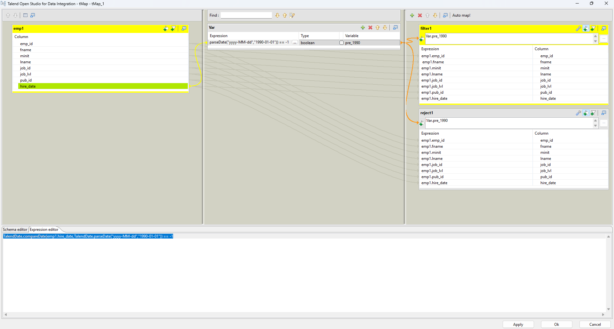
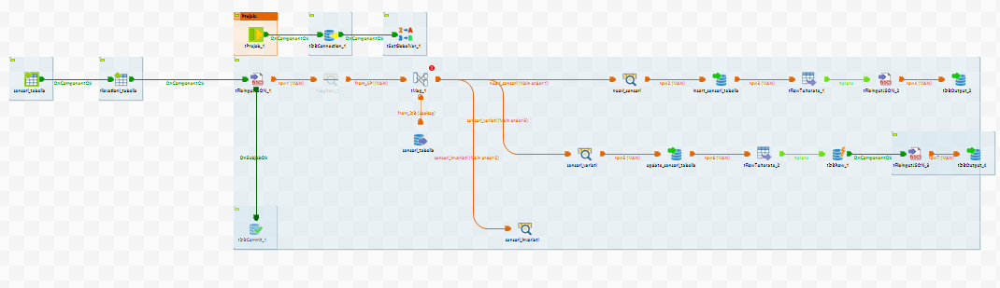
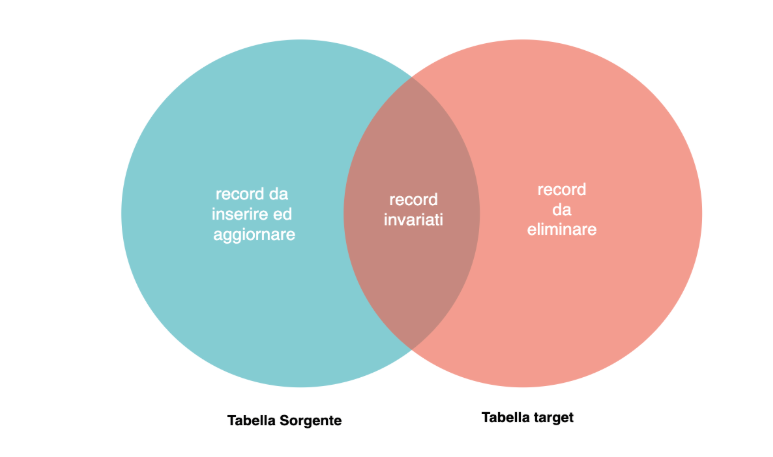
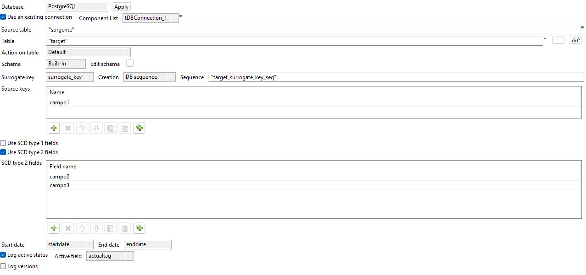
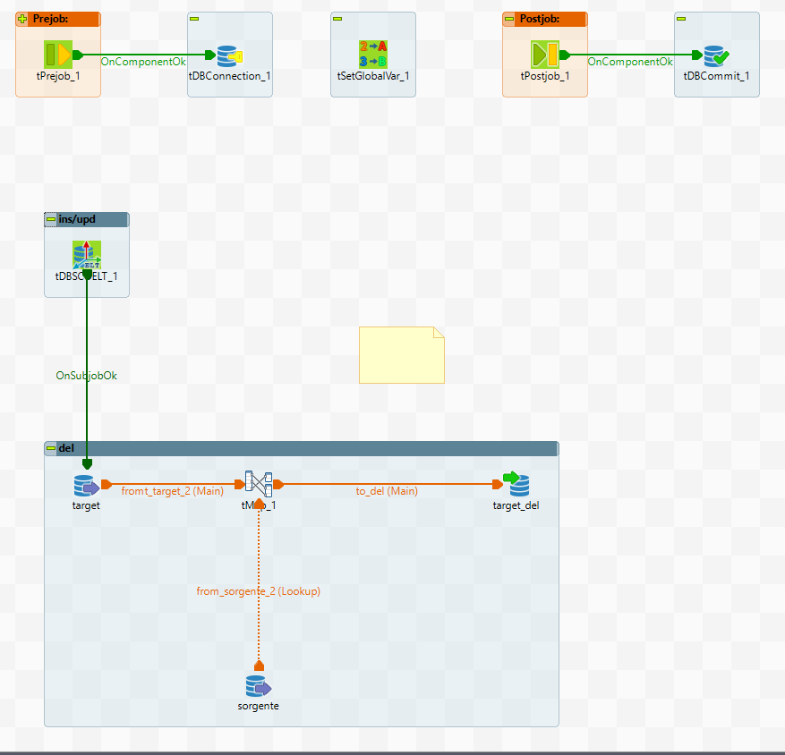
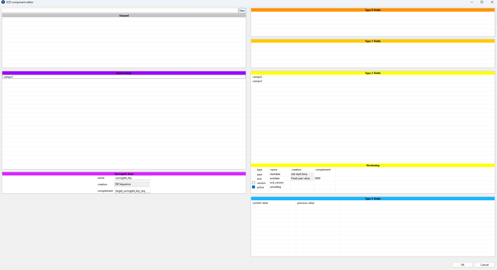
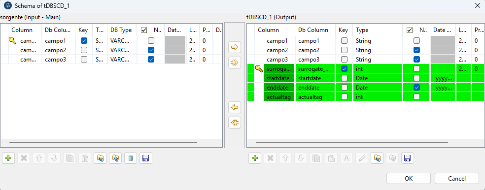
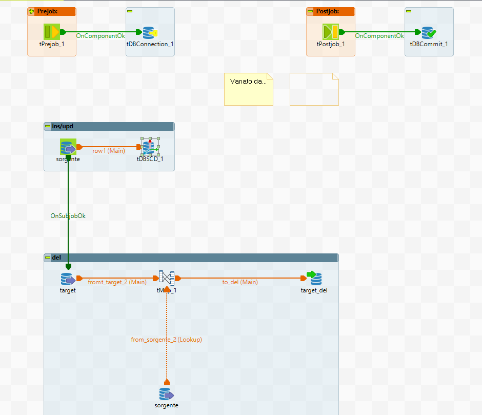

# Data Integration

## Esercizi Riassuntivi

### <u> Ese 1 </u>

**Creare nel repository Talend i metadati relativi al file Employees.txt.**

Per poter creare dei metadati per prima cosa andiamo nella sezione Repository -> Metradata -> File Delimited. Successivamente creaiamo un nuovo file delimited, fornendo un nome significativo, un path al file, formato Unix.

Alla schermata successiva specifichiamo:
- enconding UTF-8
- field separator (nel nostro caso "," ma dipende dal tipo di file .csv)
- row separator "Standard End Of Line"
- row to skip spuntiamo header con valore 1 (significa che ignoriamo l'header che si trova in riga 1)

Importante ora é il setting dell'escape char. Siccome siamo in un contesto Java con file CSV dobbiamo selezionare opzione per CSV file, inserendo:

- Escape char "\ "" (usiamo il \" come in Java per gli escape character)
- Text enclosure "\ "" (nel nostro caso ogni stringa nel file è racchiusa tra doppi apici. In questo modo ci assicuriamo che Talend legga il testo escludendo gli apici che lo racchiudono)

Clicchiamo su refresh preview per un cross-check, e se otteniamo un risultato simile a come lo otterremo su Excel, è tutto corretto.


---

### <u> Ese 2 </u>

**Utilizzando i metadati definiti nell'esercizio 1, leggere il file Employees.txt e stamparne a video il contenuto.**

Per l'esercizio 2, dobbiamo realizzare per prima cosa un Job, cliccando con tasto destro su Job Designs e creando un nuovo Job (assegnandogli un nome significativo).

Successivamente possiamo inserire nel job due elementi, recuperabili in due modi:
1. Trascinandoli dalla palette di lato (dopo averli cercati dalla barra di ricerca)
2. Cliccare sulla scacchiera centrale e digitare direttamente il nome del componente.

I componenti necessari sono:

- tFileInputDelimited che rappresenta il nostro file csv da leggere in input
- tLogRow che fornisce la possibilità di stampare a video un log (report)

Questi due componenti però devono dialogare, di conseguenza necessitano di essere collegati. In Talend si hanno due tipi di collegamenti:
- row, che consente di trasferire un flusso dati (Data flow)
- trigger, che consente di trasferire un flusso di controllo (Control flow)

Nel nostro caso, possiamo collegare tFileInputDelimited al tLogRow semplicemente tirando la riga arancione da sx a dx. In questo caso inseriamo una row Main che trasferisce il contenuto dal componente a monte al componente a valle, in un unico flusso.

Ora passiamo a configurare il tFileInputDelimited.

Poichè esso rappresenta il file di input, andiamo a fare un dobbio click sul componente e selezioniamo la schermata "Component". Da qui:

- "Schema" = Repository
- selezioniamo il primo ... per selezionare lo schema creato nell'esercizio due (andiamo in file delimited >  "nome del file" > metadata). Se viene chiesto di propagare le modifiche, diciamo di sì, in questo modo verranno applicate anche al tLogRow. Per verificare, clicchiamo Edit Schema, se tutto coincide facciamo cancel
- File name/Stream = path/to/file.csv
- Spuntiamo CSV options, inserendo escape char e text enclosure come indicato nell'ese 1, e header = 1. Infine spuntiamo "Die on error" e togliamo la spunta da "Skip empty rows".

Rimamnendo sempre sulla scheda Component, selezioniamo "Advanced Settings" e modifichiamo l'enconding in UTF-8.

Ora passiamo a configurare il componente TLogRow. 

Sempre dalla scheda Component clicchiamo "Edit schema" e possiamo notare come a sx abbiamo lo schema di ingresso (tutte le colonne) mentre a dx abbiamo lo schema di output. Possiamo selezionare, a nostro piacimento per esempio, di voler in output solo uno o più campi, ma per il momento li lasciamo tutti e clicchiamo cancel.

Nella scheda Component, mettiamo il radio button su Mode = Table, in questo modo la stampa avrà un aspetto tipo tabella.

Terminato tutto possiamo andare nella scheda Run e cliccare "Run" per eseguire il job.


### <u> Ese 3 </u>

**Utilizzando i metadati definiti nell'esercizio 1, leggere il file Employees.txt e generare come output un file csv con header avente lo stesso tracciato del file originario ma come delimitatore per le colonne il carattere ';'**

Per la realizzazione dell'esercizio é necessario utilizzare due componenti:
1.  tFileInputDelimited, che rappresenta il file di input CSV da leggere
2.  tFileOutputDelimited, che rappresenta il file di output CSV in cui scriveremo.

La configurazione del tFileInputDelimited avviene come fatto precedentemente, sfruttando i metadata creati nell'esercizio 1 e inserendo le modifiche necessarie nella scheda Component.

Per quanto riguada la configurazione del tFileOutputDelimited é necessario:
- configurare il *File Name* inserendo il percorso assoluto di dove salveremo il file di output (e.g "C:/Program Files (x86)/TOS_DI-8.0.1/studio/workspace/out.csv")
- inseriamo come *Field Separator* il valore ";"
- togliere la spunta da 'Use OS line separator as row separator ...'
- spuntare *Include Header* in quanto vogliamo mantenere come prima riga l'intestazione del file
- infine come cross-check clicchiamo su 'edit schema' per controllare che lo schema è stato importato correttamente.
  
Successivamente andiamo nella schermata *Advanced Settings* dove:
- abilitiamo *CSV options* e inseriamo i soliti valori per *Escape char* e *Text enclosure*
- spuntiamo *Create directory if does not exist*
- selezioniamo 'UTF-8' come *Encoding*.
- togliamo la spunta da *Throw an error if the file already exist*.


Terminato tutto possiamo andare nella scheda Run e cliccare "Run" per eseguire il job.

### <u> Ese 4 </u>

**Utilizzando i metadati definiti nell'esercizio 1, leggere il file Employees.txt e generare in uscita un file csv con header per i soli record aventi hire_date precedente al 01/01/1990. Mostrare invece a video quelli aventi hire_date successiva (o uguale) al 01/01/1990.**

Per la realizzazione di questo esercizio creeremo due versioni:
1. con il componentet **FilterRow**
2. con il componente **tMap**

La **soluzione** con il componente **tFilterRow** richiede i seguenti componenti:
- tFileInputDelimited
- tFilterRow
- tSortRow
- tFileOutputDelimited
- tLogRow
Per prima cosa configuriamo il *tFileInputDelimited* come fatto negli esercizi precedenti. Successivamente configuriamo il *tFilterRow* inserendo una condizione nella tabella *Conditions* dove specifichiamo:
- InputColumn = hire_date
- Function = Empty
- Operator = Lower than
- Value = `TalendDate.parseDate("yy-MM-dd","90-01-01")`
- Logical operator used to combine conditions: And (di fatto ignorato in questo caso perchè abbiamo solo una condizione, ma in caso di condizioni multiple verrebbero concatenate con un and logico)
In questo modo configuriamo una condizione di filtro sulla colonna `hire_date` applicando l'operatore `lower than` della classe delle funzioni sulle stringhe/date e specifichiamo che dev'essere inferiore al 1/1/1990 nel formato specificato.

Successivamente colleghiamo il *tFileInputDelimited* al *tFilterRow* che a sua volta avrà un collegamento di tipo *filter* al *tFileOutputDelimited* mentre con un collegamento di tipo *Reject* al *tSortRow*. In questo modo i record che soddisfano il predicato di filtro vengono inviati per la scrittura su file mentre quelli che non soddisfano il criterio di selezione vengono passati al sorter. 

Il *tFileOutputDelimited* dev'essere configurato come nell'esercizio 3. Il *tSortRow* richiede di configurare il criterio ordinamento, che nel nostro caso è:
- Schema column: `hire_date`
- sort num or alpha? : date
- order asc or desc? : asc
In questo modo specifichiamo che vogliamo ordinare il campo `hire_date` di tipo `date` in modo crescente.

Infine colleghiamo il `tSortRow` al `tLogRow` per poter stampare il contenuto ordinato a video.

Terminato tutto possiamo andare nella scheda Run e cliccare "Run" per eseguire il job.

La **soluzione** con il componente **tMap** è analoga alla precedente con un'unica differenza:
- inseriamo un componente tMap al posto del tFilterRow che dev'essere eliminato.

Il componente **tMap** è un componente polifunzionale perchè fornisce un numero elevato di settings per poter gestire/filtrare/modificare i flussi. Di fatti il tMap viene solitamente per prendere in input uno o più flussi, applicare logiche intermedie (join, filtraggio, mapping) e infine mappare gli input in uno o più flussi in output. Nel nostro caso il componente avrà un solo flusso in input ma due flussi in output (uno per i record che sono prima del 1 gennaio 1990 e uno per quelli dopo).

Per questo motivo possiamo notare:
- a sinistra abbiamo il flusso di input mentre sotto abbiamo il suo schema nello *schema editor*
- nella sezione centrale possiamo specificare delle variabili che possono essere utilizzati come valore di un nuovo campo o come criterio di selezione
- nella sezione di destra abbiamo i flussi di output e sotto i relativi schema.

Procediamo a creare un flusso di output chiamato *filter_1*. Successivamente facciamo 'Ctrl + a' sui campi del flusso di input e li trasciniamo interamente su filter_1. In questo modo stiamo dicendo che preso il flusso in input quest'ultimo verrà replicato sul flusso in output. Riapplichiamo la stessa logica su un secondo flusso di output chiamato *reject_1*. Per il momento abbiamo due flussi che sono identici e non si distinguono in alcun modo.
Ora dobbiamo far si che in *filter_1* vi siano i dati filtrati correttamente mentre in *reject_1* quelli che non passano la selezione.

Quindi nella sezione centrale delle variabili creiamo una nuova variabile con:
- Type = boolean
- Variable = pre_1990
- Expression = `TalendDate.compareDate(emp1.hire_date,TalendDate.parseDate("yyyy-MM-dd","1990-01-01")) == -1`
Questo consente di creare una variabile chiamata *pre_1990* di tipo booleano e che viene calcolata tramite l'espressione indicata. Tale espressione effettua un confronto tra date, principalmente quella che viene dal flusso di input *emp1* che è *emp1.hire_date*, e la data ottenuta effettuando un parsing in formatto corretto del 1/1/1990. Il confronto restituisce:
- 1 se la prima data è a posteriori della seconda
- 0 se sono uguali
- -1 se la prima è antecedente la seconda

Infine dobbiamo comunicare in qualche modo che i record in *filter_1* devono essere mappati solo se *pre_1990* è true e analogamente per *reject_1* con valore false. Quindi sul flusso di output *filter_1* selezioniamo la freccia col segno "+", affianco alla chiave inglese, e inseriamo `Var.pre_1990`. In questo modo specifichiamo che i record devono essere mappati in questo output solo se la variabile *pre_1990* è true. Analogamente facciamo su *reject_1* ma indicando `!Var.pre_1990` (neghiamo l'esito). Dovremmo ottenere questa situazione:



Terminato tutto possiamo andare nella scheda Run e cliccare "Run" per eseguire il job.

### <u> Ese 5 </u>
**Creare nel repository Talend i metadati relativi al file Jobs.txt, effettuare poi una lookup a partire dal contenuto del file Employees.txt sul contenuto del file Jobs.txt (dei soli record con min_lvl > 100). Creare quindi un file csv con header in output con i soli record che matchano, mentre per i record che non matchano fare una stampa a video.**

Per realizzare questo job forniamo due versioni:
- una prima versione con il componente *tJoin*
- una seconda versione con il componente **tMap**

Per la prima versione abbiamo bisogno di:
- *tFileInputDelimited* x2
- *tFilterRow* 
- *tJoin*
- *tFileOutputDelimited*
- *tLogRow*

Per prima cosa configuriamo i due *tFileInputDelimited* come precedentemente descritto, rispettivamente per leggere il file *Employees.txt* e *Jobs.txt*. Successivamente colleghiamo il componente che legge il file degli impiegati al *tJoin* e quello che legge il file dei lavori al *tFilterRow* e successivamente quest'ultimo al *tJoin*.

Il *tFilterRow* (vedi lezione precedente) deve filtrare il campo `min_lvl` in modo tale che sia maggiore di 100, quindi:
- InputColumn = `min_lvl`
- Function = Empty
- Operator = Greater than
- Value = 100

Successivamente configuriamo il *tJoin*, un componente che ci consente di applicare il predicato di join tra i due flussi in input. Solitamente il flusso master viene collegato con un collegamento *Main* mentre il secondo flusso prende il nome di *lookup* e ha un collegamento tratteggiato. L'operazione di lookup la eseguiamo quando vogliamo prendere una *master-table* e portarci delle informazioni aggiuntive provenienti da un'altra tabella. La configurazione del *tJoin* prevede di:
- Configurare la tabella *Column Mapping*, che specifica quali dati vogliamo in output dalla tabella di lookup. Nel nostro caso mettiamo come *Lookup column*:
  - *jobs_filtered.job_desc*
  - *jobs_filtered.min_lvl*
  - *jobs_filtered.max_lvl*
- Configuriamo la tabella *Key Definition*, che specifica il predicato di join. In questo caso mettiamo:
  - Input key attribute = job_id (campo della *master-table*)
  - Lookup key attribute = jobs_filtered.job_id (campo della tabella di *lookup*)

Infine spuntiamo la voce *Inner join ( with reject output)* che consente di eseguire una `INNER JOIN` abilitando un collegamento in output del *tJoin* dove vengono fatti convogliare gli scarti della join. 

Ora colleghiamo con un  cavo *Main* il *tJoin* al *tFileOutputDelimited* (che dev'essere configurato per scrivere in output, come indicato nelle lezioni precedenti) e colleghiamo il *tJoin* al *tLogRow* con un collegamento *reject*.

Terminate le configurazioni possiamo eseguire il job.

La seconda versione è identica alla precedente ma prevede la presenza del *tMap* al posto del *tJojn* e l'eliminazione del *tFilterRow*. Come precedentemente indicato il *tMap* permette di applicare logiche di mapping su flussi in ingresso verso flussi in uscita. In questo caso possiamo applicare la logica di filtraggio sul flusso di *lookup* e applicare successivamente la join.

Quindi il *tMap* prevede prima di tutto di specificare una condizione di filtro sul flusso di *lookup* in input (vedi lezione precedente). In questo caso non serve definire una variabile per filtrare i dati, agiamo direttamente sul campo. Selezioniamo la freccia col "+" a destra della chiave inglese e indichiamo `flusso_lookup.min_lvl > 100`. In questo modo diciamo che di questo flusso vogliamo solo i lavori con il livello minimo superiore a 100. Successivamente dobbiamo configurare l'opzione di join.

Selezioniamo la chiave inglese, sempre sul secondo flusso, e si aprirà un menù di configurazione. In questo menu vediamo:
- **Lookup Model**: possiamo specificare che cosa accade al flusso di lookup a ogni valutazione.
  - **Load Once** (Carica una volta): è l'impostazione predefinita. I dati della tabella di lookup vengono caricati interamente in memoria all'inizio dell'esecuzione del componente. Questa modalità è la più veloce per tabelle di lookup di piccole o medie dimensioni.
  - **Reload at each row** (Ricarica a ogni riga): per ogni riga del flusso principale, Talend esegue una nuova interrogazione sulla sorgente di lookup. È utile quando la tabella di lookup è troppo grande per la memoria o quando i dati cambiano frequentemente durante l'esecuzione del job.
  - **Reload at each row** (cache): simile alla precedente, ma mantiene in memoria i risultati delle ricerche già effettuate per migliorare le prestazioni in caso di chiavi duplicate nel flusso principale.
- **Match Model**: qui si decide quale record restituire in caso di corrispondenze multiple:
  - **Unique match**: restituisce solo l'ultimo record trovato che corrisponde alla chiave (se ce ne sono diversi, sovrascrive i precedenti).
  - **First match**: restituisce solo il primo record trovato che soddisfa la condizione di join.
  - **All matches**: restituisce tutti i record che corrispondono alla chiave, creando un prodotto cartesiano parziale (moltiplica le righe in uscita).
  - **All rows**: effettua una `CROSS JOIN` tra i due flussi quindi non permette di specificare il predicato di join
- **Join Model**: permette di specificara la tipologia di join
  - **Inner join**: eseguiamo la classica inner join sql
  - **Left Outer join**: nel tMap l'unica outer join supportata è la left, quindi si tiene sempre come *master-table* la tabella del flusso di sinistra
- **Store temp data**: serve a gestire i dati di lookup quando sono troppo grandi per essere contenuti interamente nella memoria RAM. Quando questa opzione è attivata, Talend non carica l'intero set di dati di lookup nella RAM, ma scrive i dati temporanei in una cartella locale sul disco.

Nel nostro caso andiamo a indicare:
- Lookup model = Load once
- Match model = Unique match
- Join model = Inner Join
- Store temp data = false

Nella parte inferiore, *Expr. key*, trasciniamo il campo `job_id` della master-table nella riga della colonna `job_id` della tabella di *lookup*. In questo modo indichiamo la chiave di join.

Infine configuriamo due flussi di output, chiamati *match1* e *nomatch1*. Per il flusso di match copiamo tutti i campi, sia della master che della tabella di lookup. Per il flusso di nomatch, vogliamo inserire i dati che non soddisfano il predicato di join, e siccome comanda sempre la tabella di sinistra, otterremo gli scarti della join come "record della tabella di sinistra che non soddisfano il predicato di join", quindi possiamo copiare solo tutti i campi della tabella di sinistra. Inoltre dobbiamo dire al *tMap* di inserire in *nomatch1* i record che non passano la join, quindi selezioniamo la chiave inglese nel flusso *nomatch1* e qui abbiamo tre campi:
- **Catch output reject**: restituisce tutti i record che non soddisfano i predicati di selezione (non di join). Raccoglie tutte le righe rifiutate dai filtri di selezione sulla tabella di output. Per esempio se un flusso in output ha la condizione `eta > 15`, un nuovo flusso con questa opzione attivata prende i record con `eta <= 15`.
- **Catch lookup inner join reject**: restituisce tutti i record che non soddisfano il predicato di join. Poichè la master-table è quella di sinistra, otterremo sempre record della tabella di sinistra che non trovano match (di fatti ottengo l'esito di una `LEFT ANTI JOIN`).
- **Schema Type**: specifichiamo lo schema delle colonne di output, che può essere *Built-in* o scelto dal *Repository*.

Nel nostro caso mettiamo su `nomatch1`:
- Catch output reject: false
- Catch lookup inner join reject: true
- Schema Type: Built-in

### <u> Ese 6 </u>

### <u> Ese 7 </u>

## Esercizi API

### <u> Ese 1 </u>
TODO

### <u> Ese 2 </u>

**Realizzare un job che crei due tabelle 'anagrafica_sensori' e 'rilevazioni_sensori' utilizzando le seguenti API:**\

anagrafica sensori -> https://www.dati.lombardia.it/resource/ib47-atvt.json?$where=datastart>'2015-01-01T00:00:00.000' 

rilevazioni per sensore ->  https://www.dati.lombardia.it/resource/nicp-bhqi.json?$limit=10&$where=idsensore= '< id >'

**L'integrazione deve essere fatta nel seguente modo: interrogare l'API dell'anagrafica, nel caso in cui essa restituisca un sensore che non è presente nella tabella di anagrafica, aggiungere il record alla tabella, poi scaricare le rilevazioni per quel sensore interrogando l'API delle rilevazioni e salvarle nella tabella delle rilevazioni. Per quei sensori che invece sono già presenti nella tabella di anagrafica bisogna effettuare un controllo sulla data start per capire se il record sia stato aggiornato o meno (stiamo ipotizzando che in caso ci sia una variazione su un sensore, l'API dell'anagrafica restituirà per quel sensore un record con data start più recente e che le vecchie rilevazioni per quel sensore saranno da considerare non più valide). Nel caso in cui la data start del record restituito dall'API coincida con quella del record presente in tabella non deve essere effettuata alcuna modifica, altrimenti aggiornare il record nella tabella di anagrafica con i nuovi valori restituiti dall'API, cancellare le rilevazioni presenti per quel sensore dalla tabella delle rilevazioni e salvare nella tabella delle rilevazioni le nuove rilevazioni per quel sensore, ottenute interrogando l'API delle rilevazioni.  
Prima di procedere con la realizzazione del job, disegnare il flow-chart, tenendo in considerazione le varie problematiche che si possono riscontrare.**

Per la realizzazione dell'esercizio necessitiamo in prima battuta dei seguenti componenti:

- tPrejob
- tDbConnection
- tSetGlobalVar
- tCreateTable_1
- tCreateTable_2
- tFileInputJson
- tDbCommit

Procediamo a impostare il tDBConnection selezionando come database *PostgreSQL* e trascinando sul component il metadato relativo alla connessione DB. 
Successivamente colleghiamo il tPrejob al tDbConnection, che a sua volta risulterà collegato al tSetGlobalVar (tutti con collegamento *OnComponentOk*).

Passiamo ora a realizzare i metadati del file json dell'anagrafica e delle rilevazioni (per semplicità prendiamo le rilevazioni del sensore 20104).
Dopo aver creato il metadato in Repository > File Json, in ultima battuta ci viene chiesto di specificare lo schema. Per il file dei sensori il risultato dovrà essere il seguente (importante rimuovere gli *underscore* da Column Name "coordinates__"):


Importante spuntare *idsensore* come chiave e impostare *datastart* e *datastop* in tipo Date con formato "yyyy-MM-dd'T'HH:mm:ss.SSS":


Mentre per quanto riguarda le rilevazioni (campo *idsensore* e *data* sono chiave e data ha il formato precedentemente indicato):


Successivamenten configuriamo il componente tSetGlobalVar, che dovrà avere la seguente configurazione


Procediamo ora a configurare i tCreateTable, dove andiamo a specificare che usiamo Postgresql, di usare una connessioine esistente (selezionandola) e come *Table Action: Create table if not exists". Trasciniamo poi la variabile *sensori_tabella* nel campo *Table Name* e trasciniamo lo schema *sensori_api_schema*.


Analogamente facciamo per l'altro tCreateTable:


Procediamo ora a configurare il tFileInputJSON, dove andiamo a trascinare lo schema *sensori_api_schema* sul componente, spuntiamo *Use Url* e trasciniamo la variabile globale *sensori_api* e infine spuntiamo l'ultima voce *Die on error*. Risultato:


Infine colleghiamo i componenti nel seguente modo:


Eseguendo poi il job possiamo notare se tutto quanto è ok. Se le configurazioni sono state eseguite correttamente, nel database avremo due nuove tabelle, vuote ma con lo schema che rispecchia la nostra API.

Ora procediamo a configurare l'ultima parte dell'esercizio inserendo:
- tMap
- tDbCommit
- tDbInput
- tDbOutput x4
- tFlowToIterate x2
- tDbRow
- tFileInputJSON x2
- tLogRow x2

Per prima cosa colleghiamo il tMap al precedente tLogRow e  un tDbInput, entrambi con collegamento *Main*. Questo oggetto ci serve per dividere il flusso in input in più flussi di output. Nel dettagio il tMap otterrà in input il flusso JSON dell'anagrafica tramite richiesta API correttamente parsato (chiameremo questo flusso *from_API*) e il flusso di dati provenienti dall'interrogazione del database (chiameremo questo flusso *from_DB*), mentre in output dobbiamo ottenere 3 flussi:
1. flusso dati per i sensori già presenti e invariati (*datastart* coincide). Chiameremo questo flusso *sensori_invariati*
2. flusso dati per i sensori già presenti ma variati (*datastart* non coincide). Chiameremo questo flusso *sensori_variati*
3. flusso dati per sensori non ancora presenti. Chiameremo questo flusso *nuovi_sensori*.

Configuriamo ora il tDbInput (chiamato *sensori_tabella*) dove andiamo a specificare che usiamo PostgreSQL e una connessione pre-esistente. Successivamente selezioniamo *schema_sensori_api* dal repository e lo trasciniamo sul tDbInput. Successivamente facciamo *Guess query*, in questo modo Talend genera una ```SELECT * FROM <tabella>``` esplicitando tutti i campi. Modifichiamo poi la query affinché risulti in questo modo:
```sql
"SELECT 
  idsensore,
  datastart
FROM "+((String)globalMap.get("sensori_tabella"))
```
e modifichiamo lo schema del tDbInput lasciando solo i campi *idsensore* e *datastart*, in modo che coincidano col risultato della query.

Configuriamo ora il tMap in questo modo:


Possiamo notare che nuovi_sensori e sensori_variati hanno in output lo stesso schema di input, perché i nuovi sensori andranno salvati mentre i sensori variati, dovranno essere aggiornati (e non sappiamo cosa cambia oltre la datastart, quindi ci portiamo tutto), mentre i sensori invariati rimarranno tali.
Andiamo quindi a eseguire in input una *INNER JOIN* tra il campo *from_API.idsensore* e *from_DB.idsensore*. Nel flusso *nuovi_sensori* andiamo a indicare in *Catch lookup inner join reject = true*. Questa opzione permette di trasferire lo scarto della inner join verso questo flusso (ciò che non rispetta l'uguaglianza tra *idsensore*). Questa tecnica consente di implementare una *LEFT ANTI JOIN* in quanto eseguiamo una *INNER JOIN* tra i due flussi in input e preleviamo i record che non matchano (ma solo della tabella di sinistra, in quanto la master table è sempre quella che proviene dal flusso *Main* arancione non tratteggiato). Quindi ricapitolando, questa opzione consente di fare una lookup con LEFT ANTI JOIN, eseguendo una INNER JOIN e prelevando come scarto i record della tabella di sinistra che non matchano con quella di destra (a differenza della LEFT JOIN non vengono completati con NULL).

Infine realizziamo una variabile nel tMap che chiamiamo *vSameDataStart* di tipo *Boolean* e con la seguente espressione:
```java
TalendDate.compareDate(from_API.datastart,from_DB.datastart)==0 
```

Il metodo `compareDate` restituisce:
- 1 se la prima data è successiva alla seconda
- 0 se sono uguali
- -1 se la seconda data è successiva alla prima

Ora impostiamo la condizione `Var.vSameDate` sul flusso *sensori_invariati* e `!Var.vSameDate` sul flusso *sensori_variati*.

Ora colleghiamo tre tLogRow in uscita al tMap, nominando i flussi come all'interno del tMap e assegnando lo stesso nome anche ai tLogRow e colleghiamo il tDbCommit al primo tFileInputJson con collegamento *OnSubjobOk* ma che per il momento disattiviamo. Risultato:


Ora procediamo a configurare il primo ramo, *nuovi_sensori*. In questo caso dobbiamo collegare al tLogRow un tDbOutput, poiché dobbiamo salvare i nuovi sensori letti. Lo schema dovrebbe essere associato automaticamente (in caso negativo trasciniamo il solito *schema_sensori_api*) e specifichiamo la tabella su cui agire con azione *Insert*.


Colleghiamo al tDbOutput del flow *nuovi_sensori* il componente tFlowToIterate. Questo componente ci permette di passare da una logica di dataset a una logica di record. Più nel dettaglio, questo componente dichiara una chiave per ogni attributo del dataset di input e in base al record processato viene associato a quella chiave un valore pari al valore dell'attributo del record processato.

Quindi il flusso *nuovi_sensori* viene scritto nel database tramite tDbOutput e lo stesso flusso successivamente viene iterato record per record. Colleghiamo poi con un link *Iterate* il tFlowToIterate a un nuovo FileInputJSON che dovrà leggere il risultato delle rilevazioni di ciascun sensore.

Configuriamo il nuovo tFileInputJSON trasciando il metadato delle rilevazioni sull'oggetto e specificando l'endpoint delle rilevazioni modificato in questo modo:

```java
((String)globalMap.get("rilevazioni_api_base")).replace("<id>",((Integer)globalMap.get("row3.idsensore")).toString())
```


Infine colleghiamo un tDbOutput al tFileInputJSON che permetterà di scrivere le rilevazioni di ciascun sensore nella tabella.
Lo configuriamo come gli altri, prestando attenzione a inserire lo schema delle rilevazioni:


Ora passiamo a configurare il ramo *sensori_variati* per cui dobbiamo, per ogni sensore variato, aggiornare l'anagrafica e aggiornare da zero lo storico delle rilevazioni. 

Per tanto procediamo a collegare al tLogRow un tDbOutput che eseguirà l'update della tabella *sensori_tabella*:


Successivamente ci colleghiamo un tFlowToIterate, il qualle sensore per sensore dovrà procedere a fare la richiesta all'API delle rilevazioni, per cui necessitiamo di un tdBRow e tFileInputJSON.


Il tDbRow conterrà:

```sql
"delete from " + ((String)globalMap.get("rilevazioni_tabella")) +
" where idsensore = " + ((Integer)globalMap.get("row6.idsensore")).toString()
```

in modo da eliiminare tutte le rilevazioni di quel sensore iterato e successivamente, quando il componente tDbRow é ok, e ha finito, procediamo a interrogare l'API rilevazioni, configurando il tFileInputJSON in questo modo:


e a collegare al tFileInputJSON un tDbOutput che farà la *insert* delle nuove rilevazioni.


Job completo:




## Eserci Ingestion Delta
Per ingestion delta intendiamo quando vogliamo integrare un particolare flusso di una determinata sorgente su un nostro *target* ma non in *full* (logica in cui prendiamo tutta la sorgente e la scriviamo sul target), bensì facciamo integrazione solo di quei record che hanno subito una modifica (sono nuovi record, sono stati modificati o sono stati eliminati) mentre lascio inalterati i record che non hanno subito modifica.

Visualizzandola con un diagramma di Venn possiamo notare che i record che sono nell'intersezione sono i record che non hanno subito modifiche. I record presenti nella tabella sorgente ma non in target, sono i record nuovi, mentre i record presenti su target ma non su sorgente sono quelli da eliminare dal target:


### Soluzione con double left anti join
Vediamo una prima soluzione, ovvero eseguire una doppia `LEFT ANTI JOIN`.

Una prima soluzione potrebbe essere quella di impostare il job in due fasi: nella prima fase del job andremo ad effettuare una left anti join tra tabella sorgente e tabella target (così da trovare cosa è presente
sulla tabella sorgente ma non sulla tabella target, quindi i record risultanti dovranno essere inseriti nella tabella target), nella seconda fase andremo invece ad effettuare una left anti join tra tabella target e
tabella sorgente (così da trovare cosa e presente sulla tabella target ma non sulla tabella sorgente, quindi i record risultanti dovranno essere eliminati dalla tabella target). Nella prima fase andremo quindi a
gestire INSERT e UPDATE sulla tabella sorgente mentre nella seconda andremo a gestire UPDATE e DELETE.
Nota: gli UPDATE sono gestiti con entrambe le 'fasi' di questo job, questo perchè gli update sulla tabella sorgente vengono sostanzialmente trasformati in INSERT (nuovo record) e DELETE (vecchio record).
NOTA BENE: i casi in cui negli esempi sottostanti c'e esito "/" sono automaticamente gestiti dal fatto che effettuiamo delle left anti join utilizzando come chiave di join tutti i campi delle tabelle.

NOTA: il motivo per cui non utilizziamo una right anti join ma una doppia left anti join scambiando la tabella master e dovuto al fatto che su Talend non e possibile implementare una right anti join!

### Soluzione con full outer join

NOTA: nella soluzione precedente facciamo una left anti join seguita da una right anti join (perchè nella seconda left anti join scambiamo tabella target e tabella sorgente, quindi la seconda leftjoin potrebbe essere scritta come sorgente right anti join target) dunque
concettualmente effettuiamo una full outer anti join.
Potremmo infatti ottenere il risultato desiderato anche effettuando una full outer anti join utilizzando come chiave tutti i campi:
- se nel risultato della full outer anti join sono presenti dei record con i campi della tabella target popolati e quelli della tabella sorgente a null allora questi record dovranno essere eliminati dalla tabella target (sono record presenti nella tabella target ma non nella tabella sorgente)
- se nel risultato della full outer anti join sono presenti dei record con i campi della tabella sorgente popolati e quelli della tabella target a null allora questi record dovranno essere inseriti dalla tabella target (sono record presenti nella tabella sorgente ma non nella tabella target)
- se nel risultato della full outer anti join sono presenti dei record con sia i campi della tabella target popolati sia quelli della tabella sorgente popolati allora NON dobbiamo controllare se i valori nelle due tabelle coincidano in quanto stiamo utilizzando come chiave di join tutti i
campi, non si può quindi presentare la situazione in cui sono popolati i campi sia di sorgente che di target ma con valori diversi (per questi record quindi non dobbiamo effettuare cambiamenti nella tabella target).
NOTA: II motivo per cui questa soluzione (che a livello di performance è sicuramente preferibile) non è stata presentata come principale è perchè nativamente su Talend non esiste un componente che permetta di effettuare la full outer join, ma essa deve essere simulata
effettuando una left join ed una right join di cui si uniscono i risultati.

### Soluzione doppia left hash
Quando il numero di colonne nella tabella sorgente grande, il numero di confronti che deve essere effettuato tra sorgente e target per controllare se c'é coerenza tra i record chiaramente aumenta. Una strategia per ridurre il numero di confronti quella di creare un campo
che contenga una 'sintesi' dei valori presenti nelle varje colonne del record cosi da poter effettuare il controllo di uguaglianza solo di quel valore. In caso il record sorgente ed il record target abbiano Io stesso valore di 'sintesil (che indicheremo con 'hash') allora significa che il
record sorgente ed il record target saranno uguali, altrimenti significa che qualche valore nel record sorgente cambiato. La strategia da applicare resta quindi Ia stessa giå vista in precedenza, I'unica differenza rjguarda il valore su cui effettueremo il controllo di eguaglianza.
Per ottimizzare ulteriormente il confronto possiamo creare nella tabella target un campo tecnico per salvare I'hash, cosi da non doverlo ricalcolare ogni volta (mentre ovviamente per i record della tabella sorgente dovremo effettuare il ricalcolo ogni volta).
Per creare questo 'hash' possiamo concatenare i valori delle varie colonne di un record; se Ie colonne della tabella perö sono molte e contengono valori lunghi Ia stringa complessiva potrebbe diventare molto lunga. Per ottimizzare ulteriormente Ie performance del confronto
dell'hash tra sorgente e target possibile utilizzare una funzione di hash (funzione che data in input una stringa di lunghezza arbitraria produce in output una stringa di lunghezza predefinita, la quale varia a seconda dell'algoritmo scelto) cosi da effettuare dei controlli su
stringhe aventi sempre la stessa lunghezza.

### Implementazione doppia left anti join
Per implementare la soluzione con doppia left anti join in Talend abbiamo bisogno di:
- tPreJob,tPostJob, tDbConnection e tDbCommit per configurare l'apertura e chiusura della connessione
- tDbInput x4
- tMap x2
- tDbOutput x2
In prima battuta impostiamo gli inserimenti e quindi abbiamo bisogno di configurare un tDbInput dove leggiamo dalla sorgente con una semplice `SELECT * FROM sorgente` e configuriamo un secondo tDbInput dove leggiamo dal target, con una semplice `SELECT * FROM target`. 
Ora colleghiamo come *master-table* la sorgente al tMap e facciamo una *lookup* sul target. In questo caso il tMap dovrà fare una inner join tra tutti i campi di sorgente e target e in uscita andiamo a *flaggare* il campo *catch lookup inner join reject* dove andiamo a specificare sempre lo stesso schema e mapperemo come record tutti quelli che sono scartati dall'inner join (rispetto alla tabella di sinistra). Quindi abbiamo implementato una `LEFT ANTI JOIN`. Infine in uscita al tMap colleghiamo un tDbOutput dove andremo a inserire effettivamente i record ottenuti nella tabella target configurandolo per una `INSERT`. Importante notare che lo schema della tabella target deve comprendere un campo `TIMESTAMP` che rappresenta il momento in cui quel record è stato inserito (o modificato, anche se per noi la modifica è un nuovo inserimento). Quindi nella scheda *Advanced Settings* del tDbOutput, specifichiamo una *additional-columns* chiamata *ts_read* con valore *current_timestamp* posizionata in coda all'ultimo campo.

Analogamente facciamo per la delete, tenendo come *master-table* la tabella target (in quanto vogliamo trovare tutti i record di target che non compaiono in sorgente per poterli eliminare). Successivamente andiamo a configurare il tMap e il tDbOutput per effettuare una `DELETE`. Importante in questo caso specificare, sia per il tDbInput che tDbOutput, i campi come chiave sullo schema in quanto la delete con tDbOutput viene costruita a partire dai campi chiave nello schema.


### Soluzione con campo tecnico in sorgente (ts_sorgente) 
Fino ad'ora abbiamo trattato la sorgente come un flusso dati in cui erano presenti i record da integrare in target ma assumevamo che la sorgente non fornisse nessun'altro tipo di informazione, in particolare:
- non sappiamo quale campo è chiave
- non abbiamo informazioni temporali sui record (nessun timestamp di inserimento, modifica)
- non abbiamo informazioni sui record eliminati (nessun flag che dice che quel record non è più presente in sorgente)
In questa soluzione proponiamo invece la presenza di un campo tecnico chiamato `ts_sorgente`, presente appunto in sorgente, che contiene il timestamp di quando quel record ha subito una modiffica (inserimento o aggiornamento) ma che ovviamente non fornisce informazioni sull'eliminazione, in quanto al momento i record eliminati spariscono da sorgente senza avvertirci in alcun modo.

La presenza di questo campo tecnico ci rende le cose molto più semplici e performanti in quanto ogni volta che eseguiamo il processo di integrazione, non leggiamo l'intera sorgente ma bensì solo una parte. Più precisamente noi andremo a fare come sempre il primo giro in full (target è vuota), portandoci dentro il `ts_sorgente` e inserendo il nostro valore per `ts_read`. Ora questi due timestamp forniscono due dati nettamente separati ma importanti allo stesso modo:
- `ts_read` rappresenta il timestamp di quando quel record ha subito una modifica (inserimento/aggiornamento) nella nostra base di dati (in target)
- `ts_sorgente` rappresenta il timestamp di quando quel record ha subito una modifica (inserimento/aggiornamento) in sorgente

In questo modo, a ogni esecuzione del flusso di integrazione, andiamo a prelevare il *max(ts_sorgente)* da `target`, il quale ci dice l'ultima modifica effettuata in sorgente che abbiamo notato, e che quindi abbiamo in target, e successivamente andiamo a chiedere alla sorgente tutti i record che hanno `ts_sorgente > max(ts_sorgente)`. Quindi mentre prima prendevamo tutti i record da sorgente, ora prendiamo solo quelli che dall'ultima modifica captata dal nostro job hanno subito una manipolazione in sorgente.

**N.B.** Potremmo imporre `>=` nel confronto perchè a primo impatto sembrerebbe che processeremo "due volte" alcuni record (quelli ugualmente già trattati l'ultima volta nel nostro job), e che quindi a costo di un piccolo *overhead* abbiamo maggiore sicurezza. In realtà questo approccio è errato perchè quando preleviamo i record già processati nell'esecuzione precedente, quest'ultimi non verrebbero inseriti in quanto già presanti (vincolo su PK violato) e quindi il *tDbOutput* farebbe un `UPDATE` aggiornando il `ts_read` con il `current_timestamp`, ma quel record non è stato aggiornato. Questo passaggio sarà più chiaro nell'implementazione, che come vedremo, prevede di usare per `INSERT/UPDATE` un *tDbOutput* con *Action = Insert or update*.

Quindi rispetto a prima non dobbiamo fare una `LEFT ANTI JOIN` tra sorgente e target, perchè prendiamo già tutti i record che sono "nuovi" (inteso come record modificato o aggiunto). Quindi il flusso prevede di leggere i dati da sorgenti filtrati sul campo `ts_sorgente` affinchè quest'ultimo sia maggiore del massimo `ts_sorgente` presente in target. Successivamente questi record vengono inseriti nel database se nuovi oppure aggiornando quelli esistenti. In realtà per il momento le update sono trattate ancora come insert perchè non conoscendo la chiave primaria il componente *tDbOutput* prova a fare un inserimento in prima battuta, se il vincolo di chiave primaria viene violato allora quello diventa un aggiornamento altrimenti il record viene inserito. Al momento la nostra chiave primaria è l'insieme di tutti i campi (non sappiamo quale campo sia la chiave) e di conseguenza un record `A B C` in target che ora è `A B D` in sorgente, verrà inserito *ex-novo*, ritrovandoci entrambi i record.

Importante notare che il calcolo del massimo timestamp sorgente in target debba avvenire in modo che funzioni anche per il primo giro (il giro di full). Infatti al primo giro target è vuota e quindi il max di una colonna vuota è `NULL`. Quindi agiamo di `coalesce` indicando `coalesce(max(ts_sorgente), '0001-01-01')`. In questo modo se la funzione `max` restituisce `NULL` prendiamo come massimo un valore *hard-coded* che in questo caso è il 1 gennaio 1 d.C. 

Infine le `DELETE` vengono trattate allo stesso modo della soluzione con doppia left anti join. Non conoscendo il campo chiave e non avendo flag che indicano eventuali cancellazioni dobbiamo fare una `LEFT ANTI JOIN` tra target per scoprire i record "in più" nella nostra base di dati e procedere a fare una delete indicando come chiave tutti i campi. Inoltre è importante notare che il processo di delete non prevede di filtrare la sorgente, in quanto quest'ultima può eliminare anche dati antecedenti all'ultima run del job, per cui dobbiamo leggerla interamente.


### Soluzione con campo tecnico in sorgente (ts_sorgente) variante robusta
In questa variante proponiamo una soluzione identica alla precedente ma con una piccola modifica molto importante. Nella soluzione precedente decidavamo di prelevare da sorgente quei record per cui `ts_sorgente` era maggiore del `ts_sorgente` presente in target, ovvero "dammi tutti i record che hanno subito una modifica dall'ultima volta che io le ho captate". Quindi se per esempio il massimo `ts_sorgente` in target è il "2026-1-10 18:34:33:332", noi chiediamo alla sorgente tutti i dati che hanno subito una modifica dopo quel timestamp. È una soluzione sicuramente efficiente rispetto alle prime ma poco robusta, in quanto la sorgente potrebbe modificare dei dati durante l'esecuzione del job. Noi andiamo quindi a salvarci il momento esatto in cui abbiamo fatto partire il job (chiamato `ts_start_job`) ed inoltre il tempo di fine job e un flag per l'esito (OK/KO). Ogni volta che andiamo a chiedere alla sorgente dei nuovi dati, lo facciamo richiedendo dati per cui `ts_sorgente` è maggiore di `ts_start_job`. In questo modo abbiamo il vantaggio di poter ottenere tutti quei record che non abbiamo processato da quando l'ultima volta abbiamo fatto partire il flusso di ingestion delta. Per quanto riguarda il processo di delete questo non cambia.


### Soluzione con campo tecnico in sorgente (ts_sorgente) e campo chiave noto
In questa soluzione aggiungiamo un'informazione all'esempio precedente, ovvero conosciamo la chiave dei record in sorgente. Questa informazione può sembrare poco rilevante ma in realtà fornisce un grande aiuto. Infatti precedentemente gli aggiornamenti (`UPDATE`) venivano trattati come semplici inserimenti (`INSERT`). Questo perchè non conoscendo la chiave dei record impostavamo tutti i campi a formare un'unica chiave primaria e di conseguenza in presenza di un record mutato, quest'ultimo appariva come uno nuovo (chiave non presente), e procedevamo a inserirlo (rimuovendo il vecchio in una seconda fase). Conoscendo invece il campo chiavo, gli aggiornamenti vengono trattati come veri e propri aggiornamenti, in quanto il *tDbOutput* prova a fare una insert con la chiave specificata e se questo fallisce esegue un update (trattandosi di uno o qualche campo chiave, ma non tutti, se quel record esiste allora verrà aggiornato) e non dovremo fare una delete. Per quanto riguarda il processo di delete l'unico cambiamento riguarda solamente il numero di campi che leggiamo da *target* e *sorgente*, ovvero non leggiamo più tutti i campi ma bensì solo i campi chiave, quelli su cui computiamo la left anti join.


## Slowly Changing Dimension (SCD)
L'SCD è un concetto fondamentale nel data warehousing che descrive come gestire i cambiamenti dei dati descrittivi (le "dimensioni") nel tempo. 

Possono essere di diverso tipo, sei, ma noi ne vedremo 4:
- tipo 0: ignora gli attributi/cambiamenti
- tipo 1: tipo di SCD che sovrascrive i dati precedenti con le variazioni (non teniamo traccia delle variazioni ma solo delle nuove versioni)
- tipo 2 (le più usate): mantengono storicità di tutte le variazioni sui vari record, quindi si crea un nuovo record che è la nuova versione ma viene mantenuto il precedente
- tipo 3 (simile alla tipo 2): non si tiene traccia di tutte le variazioni dei record ma solo record versione attuale e precedente. In questo caso non si tiene traccia di variazione a livello di record ma solo di colonna. Quindi la differenza è che nel tipo 3 aggiungo un campo per quella colonna, come *colonna_attuale*, *colonna_vecchia*.


A livello teorico potremmo avere un SCD per ogni campo ma questo potrebbe complicare le cose. Immaginiamo una tabella anagrafica utente. Potrebbe tornare comodo avere una SCD tipo 1 sul campo *nome* e tipo 2 sul campo *indirizzo*, ma questo causerebbe difficoltà di gestione perchè non manteniamo storicità su nome ma per via di indirizzo si.

Vediamo ora un esempi di implementazione di SCD di tipo 2 attraverso dei campi tecnici:
- `STARTDATE`: è il momento in cui il record inizia ad avere validità (momento in cui nasce il record), solitamente il momento di inizio del job.
- `ENDDATE`: momento in cui il record cessa di avere validità (per i record attivi, ossia quelli presenti al momento corrente nella tabella SORGENTE, il campo sarà valorizzato con una data fittizia (*dummy*)/con null poichè questi record non hanno una data di fine validità). Quando invece il record cessa di essere valido, questo valore assume il valore di inizio job meno un secondo
- `ACTUAL TAG`: campo utilizzato per discriminare un record attivo da uno inattivo (i record con `actual_tag=0` sono quelli contenenti lo storico delle variazioni dei record nella tabella sorgente mentre i record con `actual_tag=1` sono quelli presenti al momento corrente nella tabella sorgente). Solitamente un booleano o un intero.

Immaginiamo ora di avere **sorgente**:

| campo1 (chiave) | campo2 | campo3 |
| --------------- | ------ | ------ |
| A               | B      | C      |
| D               | E      | F      |
| G               | H      | I      |


e **target inizialmente vuota**:
| campo1 (chiave) | campo2 | campo3 | STARTDATE | ENDDATE | ACTUAL_TAG |
| --------------- | ------ | ------ | --------- | ------- | ---------- |
|                 |        |        |           |         |            |

Importante notare che *target* non può impostare un vincolo di chiave primaria solo su `campo1` perchè abbiamo in mente di mantenere uno storico e quindi quel record potenzialmente comparirà più volte. La scelta migliore e utile è impostare una chiave composta da:
- il/i campo/i chiave di sorgente
- startdate
In questo modo non possiamo avere due record con stessa chiave e stesso startdate. Questo significherebbe leggere due versioni della stessa chiave nello stesso momento (ma `campo1` è chiave su *sorgente* quindi non può apparire più di una volta).
Lo stesso ragionamento lo si può applicare alla composita:
- il/i campo/i chiave di sorgente
- enddate
In questa variante non possiamo avere due record con stessa chiave e stesso enddate, il quale può assumere due valori:
- dummy, quindi no due record con stessa chiave e validi allo stesso momento (solo una versione è valida in un certo startdate)
- valore valido, quindi no due record con stessa chiave invalidati nello stesso momento (il processo di invalidazione riguarda solo la versione con actual_tag=1 e per sua natura actual_tag è a 1 solo su un record per quella chiave altrimenti avrei più versioni valide)

Alla prima esecuzione del job (ore 18:30 del 03/03/2022) abbiamo *target* che verrà popolata in full in quanto vuota e avremo una situazione simile:

| campo1 (chiave) | campo2 | campo3 | STARTDATE           | ENDDATE             | ACTUAL_TAG |
| --------------- | ------ | ------ | ------------------- | ------------------- | ---------- |
| A               | B      | C      | 03/03/2022 18:30:00 | 31/12/9999 23:59:59 | 1          |
| D               | E      | F      | 03/03/2022 18:30:00 | 31/12/9999 23:59:59 | 1          |
| G               | H      | I      | 03/03/2022 18:30:00 | 31/12/9999 23:59:59 | 1          |

Se immaginiamo che succesivamente *sorgente* subisce una modifica su alcuni record, dobbiamo andare a mantenere lo storico sui vecchi dati, invalidandoli e inserendo il nuovo record come valido. Il processo di invalidazione di un record prevede:
- cercare in *target* i record che hanno la stessa chiave di sorgente e *actual_tag* a 1
- confrontare quali record sono cambiati (hanno gli altri campi differenti o uguali?)
- successivamente bisogna eseguire
  - inserimento della nuova versione in *target* con actual_tag a 1, startdate impostata come data di inizio job e enddate *dummy*
  - aggiornamento della vecchia versione impostando actual_tag a 0 e enddate alla data di inizio job meno un secondo. Il campo startdate non dev'essere toccato in quanto ci comunica da quale momento quel record era considerato valido nel nostro storico.

**Nota bene**:
L'invalidazione del record (aggiornamento del vecchio e inserimento del nuovo) deve avvenire nella stessa transazione. Questo è molto importante in quanto garantiamo che *target* sia sempre in uno stato coerente e valido. Se durante il processo di invalidazione qualcosa andasse storto e non fossimo nella stessa trasanzione avremmo come risultato la presenza di record invalidati senza avere una versione valida o viceversa due record validi senza che il vecchio sia stato invalidato. In caso di errore possiamo fare un rollback e ripristinare l'ultima versione che sicuramente è coerente in quanto sarebbe la situazione che si aveva a eseuzione del flusso. 

Quindi se ora *sorgente* diventa:
| campo1 (chiave) | campo2 | campo3 |
| --------------- | ------ | ------ |
| A               | B      | X      |
| D               | E      | Y      |
| G               | H      | I      |

*target* deve procedere a invalidare il record con `campo1=A` e `campo1=D` impostando `actual_tag` a 0 e enddate alla data di esecuzione del job meno un secondo (supponiamo il job venga eseguito ogni giorno alle 18:30) e a inserire il nuovo record impostando `startdate` alla data/ora attuale di inizio job, `enddate` *dummy* e `actual_tag` a 1.

Quindi *target* diventa:
| campo1 (chiave) | campo2 | campo3 | STARTDATE           | ENDDATE             | ACTUAL_TAG |
| --------------- | ------ | ------ | ------------------- | ------------------- | ---------- |
| A               | B      | C      | 03/03/2022 18:30:00 | 04/03/2022 18:29:59 | 0          |
| D               | E      | F      | 03/03/2022 18:30:00 | 04/03/2022 18:29:59 | 0          |
| G               | H      | I      | 03/03/2022 18:30:00 | 31/12/9999 23:59:59 | 1          |
| A               | B      | X      | 04/03/2022 18:30:00 | 31/12/9999 23:59:59 | 1          |
| D               | E      | Y      | 04/03/2022 18:30:00 | 31/12/9999 23:59:59 | 1          |


Immaginiamo ora di avere delle cancellazioni su *sorgente*. In alcuni casi potrebbe essere presente un campo tecnico *deleted*, un flag, che ci informa che il record indicato è stato eliminato. In questo caso andremmo a *flaggare* anche noi il nostro record come *deleted*. In asssenza di questo campo, come nel nostro caso si va a eseguire la classica `LEFT ANTI JOIN` tra *target* e *sorgente*, filtrando per i campi con `actual_tag` a 1. Quindi andiamo a chiederci "quali dei record attualmente validi sono stati eliminati in sorgente?"

Questa join ci restituisce i record attivi di *target* che non hanno fatto match con quelli in *sorgente* e procediamo semplicemente a invalidare tali record. Analogamente a prima dovremmo:
- impostare `enddate` alla data di esecuzione job meno un secondo
- impostare `actual_tag` a 0.

Quindi se *sorgente* ora fosse (05/03/2022 18:30:00):
| campo1 (chiave) | campo2 | campo3 |
| --------------- | ------ | ------ |
| A               | B      | X      |
| D               | E      | Y      |

Allora *target* diventa:
| campo1 (chiave) | campo2 | campo3 | STARTDATE           | ENDDATE             | ACTUAL_TAG |
| --------------- | ------ | ------ | ------------------- | ------------------- | ---------- |
| A               | B      | C      | 03/03/2022 18:30:00 | 04/03/2022 18:29:59 | 0          |
| D               | E      | F      | 03/03/2022 18:30:00 | 04/03/2022 18:29:59 | 0          |
| G               | H      | I      | 03/03/2022 18:30:00 | 05/03/2022 18:29:59 | 0          |
| A               | B      | X      | 04/03/2022 18:30:00 | 31/12/9999 23:59:59 | 1          |
| D               | E      | Y      | 04/03/2022 18:30:00 | 31/12/9999 23:59:59 | 1          |


### <u> Ese 1 </u>

Per l'esercizio 1 dobbiamo riptere quanto riportato prima su Talend. Per fare ciò abbiamo bisogno di configurare due subjob:
- uno per inserimento/aggiornamento
- uno per cancellazioni

Entrambi sfruttano la presenza di un tSetGlobalVar nel tPrejob che imposta 3 variabili globali:
- startdate = TalendDate.getCurrentDate()
- enddate = TalendDate.addDate(TalendDatre.getCurrentDate, -1, "ss")
- dummy_enddate = TalendDate.parseDate("yyyy-MM-dd HH:mm:ss","9999-12-31 23:59:59")

Per il primo subjob utilizziamo due tDbInput, rispettivamente:
1. per leggere da *sorgente*
2. per leggere da *target*

Per il primo usiamo la seguente query:
```sql
select 
	campo1, 
	campo2,
	campo3
from sorgente
```

Per il secondo usiamo la seguente query:
```sql
select 
	campo1, 
	campo2, 
	campo3,
	startdate
from target
where actualtag = true
```

Configuriamo poi i due tDbInput in un tMap dove andiamo a eseguire una `INNER JOIN` tra i due flussi. In questo modo abbiamo:
1. i record di *target* che matchano sulla chiave di join (`campo1`) di cui andremo a vedere se ci sono state delle modifiche sugli altri campi 
2. i record di *sorgente* che non matchano sulla chiave di join, attraverso left join, e che quindi devono essere inseriti.

Per il secondo flusso andiamo a copiare i dati della *sorgente* in output e inserendo i 3 campi tecnici aggiuntivi:
- `start_date` = ((Date)globalMap.get("start_date"))
- `end_date` = ((Date)globalMap.get("dummy_end_date"))
- `actual_tag` = true

Per il primo flusso invece definiamo una variabile nel tMap che si occupa di controllare, per i record restituiti dalla `INNER JOIN`, se ci sono state variazioni negli altri campi. Questa variabile è una booleana del tipo:
```java
java.util.Objects.equals(from_sorgente.campo2,from_target.campo2) &&
java.util.Objects.equals(from_sorgente.campo3,from_target.campo3)
```

Utilizziamo il metodo `Objects.equals` in quanto null-safe (se confrontiamo due null ci restituisce true, un null e uno definito restituisce false).

Successivamente questa variabile viene usata per filtrare i record da aggiornare (flusso 1) in due sottoflussi:
- *to_update*: record effettivamente che rappresenta una nuova versione di uno precedente
- *no_action*: record che non ha subito modifica su *sorgente* e che non deve subire modifiche su *target*

Situazione del tMap:

.png)

Successivamente il flusso *to_ins* finisce in input a tDBOutput che scriverà sulla tabella *target* con modalità *Insert*.

Il flusso *to_update* finisce in un secondo tMap in quanto il record da aggiornare deve subire due processi, in due flussi separati:
- il primo flusso riguarda l'inserimento di quei nuovi dati (la versione che dovrà risultare valida) e quindi aggiungiamo i valori di `start_date` attuale, `end_date` a *dummy* e `actual_tag` a true.
- il secondo flusso deve invalidare la versione che ora non è più considerata valida. Di conseguenza aggiungiamo `end_date`= ((Date)globalMap.get("end_date")) e `actual_tag`=false

Successivamente il primo flusso entra in un tDBOutput che eseguirà una *Insert* su *target* e il secondo flusso una *Update* su  *target* (update che viene fatta sfruttando la coppia che identifica la chiave (campo1,start_date)).


Per quanto riguarda il job di cancellazione, deve eseguire una `LEFT ANTI JOIN` tra *target* e *sorgente*, dove abbiamo le seguenti query rispettivamente nei due tDBInput:
```sql
select 
	campo1,
	startdate
from target
where actualtag = true
```

```sql
select 
	campo1
from sorgente
```

Nel tMap, dopo aver configurato la left anti, andiamo a inserire sul flusso di output `end_date`= ((Date)globalMap.get("end_date")) e `actual_tag`=false. Analogamente per l'update, abbiamo bisogno di portarci in output la chiave del record (la coppia campo1,start_date) su cui calcolarci la *Delete* attraverso un tDBOutput su *target*. Situazione del secondo tMap:
.png)

Vista final del job:

.png)

### <u> Ese 2 </u>
Vediamo ora i componenti tDBSCDELT e tDBSCD che hanno una limitazione, funzionano presupponendo che *sorgente* e *target* risiedono nella stessa base di dati. Questi componenti fanno tutto quanto loro in un unico componente.

Il tDBSCDELT prevede di specificare:
- tabella sorgente
- tabella target
- lo schema della tabella target
- specificare la chiave surrogata della tabella target (un'altra limitazione di questi componenti è proprio il fatto che lavorano solo attraverso chiavi surrogate)
  - specificare la crezione della chiave surrogata che può essere attraverso un auto increment (ma se la tabella è vuota, l'*autoincrement* fa +1 del MAX(surrogate_key), ed essendo vuota il massimo è `NULL` e quindi restituirebbe sempre `NULL`)
  - oppure *DB sequence*, specificando il nome del generatore della sequenza (creato appositamente)
- chiave della sorgente
- possibilità di indicare se vogliamo usare una SCD di tipo 1 o 2
- specificare i campi della scd di tipo 2 (nel nostro caso campo2 e campo3), ovvero i campi su cui tracciare lo storico
- specificare i campi di startdate ed enddate. Inoltre in questo caso *enddate* assumerà un valore null non *infinito/dummy* nel caso di record attualmnente valido.
- possibilità di loggare i record attualmente validi e specificarne il campo associato (`actual_tag`) di tipo intero.

Di seguito vediamo alcuni comandi SQL necessari al funzionamento:
```sql
create sequence scd_sequence increment by 1 start 1 minvalue 0;
create table sorgente (
	campo1 VARCHAR primary key,
	campo2 VARCHAR,
	campo3 VARCHAR
);

-- must specify timestamp or timestamp(6) because tDBSCDELT use default timestamp(3) -- 
create table target (
	surrogate_key serial primary key,
	campo1 VARCHAR,
	campo2 VARCHAR,
	campo3 VARCHAR,
	startdate timestamp,
	enddate timestamp,
	actualtag integer
);
```

Come prima configuriamo il subjob per la cancellazione come prima.

Configurazione del component tDBSCDELT:



Situazione attuale del job:



Ora vediamo la configurazione del tDBSCD, un componente molto simile che fornisce la possibilità di configurare anche SCD di tipo 0 e di tipo 3.

All'interno del componente andiamo ad aggiungere per prima cosa il nome della tabella target, nel nostro caso "target" e colleghiamo un tDBOutput con un connettore *main* al tDBSCD il quale riceverà il risultato di una `select * from sorgente`.
Successivamente modifichiamo lo schema da *edit schema* affinchè contenga solo ed esclusivamente i campi dei record presenti in target (solo campi dati non campi tecnici).

Successivamente configuriamo l'SCD editor dove:
- i campi *unused* sono i campi non utilizzati dello schema
- in *source keys* specifichiamo i campi chiave di sorgente
- in *type 0 fields* i campi da tracciare per l'scd di tipo 0 (i campi su cui ci preoccupiamo di vedere se ci sono state modifiche)
- in *type 1 fields* i campi da tracciare per l'scd di tipo 1 (i campi su cui ci preoccupiamo di vedere se ci sono state modifiche)
- in *type 2 fields* i campi da tracciare per l'scd di tipo 2 (i campi su cui ci preoccupiamo di vedere se ci sono state modifiche)
- in *type 3 fields* dobbiamo specificare il nome della colonna (vecchia e nuova) su cui vogliamo applicare l'scd di tipo 3
- *surrogate keys* è la sezione dove specifichiamo la chiave surrogata di *target*
  - *name* è il nome della chiave surrogata
  - creation permette di specificare il modo in cui quella chiave viene creata
    - Auto increment, come nel caso precedente
    - Input field, specifichiamo il valore che assumerà la chiave tramite parametro input
    - Routine, specifichiamo il valore tramitèuna routine Talend
    - Table max + 1, identico a Auto Increment ma non soffre del problema `NULL + 1`
    - DB Sequence, specifichiamo il nome della sequence che genera il prossimo valore
- in *versioning* specifichiamo i campi di versionamento
  - *start* è il campo *per* lo start date, dove specifichiamo il nome del campo sul db sotto *name* e come *creation* specifichiamo *Job start time*
  - *end* è il campo *per* end date, dove specifichiamo il nome del campo sul db sotto *name* e come *creation* specifichiamo *Fixed year per value* e inseriamo `9999`. Questo permette di configurare un valore *dummy* per quell'anno, che è `9999-01-01 12:00:00`
  - *version* permette di generare un campo di versionamento (versione 1,2,...,n) e nel nostro caso non lo attiviamo
  - *active* permette di generare un campo che identifica la versione attiva. Nel nostro caso specifichiamo sotto *name* actualtag

Situazione del tDBSCD:



Una volta confermato il tutto, possiamo notare che nello schema avremo i campi precedentemente specificati + i campi tecnici aggiunti da Talend (colorati di verde e non modificabili se non il *datatype*). Nel nostro caso indichiamo che:
- `actualtag` è di tipo intero (precedentemente booleano)
- `surrogate_key` è di tipo intero (precedentemente string)



Infine questo è il job finale:



